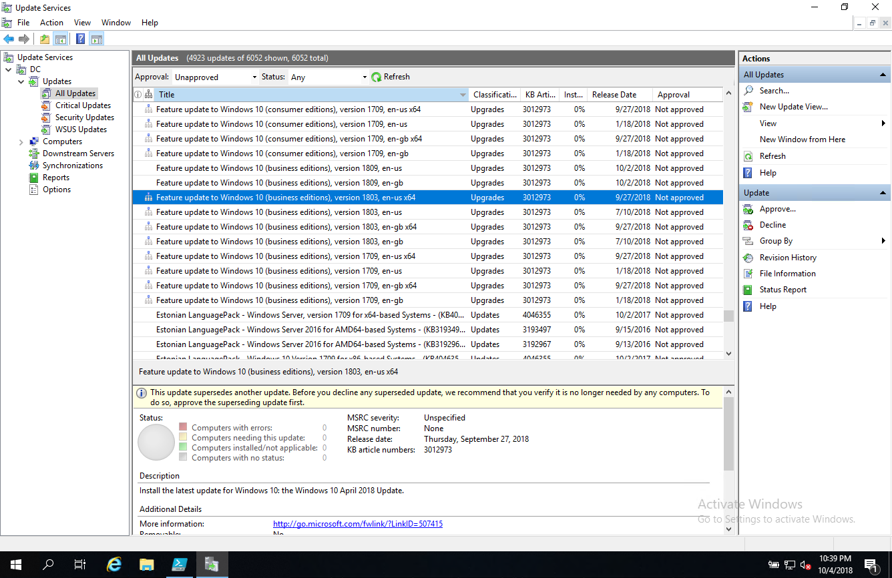
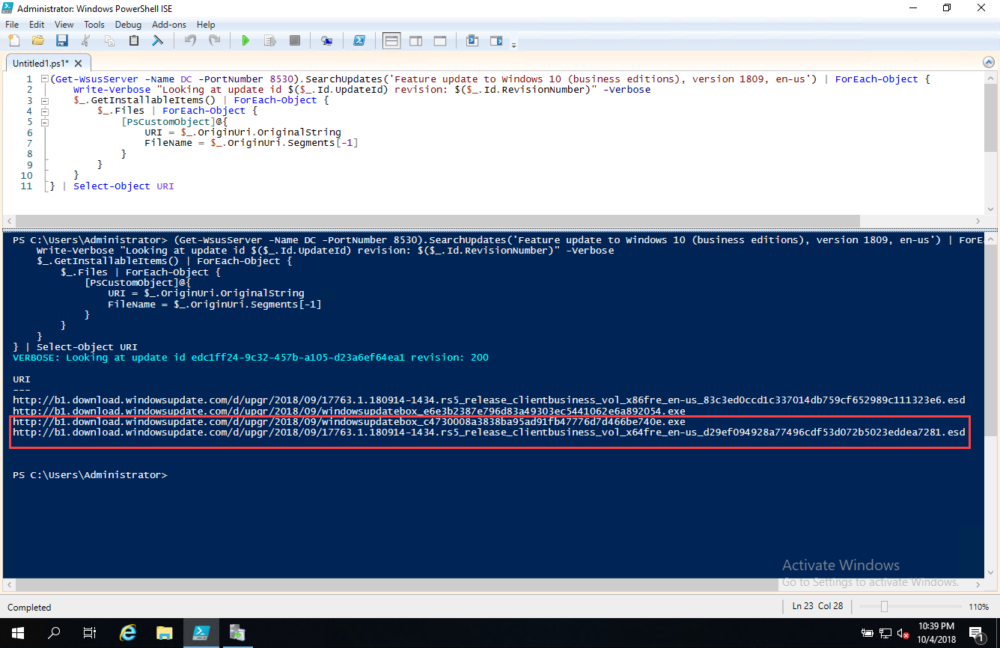
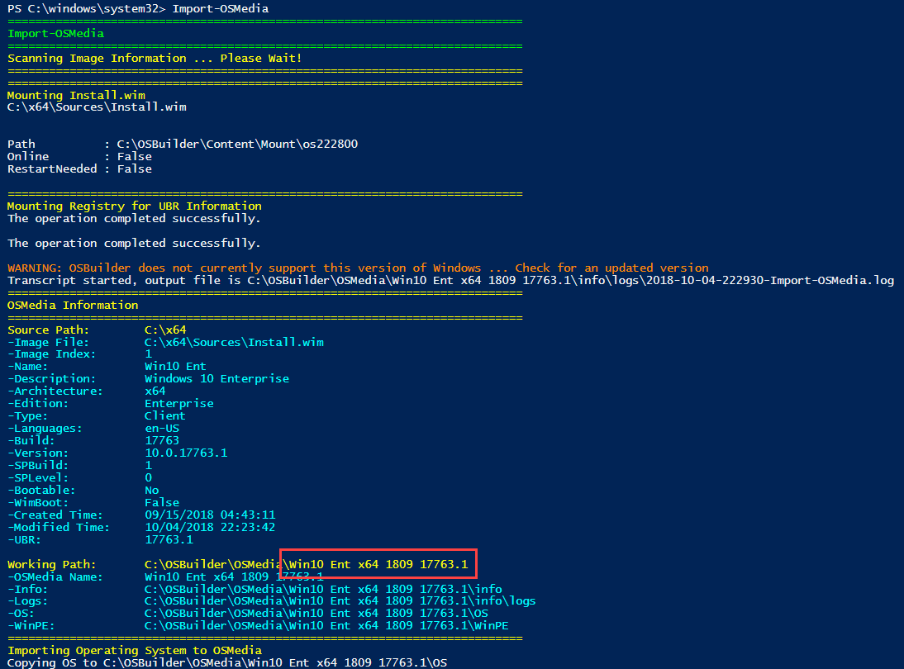
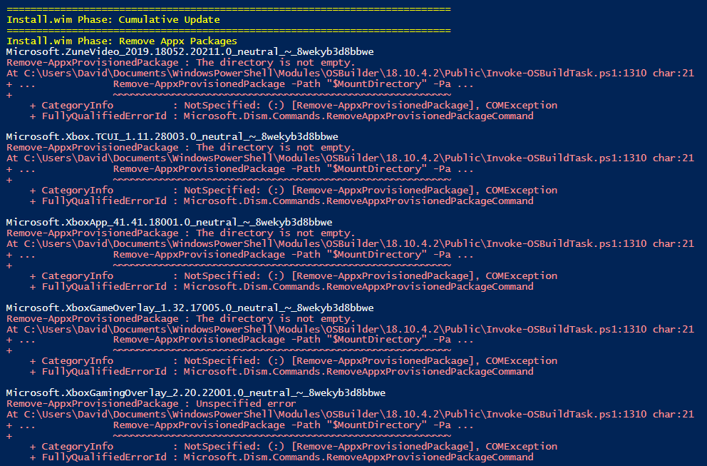
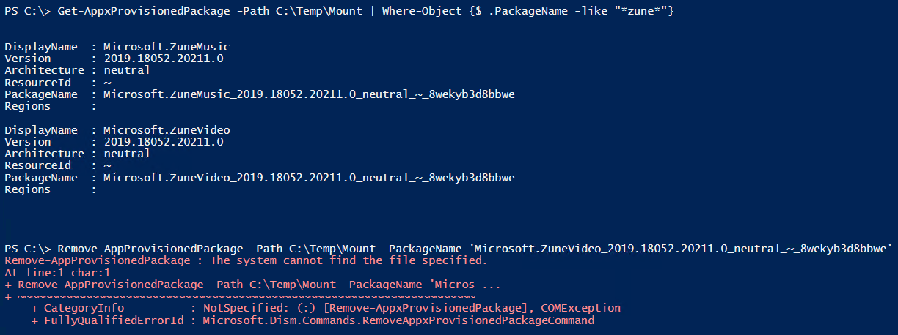
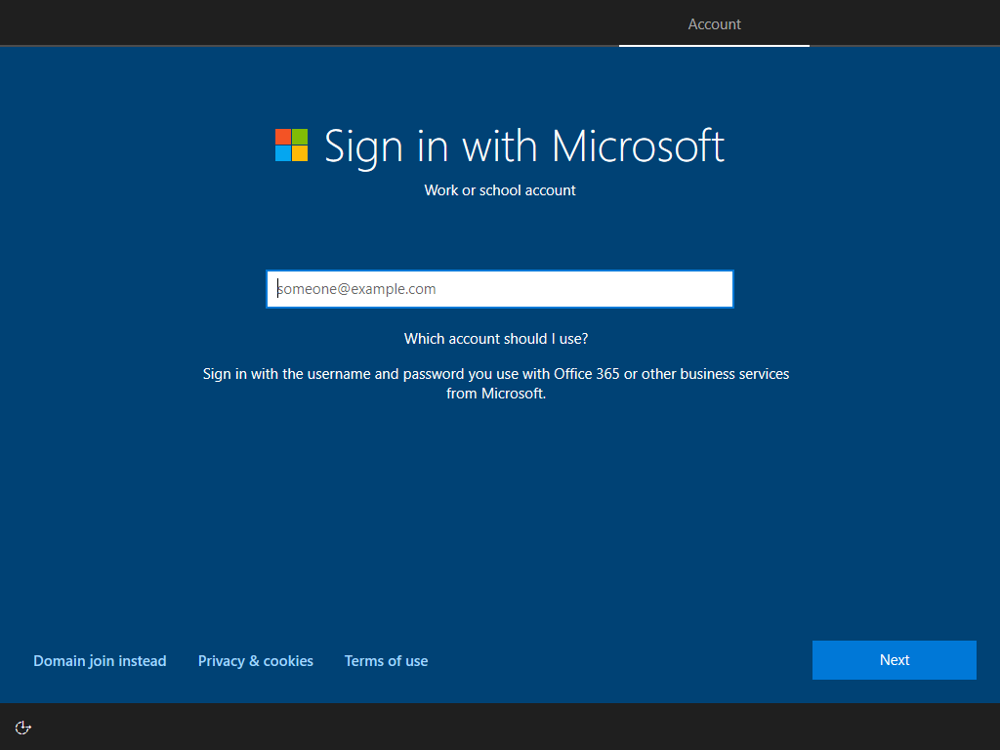

# Windows 10 from ESD

## Get the Download URL from WSUS

I can see the ESD Upgrade in WSUS teasing me . . .



So a search in WSUS gets me the link to download the ESD



Here's the link

[http://b1.download.windowsupdate.com/d/upgr/2018/09/17763.1.180914-1434.rs5\_release\_clientbusiness\_vol\_x64fre\_en-us\_d29ef094928a77496cdf53d072b5023eddea7281.esd](http://b1.download.windowsupdate.com/d/upgr/2018/09/17763.1.180914-1434.rs5_release_clientbusiness_vol_x64fre_en-us_d29ef094928a77496cdf53d072b5023eddea7281.esd)

And here's the script that gets me the link

```text
(Get-WsusServer -Name DC -PortNumber 8530).SearchUpdates('Feature update to Windows 10 (business editions), version 1809, en-us') | ForEach-Object { 
    Write-Verbose "Looking at update id $($_.Id.UpdateId) revision: $($_.Id.RevisionNumber)" -Verbose
    $_.GetInstallableItems() | ForEach-Object {
        $_.Files | ForEach-Object {
            [PsCustomObject]@{
                URI = $_.OriginUri.OriginalString
                FileName = $_.OriginUri.Segments[-1]
            }
        }
    }
} | Select-Object URI
```

## Download the ESD

So I then download the ESD to C:\Temp and get some quick information on the ESD in PowerShell.  Looks like all the ISO files and the Boot Wims are part of the ESD . . . great.  I have everything I need to rebuild the full media

```text
$ImagePath = 'C:\Temp\17763.1.180914-1434.rs5_release_clientbusiness_vol_x64fre_en-us_d29ef094928a77496cdf53d072b5023eddea7281.esd'
Get-WindowsImage -ImagePath $ImagePath
```

and I get some good info . . . 

```text
ImageIndex       : 1
ImageName        : Windows Setup Media
ImageDescription : Windows Setup Media
ImageSize        : 272,796,537 bytes

ImageIndex       : 2
ImageName        : Microsoft Windows PE (x64)
ImageDescription : Microsoft Windows PE (x64)
ImageSize        : 1,781,417,248 bytes

ImageIndex       : 3
ImageName        : Microsoft Windows Setup (x64)
ImageDescription : Microsoft Windows Setup (x64)
ImageSize        : 1,941,119,642 bytes

ImageIndex       : 4
ImageName        : Windows 10 Education
ImageDescription : Windows 10 Education
ImageSize        : 14,356,142,049 bytes

ImageIndex       : 5
ImageName        : Windows 10 Education N
ImageDescription : Windows 10 Education N
ImageSize        : 13,548,111,095 bytes

ImageIndex       : 6
ImageName        : Windows 10 Enterprise
ImageDescription : Windows 10 Enterprise
ImageSize        : 14,356,212,795 bytes

ImageIndex       : 7
ImageName        : Windows 10 Enterprise N
ImageDescription : Windows 10 Enterprise N
ImageSize        : 13,548,004,622 bytes

ImageIndex       : 8
ImageName        : Windows 10 Pro
ImageDescription : Windows 10 Pro
ImageSize        : 14,356,028,734 bytes

ImageIndex       : 9
ImageName        : Windows 10 Pro N
ImageDescription : Windows 10 Pro N
ImageSize        : 13,547,960,587 bytes
```

## Extracting and Exporting the ESD

A quick PowerShell script to do all the work.  Its important for me to place the contents in C:\x64

```text
$ImagePath = 'C:\Temp\17763.1.180914-1434.rs5_release_clientbusiness_vol_x64fre_en-us_d29ef094928a77496cdf53d072b5023eddea7281.esd'
$ApplyPath = 'C:\x64'

Expand-WindowsImage -ImagePath $ImagePath -Index 1 -ApplyPath $ApplyPath
Export-WindowsImage -SourceImagePath $ImagePath -SourceIndex 2 -DestinationImagePath "$ApplyPath\Sources\Boot.wim" -DestinationName 'Microsoft Windows PE (x64)' -CompressionType max -CheckIntegrity
Export-WindowsImage -SourceImagePath $ImagePath -SourceIndex 3 -DestinationImagePath "$ApplyPath\Sources\Boot.wim" -DestinationName 'Microsoft Windows Setup (x64)' -CompressionType max -CheckIntegrity -Setbootable
Export-WindowsImage -SourceImagePath $ImagePath -SourceIndex 6 -DestinationImagePath "$ApplyPath\Sources\Install.wim" -DestinationName 'Windows 10 Enterprise' -CompressionType max -CheckIntegrity
```

## OSBuilder Import-OSMedia

Because OSBuilder looks on all Drives for this path . . . and I can easily import the OS




## Known Issue

I do have problems removing Provisioned Appx Packages when using the ESD as the source, even running from an 1809 system, so you have been warned!



No mistakes on my part



And even DISM is a NO GO


Here's what the chatty DISM log says

```text
Info DISM   DISM Appx Provider: PID=5440 TID=6632 Processing 'packagename' option at index 2 - CAppxManager::ProcessCommandRemoveAllUserAppx
Info DISM   DISM Appx Provider: PID=5440 TID=6632 packagename='Microsoft.ZuneVideo_2019.18052.20211.0_neutral_~_8wekyb3d8bbwe' - CAppxManager::ProcessCommandRemoveAllUserAppx
Error DISM  DISM Appx Provider: PID=5440 TID=6632 Failed to get staged packages for package 'Microsoft.ZuneVideo_2019.18052.20211.0_neutral_~_8wekyb3d8bbwe'. - CPackageAdapter::CreateForRemove(hr:0x80070002)
Error DISM  DISM Appx Provider: PID=5440 TID=6632 Failed while initializing package adapter for package 'Microsoft.ZuneVideo_2019.18052.20211.0_neutral_~_8wekyb3d8bbwe' - CAppxManager::RemoveAllUserAppx(hr:0x80070002)
Error DISM  DISM Appx Provider: PID=5440 TID=6632 Failed to remove package 'Microsoft.ZuneVideo_2019.18052.20211.0_neutral_~_8wekyb3d8bbwe' - CAppxManager::ProcessCommandRemoveAllUserAppx(hr:0x80070002)
Error DISM  DISM Appx Provider: PID=5440 TID=6632 Failed processing command to remove Appx package - CAppxManager::ExecuteCmdLine(hr:0x80070002)
Info DISM   DISM Provider Store: PID=5440 TID=2496 Found the OSServices.  Waiting to finalize it until all other providers are unloaded. - CDISMProviderStore::Final_OnDisconnect
Info DISM   DISM Provider Store: PID=5440 TID=2496 Found the OSServices.  Waiting to finalize it until all other providers are unloaded. - CDISMProviderStore::Final_OnDisconnect
Info DISM   DISM Provider Store: PID=5440 TID=2496 Found the PE Provider.  Waiting to finalize it until all other providers are unloaded. - CDISMProviderStore::Final_OnDisconnect
Info DISM   DISM Provider Store: PID=5440 TID=2496 Finalizing the servicing provider(DISM Package Manager) - CDISMProviderStore::Internal_DisconnectProvider
Info DISM   DISM Package Manager: PID=5440 TID=2496 Finalizing CBS core. - CDISMPackageManager::Finalize
```


Came across this link, so maybe because I used an ESD . . . anyone else?



## Final Steps

So I guess I'll just create an ISO and build a Virtual Machine and see if OSBuilder works from there.  Enjoy!




