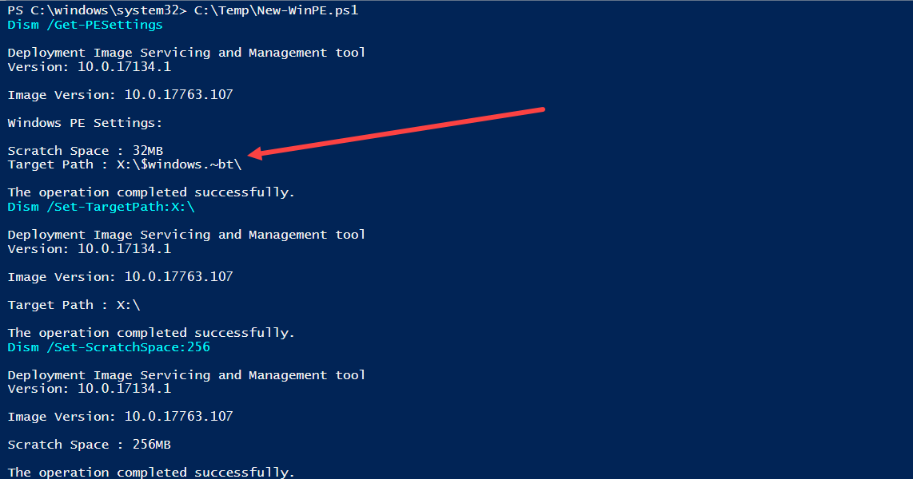
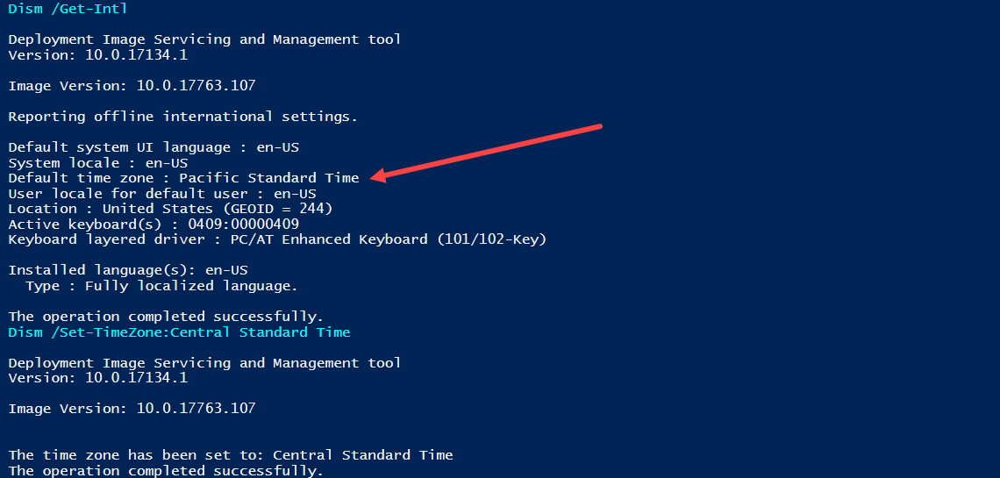
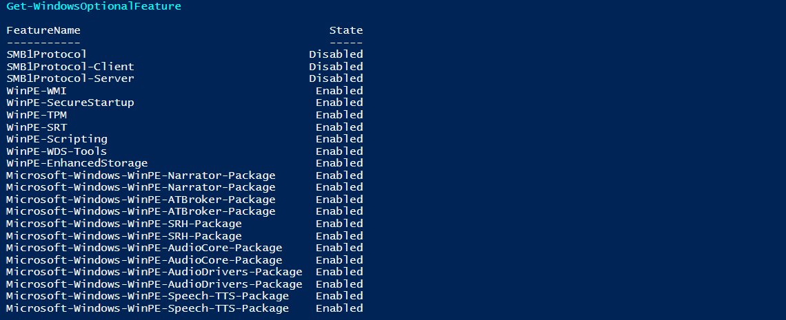
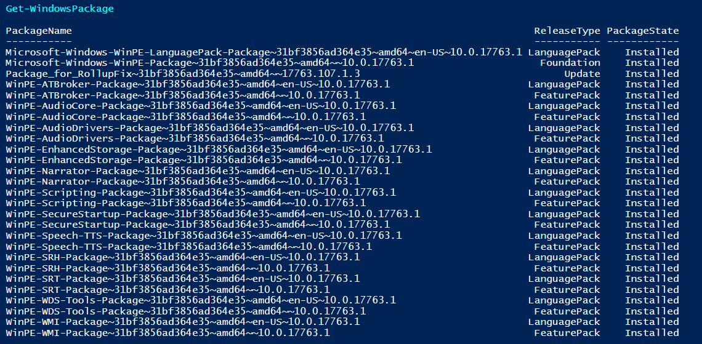
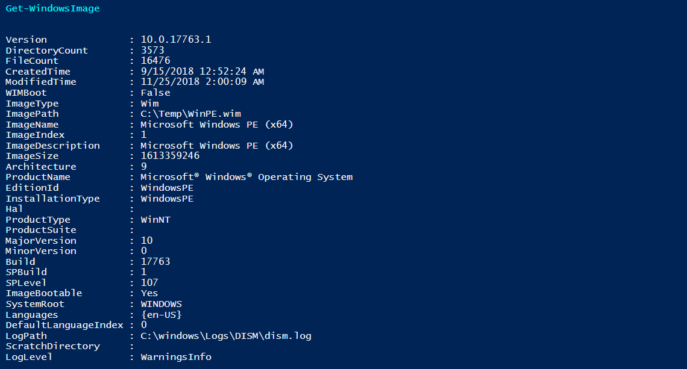
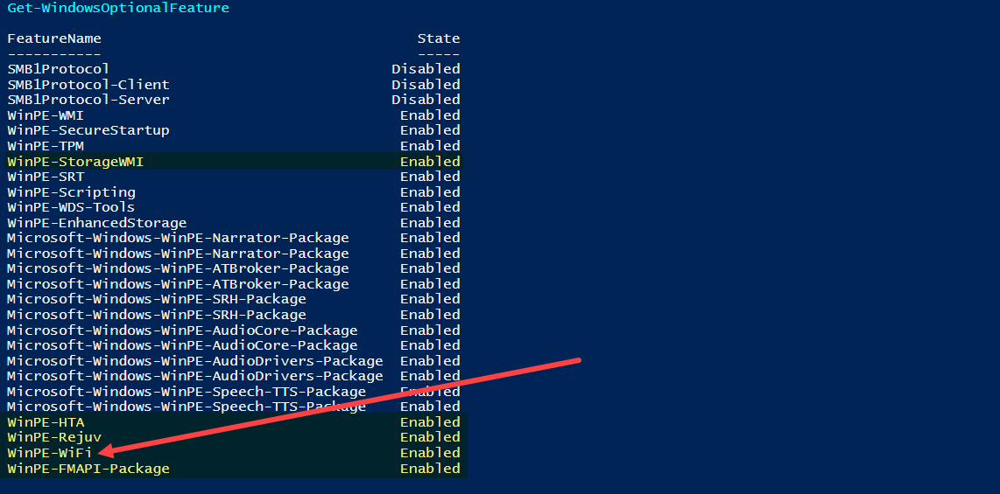
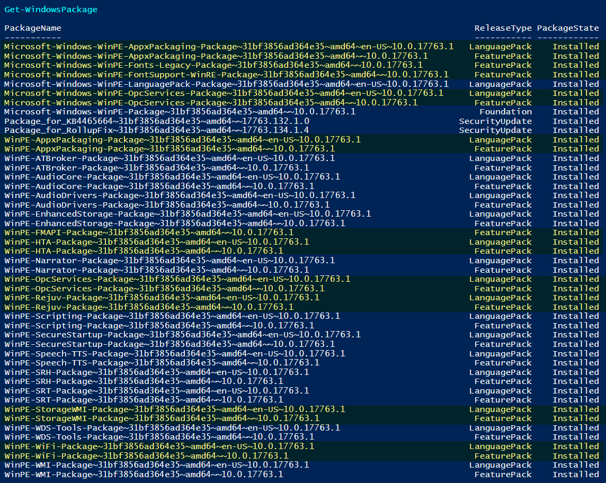

# Create WinPE.wim from Boot.wim or WinRE.wim

Obviously you can also do the same process using [OSBuilder's PEBuild](../osbuilder/docs/functions/pebuild/), but its easy enough to create a WinPE.wim using this script.

## New-WinPE.ps1

Download the complete PowerShell Script.  Admin Rights \(Elevated\) are required since you are going to be working with DISM



## Custom Variables

The only thing that you need to sort out is the Custom Variables.  These are easy enough to figure out.

```text
#===================================================
#   Custom Variables
#===================================================
#Location of the Source Boot.wim or WinRE.wim
$SourceWim = 'D:\sources\boot.wim'

#Destination Directory to create WinPE.wim
$DestinationDir = 'C:\Temp'

#Sets the available scratch space, in megabytes
#Valid values are 32, 64, 128, 256 and 512
#Default is 32
$ScratchSpace = '256'

#The name of the time zone must exactly match the name of the time zone settings in the registry
#HKLM\SOFTWARE\Microsoft\Windows NT\CurrentVersion\Time Zone
$TimeZone = 'Central Standard Time'

#ImageName of the WIM
$DestinationName = 'Microsoft Windows PE (x64)'
```

## Build Process

The script will export the Boot.wim \(Index 1\) or WinRE.wim into a new WinPE.wim.  The new WinPE.wim will then be mounted.

Dism /Get-PESettings will show the current Scratch Space and Target Path.  It is important to change the Scratch Space as 32GB is entirely too small to run things in WinPE.  I recommend 256 \(MB\).  The Target Path will be changed to X:\ in this step as well.  WinPE from the Boot.wim has a Target Path set for a Windows Setup or Upgrade, so this needs to be changed to X:\



The Time Zone is changed in this step.  The importance of this is to properly Date/Time stamp any LOG files used in a Task Sequence.  The default is Pacific Standard Time \(Microsoft's Home\)



Windows Optional Features will be displayed with their current State.  As you can see WinPE from the Boot.wim has several features enabled that are not present in the ADK WinPE.wim



Windows Packages will also be displayed



And finally the information of the new WinPE.wim will be displayed 



You can now take the complete WinPE.wim and replace the existing one in your ADK directory, or import it into Configuration Manager.

## WinRE.wim Differences

WinRE.wim contains some additional Packages, including WiFi support, but it can be used as WinPE.wim as well






