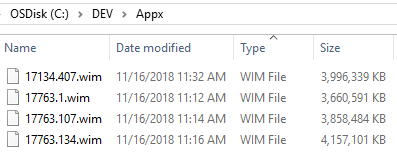
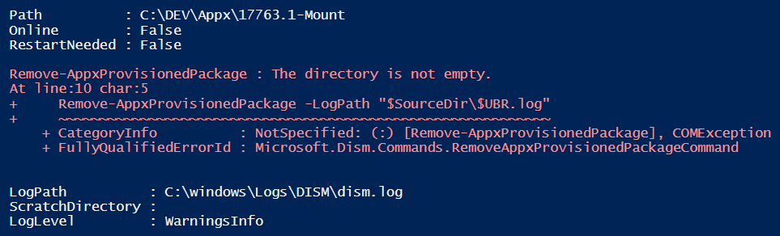
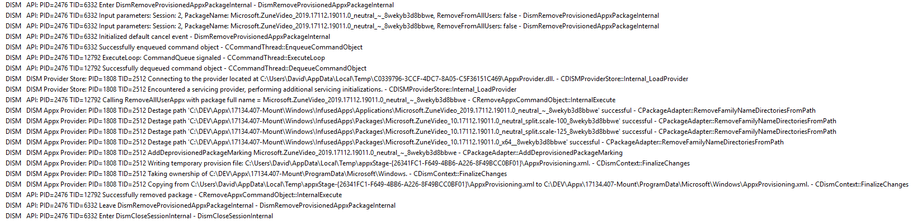
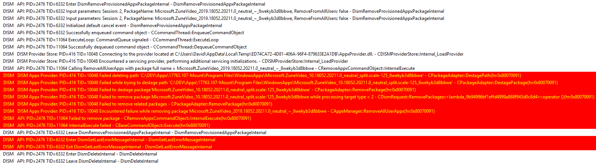

# Windows 10 1809 Appx Issues

There seems to be an issue with Windows 10 1809 where Appx Provisioned Packages can't be removed from a Mounted Image.

## The Setup

I start with 4 WIM files renamed with the appropriate UBR for each

* 17134.407 - Windows 10 Enterprise x64 **1803**
* 17763.1 - Windows 10 Enterprise x64 **1809** \(October 9, 2018 "First Release"\)
* 17763.107 - Windows 10 Enterprise x64 **1809** \(November 13, 2018 "Second Release"\)
* 17763.134 - Windows 10 Enterprise x64 **1809** \("Second Release" + SSU KB4465664 + CU KB4467708\)



## The Script

A simple PowerShell script is used to complete the following

* Mount the Image
* Remove the Zune Video package \(with logging\)
* Dismount the Image


```text
$SourceDir = 'C:\DEV\Appx'
$Images = @('17134.407','17763.1','17763.107','17763.134')

foreach ($UBR in $Images) {
    New-Item -Path "$SourceDir\$UBR-Mount" -ItemType Directory -Force | Out-Null
    Mount-WindowsImage -Path "$SourceDir\$UBR-Mount" -ImagePath "$SourceDir\$UBR.wim" -Index 1 -Optimize
    
    Get-AppxProvisionedPackage -Path "$SourceDir\$UBR-Mount" | `
    Where-Object {$_.PackageName -like "*ZuneVideo*"} | `
    Remove-AppxProvisionedPackage -LogPath "$SourceDir\$UBR.log"
    
    Dismount-WindowsImage -Path "$SourceDir\$UBR-Mount" -Discard
}
```

## The Errors

All three versions of Windows 10 1809 resulted in the following error message.  Windows 10 1803 worked perfectly.



## The Logs

Windows 10 1803 works perfectly when removing Zune Video as expected





Windows 10 1809 fails when removing Zune Video with errors.  This occurs in all 1809 UBRs \(17763.1, 17763.107, and 17763.134\)









## The Conclusion

There are obviously some internal DISM issues with Windows 10 1809.  I would be very cautious about any Enterprise deployment until this can be addressed.


