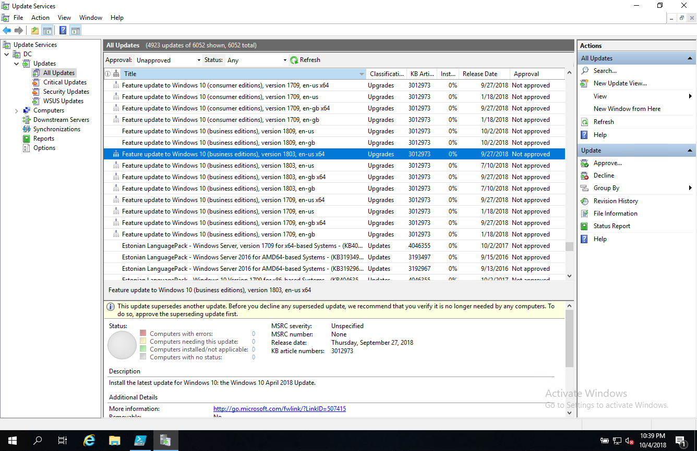
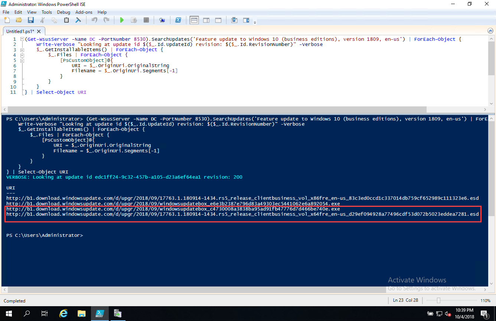
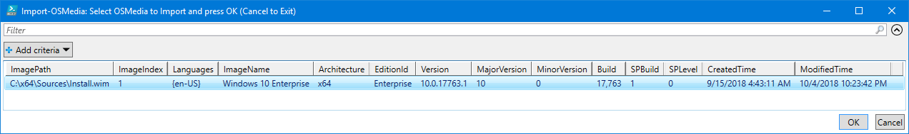
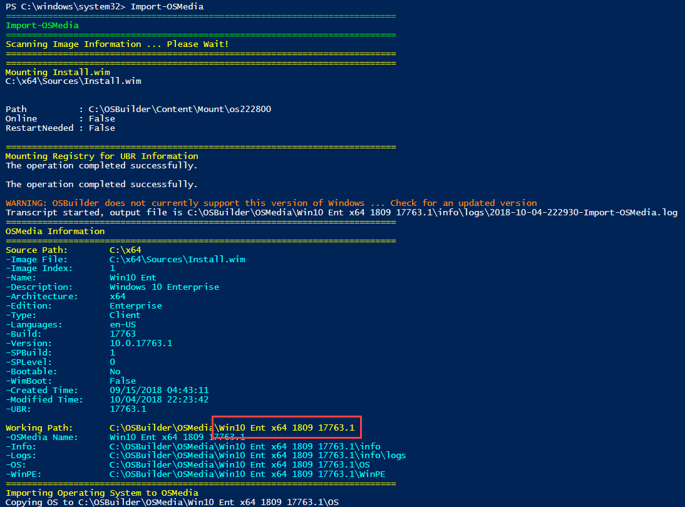
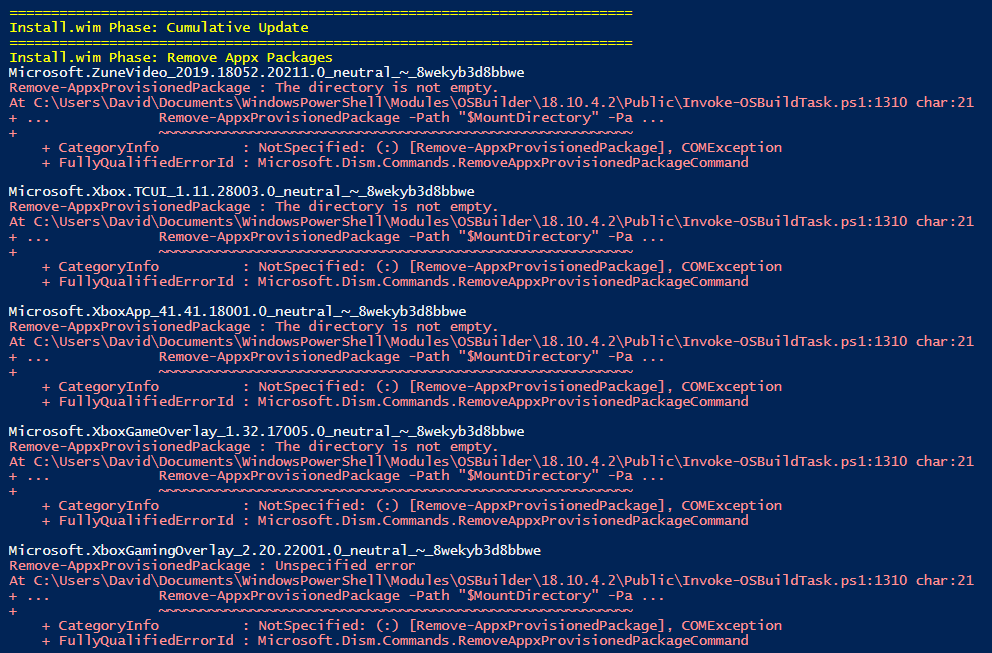
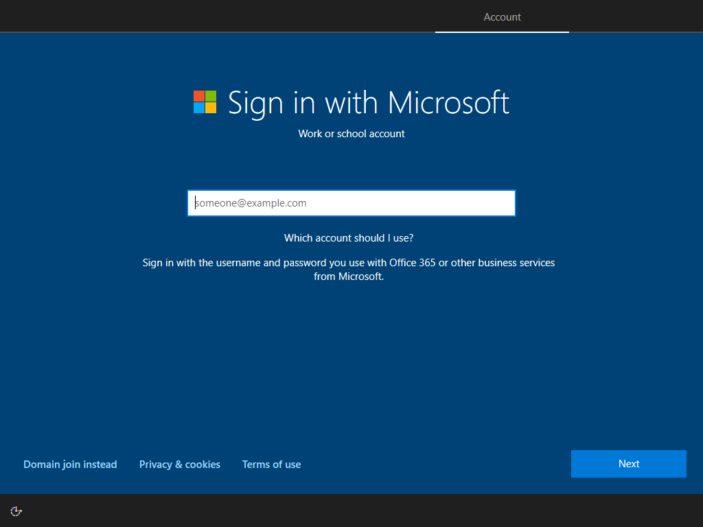

# Windows 10 from ESD

## Get the Download URL from WSUS

I can see the ESD Upgrade in WSUS teasing me . . .



So a search in WSUS gets me the link to download the ESD



Here's the script

```text
(Get-WsusServer -Name DC -PortNumber 8530).SearchUpdates('Feature update to Windows 10 (business editions), version 1809, en-us') | ForEach-Object { 
    Write-Verbose "Looking at update id $($_.Id.UpdateId) revision: $($_.Id.RevisionNumber)" -Verbose
    $_.GetInstallableItems() | ForEach-Object {
        $_.Files | ForEach-Object {
            [PsCustomObject]@{
                URI = $_.OriginUri.OriginalString
                FileName = $_.OriginUri.Segments[-1]
            }
        }
    }
} | Select-Object URI
```

## Download the ESD

So I then download the ESD to C:\Temp and get some quick information on the ESD in PowerShell.  Looks like all the ISO files and the Boot Wims are part of the ESD . . . great.  I have everything I need to rebuild the full media

```text
$ImagePath = 'C:\Temp\17763.1.180914-1434.rs5_release_clientbusiness_vol_x64fre_en-us_d29ef094928a77496cdf53d072b5023eddea7281.esd'
Get-WindowsImage -ImagePath $ImagePath
```

and I get some good info . . . 

```text
ImageIndex       : 1
ImageName        : Windows Setup Media
ImageDescription : Windows Setup Media
ImageSize        : 272,796,537 bytes

ImageIndex       : 2
ImageName        : Microsoft Windows PE (x64)
ImageDescription : Microsoft Windows PE (x64)
ImageSize        : 1,781,417,248 bytes

ImageIndex       : 3
ImageName        : Microsoft Windows Setup (x64)
ImageDescription : Microsoft Windows Setup (x64)
ImageSize        : 1,941,119,642 bytes

ImageIndex       : 4
ImageName        : Windows 10 Education
ImageDescription : Windows 10 Education
ImageSize        : 14,356,142,049 bytes

ImageIndex       : 5
ImageName        : Windows 10 Education N
ImageDescription : Windows 10 Education N
ImageSize        : 13,548,111,095 bytes

ImageIndex       : 6
ImageName        : Windows 10 Enterprise
ImageDescription : Windows 10 Enterprise
ImageSize        : 14,356,212,795 bytes

ImageIndex       : 7
ImageName        : Windows 10 Enterprise N
ImageDescription : Windows 10 Enterprise N
ImageSize        : 13,548,004,622 bytes

ImageIndex       : 8
ImageName        : Windows 10 Pro
ImageDescription : Windows 10 Pro
ImageSize        : 14,356,028,734 bytes

ImageIndex       : 9
ImageName        : Windows 10 Pro N
ImageDescription : Windows 10 Pro N
ImageSize        : 13,547,960,587 bytes
```

## Extracting and Exporting the ESD

A quick PowerShell script to do all the work.  Its important for me to place the contents in C:\x64

```text
$ImagePath = 'C:\Temp\17763.1.180914-1434.rs5_release_clientbusiness_vol_x64fre_en-us_d29ef094928a77496cdf53d072b5023eddea7281.esd'
$ApplyPath = 'C:\x64'

Expand-WindowsImage -ImagePath $ImagePath -Index 1 -ApplyPath $ApplyPath
Export-WindowsImage -SourceImagePath $ImagePath -SourceIndex 2 -DestinationImagePath "$ApplyPath\Sources\Boot.wim" -DestinationName 'Microsoft Windows PE (x64)' -CompressionType max -CheckIntegrity
Export-WindowsImage -SourceImagePath $ImagePath -SourceIndex 3 -DestinationImagePath "$ApplyPath\Sources\Boot.wim" -DestinationName 'Microsoft Windows Setup (x64)' -CompressionType max -CheckIntegrity -Setbootable
Export-WindowsImage -SourceImagePath $ImagePath -SourceIndex 6 -DestinationImagePath "$ApplyPath\Sources\Install.wim" -DestinationName 'Windows 10 Enterprise' -CompressionType max -CheckIntegrity
```

## OSBuilder Import-OSMedia

Because OSBuilder looks on all Drives for this path . . . and I can easily import the OS





## Known Issue

I do have problems removing Provisioned Appx Packages, but I assume it is because I am trying to servicing 1809 from a Windows 10 1803 system



## Final Steps

So I guess I'll just create an ISO and build a Virtual Machine and see if OSBuilder works from there.  Enjoy!




