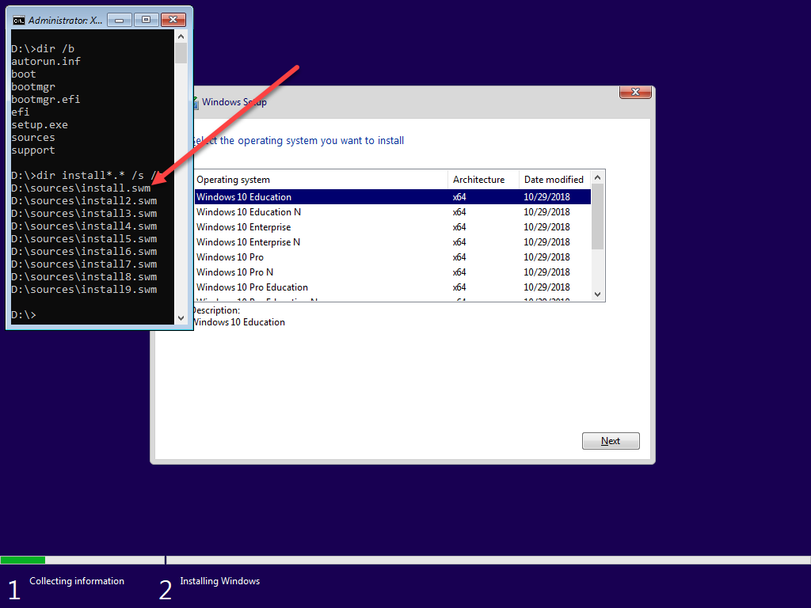
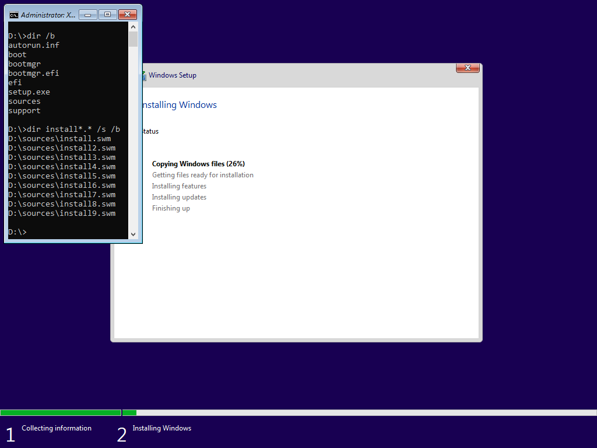
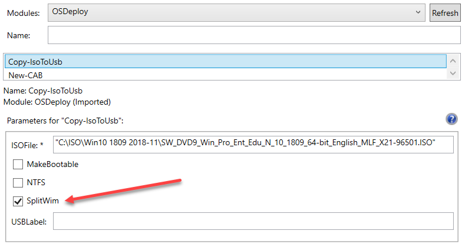
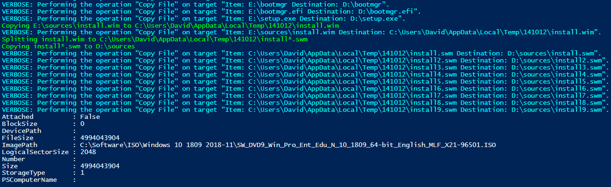

# Windows Setup: FAT32 USB with +4GB Install.wim

We all know the limitations of a large Install.wim on a FAT32 USB Drive, you can't copy the Install.wim if it is larger than 4GB.  This is a **limitation of FAT32**, but FAT32 is required for UEFI Boot!

## Export Image Index from the Install.wim

The most common method is to implement because the odds are, you have a multi-Index Install.wim

Simply export the Windows Image Index that you want to use and copy that to the Sources directory on your USB Drive.  If you do need multiple Indexes on a USB, this probably won't work for you

## Multi-Partition USB

It is also possible to make a multi-Partition USB to use a FAT32 and NTFS structure.

[Brooks Peppin](https://twitter.com/brookspeppin) does a great job with his script for creating a 500MB FAT32 Boot Partition and using an AutoUnattend.xml.  Give him a follow and a read on his blog for a good How-To on this method.



## Solution: Split the Install.wim

**The easiest solution for a large Install.wim to use with Windows Setup is to split the Install.wim using `Split-WindowsImage`**

You can then take the SWM files and place them in your Sources directory instead of having a single Install.wim.  There is no need to edit any files, or to make any other changes, Windows Setup already looks for an install.swm file

Does it really work?  Yes.

## OSDeploy PowerShell Module

If you are looking for an automated way to create a USB with SWM files from an ISO, install the OSDeploy PowerShell Module and use`Copy-IsoToUSB` with the `-SplitWim` parameter.  This parameter will be set **automatically** if you are creating a FAT32 USB and the Install.wim is larger than 4GB



The process to split the Install.wim takes a little longer than a simple copy since the SWM files need to be generated, so give it some time.  These are the steps that are required

* Copy Install.wim to Temp
* Remove Install.wim Read Only Flag \(cannot Split if this is set\)
* Split Install.wim
* Copy SWM files to USB

