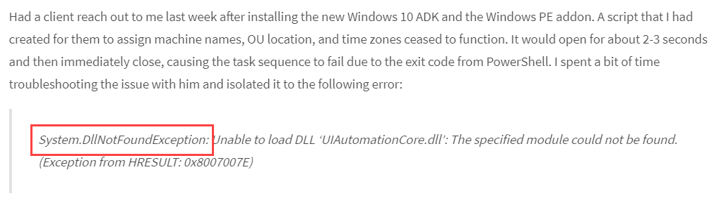
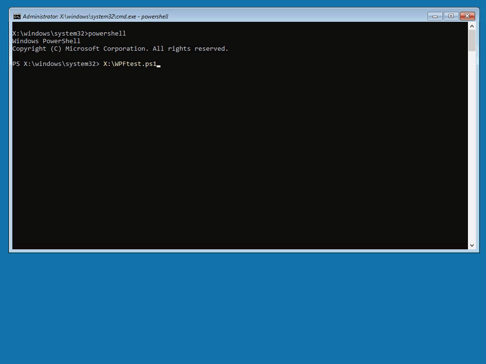
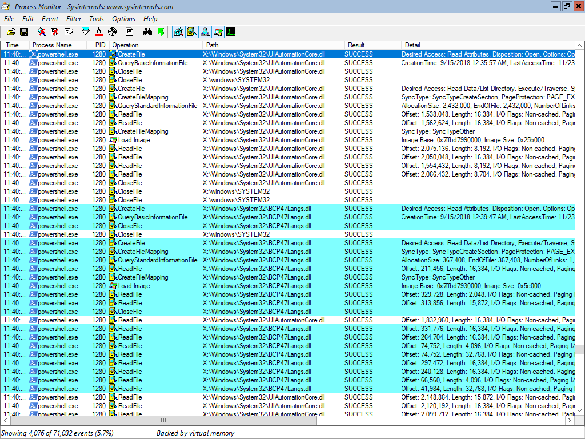
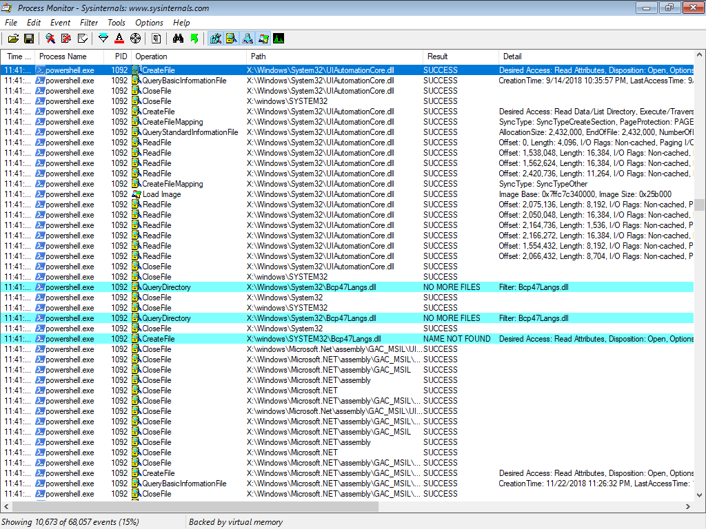
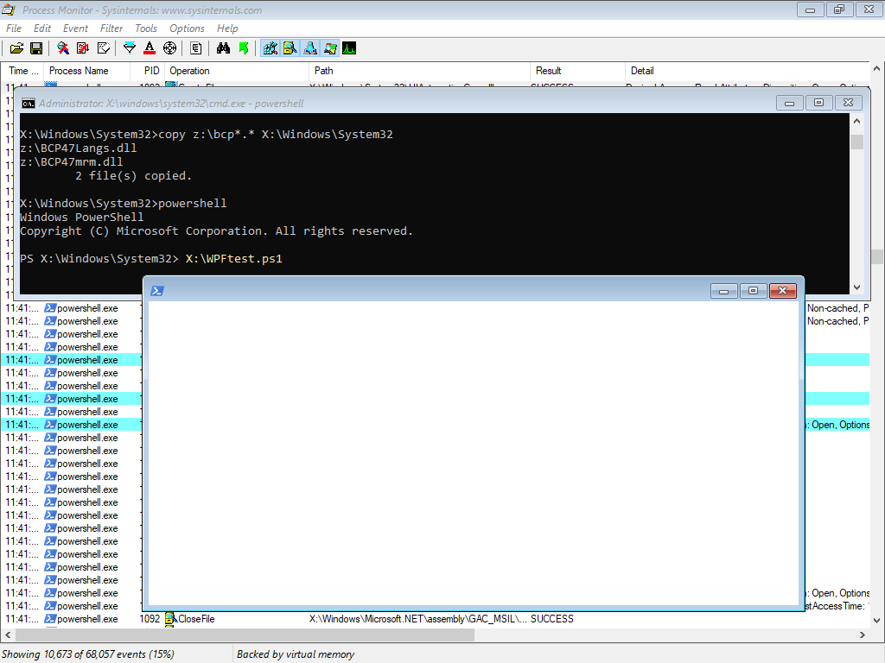

# WinPE 10 1809 WPF DLL Fix

## Workaround: Replace UIAutomationCore.dll

One solution is to replace UIAutomationCore.dll with the one from WinPE 10 1803.  While this workaround does get the ball moving, I cannot recommend making this change as there is no way to know what using an older version will break.

So let's see how this came about.  [I think Nathan Ziehnert gets credit for finding the issue first.  He then detailed the error message on his blog.](https://z-nerd.com/blog/2018/10/08-fix-wpf-in-1809-winpe/)



Mohammed Feroze Khan came up with the workaround on Twitter



And the rest is history.

## System.DllNotFoundException

A closer look at Nathan's error shows that there was a DLL not found.

> **System.DllNotFoundException**: Unable to load DLL ‘UIAutomationCore.dll’: The specified module could not be found. \(Exception from HRESULT: 0x8007007E\)

A quick read would suggest that this is a problem with UIAutomationCore.dll ... but this is not entirely accurate.  **UIAutomationCore.dll threw the exception because it could not find a required DLL**

## WinPE Process Monitor

I ran a side by side test of WinPE from the ADK and WinPE from a Windows 10 1809 Boot.wim and added NetFX, PowerShell, ProcMon64.exe, and a simple WPF test.

When executing my WPF test, I immediately notice that it is PowerShell that is crashing as it drops from a PowerShell Prompt to a Command Prompt.



Since I have an App Crash, I get a Windows Error Report which shows the same **System.DllNotFoundException**

```text
Version=1
EventType=PowerShell
EventTime=131874712000407901
ReportType=1
Consent=1
ReportStatus=2097154
ReportIdentifier=0fa42d51-809e-43b4-b7de-4561f6621150
Wow64Host=34404
OriginalFilename=PowerShell.EXE
AppSessionGuid=00000620-0001-0001-bb17-ff015a83d401
TargetAppId=W:0000da39a3ee5e6b4b0d3255bfef95601890afd80709!0000da39a3ee5e6b4b0d3255bfef95601890afd80709!powershell.exe
TargetAppVer=2074//02//28:17:48:58!70a4d!powershell.exe
BootId=4294967295
TargetAsId=43
IsFatal=4294967295
EtwNonCollectReason=4
Response.type=4
Sig[0].Name=NameOfExe
Sig[0].Value=powershell.exe
Sig[1].Name=FileVersionOfSystemManagementAutomation
Sig[1].Value=10.0.17763.134
Sig[2].Name=InnermostExceptionType
Sig[2].Value=System.DllNotFoundException
Sig[3].Name=OutermostExceptionType
Sig[3].Value=System.TypeInitializationException
Sig[4].Name=DeepestPowerShellFrame
Sig[4].Value=unknown
Sig[5].Name=DeepestFrame
Sig[5].Value=.Peers.AutomationPeer.RaiseFocusChangedEventHelper
Sig[6].Name=ThreadName
Sig[6].Value=Pipeli..ution Thread
```

WinPE exported from the Boot.wim does not crash.  Process Monitor shows it using the DLL BCP47Langs.dll



But BCP47Langs.dll does not exist in the ADK WinPE.wim , which explains Dll Not Found crash.  This is evident in the Process Monitor results.



## System.DllNotFoundException = Missing BCP47\*.dll

Adding BCP47Langs.dll and BCP47mrm.dll to ADK WinPE makes everything work as expected.  **This is the proper solution**



## Recommendations

Copy BCP47\*.dll from Windows\System32 of a Windows 10 x64 1809 and add them to your WinPE Extra Files to be copied to &lt;WinPE&gt;:\Windows\System32 or add these files in Offline Servicing.

These files are already in the Boot.wim's WinPE, so that explains why it works.  These files are NOT part of WinPE NetFX Package, or the Cumulative Update, so copying from a live OS is the only way to go for now.

Enjoy!

## Technical Notes

#### BPC47\*.dll Files

Files are located in the following locations on Windows 10 x64 1809

```text
C:\Windows\System32
C:\Windows\WinSxS\amd64_microsoft-windows-bcp47languages_31bf3856ad364e35_10.0.17763.1_none_8b3037a62efd1f71
```

#### ADK WinPE.wim Packages

```text
Microsoft-Windows-WinPE-LanguagePack-Package~31bf3856ad364e35~amd64~en-US~10.0.17763.1
Microsoft-Windows-WinPE-Package~31bf3856ad364e35~amd64~~10.0.17763.1  
```

#### Boot.wim WinPE Packages

```text
Microsoft-Windows-WinPE-LanguagePack-Package~31bf3856ad364e35~amd64~en-US~10.0.17763.1
Microsoft-Windows-WinPE-Package~31bf3856ad364e35~amd64~~10.0.17763.1
WinPE-ATBroker-Package~31bf3856ad364e35~amd64~en-US~10.0.17763.1
WinPE-ATBroker-Package~31bf3856ad364e35~amd64~~10.0.17763.1
WinPE-AudioCore-Package~31bf3856ad364e35~amd64~en-US~10.0.17763.1
WinPE-AudioCore-Package~31bf3856ad364e35~amd64~~10.0.17763.1
WinPE-AudioDrivers-Package~31bf3856ad364e35~amd64~en-US~10.0.17763.1
WinPE-AudioDrivers-Package~31bf3856ad364e35~amd64~~10.0.17763.1
WinPE-EnhancedStorage-Package~31bf3856ad364e35~amd64~en-US~10.0.17763.1
WinPE-EnhancedStorage-Package~31bf3856ad364e35~amd64~~10.0.17763.1
WinPE-Narrator-Package~31bf3856ad364e35~amd64~en-US~10.0.17763.1
WinPE-Narrator-Package~31bf3856ad364e35~amd64~~10.0.17763.1
WinPE-SRH-Package~31bf3856ad364e35~amd64~en-US~10.0.17763.1
WinPE-SRH-Package~31bf3856ad364e35~amd64~~10.0.17763.1
WinPE-SRT-Package~31bf3856ad364e35~amd64~en-US~10.0.17763.1
WinPE-SRT-Package~31bf3856ad364e35~amd64~~10.0.17763.1
WinPE-Scripting-Package~31bf3856ad364e35~amd64~en-US~10.0.17763.1
WinPE-Scripting-Package~31bf3856ad364e35~amd64~~10.0.17763.1
WinPE-SecureStartup-Package~31bf3856ad364e35~amd64~en-US~10.0.17763.1
WinPE-SecureStartup-Package~31bf3856ad364e35~amd64~~10.0.17763.1
WinPE-Speech-TTS-Package~31bf3856ad364e35~amd64~en-US~10.0.17763.1
WinPE-Speech-TTS-Package~31bf3856ad364e35~amd64~~10.0.17763.1
WinPE-WDS-Tools-Package~31bf3856ad364e35~amd64~en-US~10.0.17763.1
WinPE-WDS-Tools-Package~31bf3856ad364e35~amd64~~10.0.17763.1
WinPE-WMI-Package~31bf3856ad364e35~amd64~en-US~10.0.17763.1
WinPE-WMI-Package~31bf3856ad364e35~amd64~~10.0.17763.1
```


