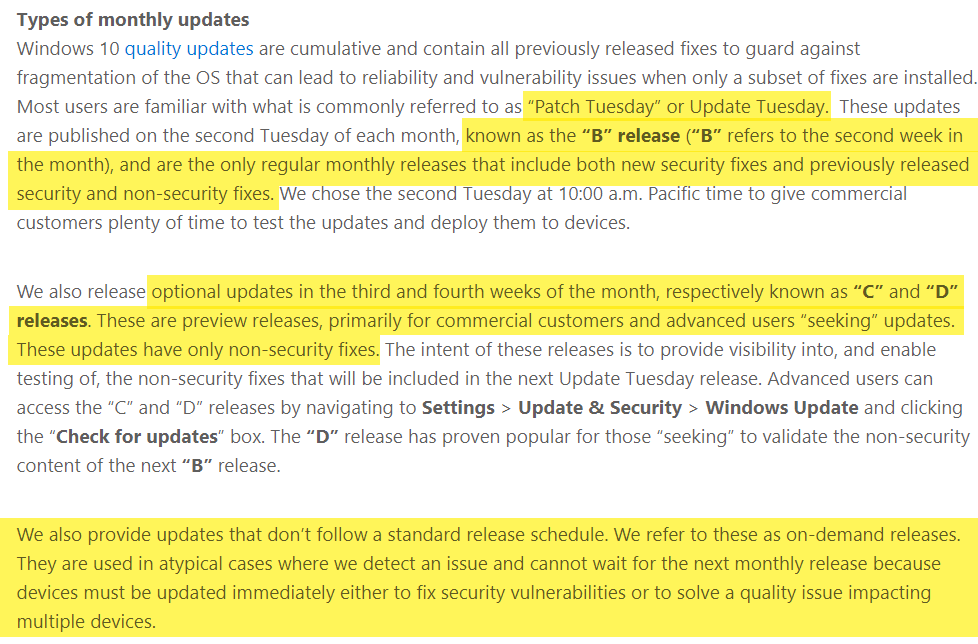
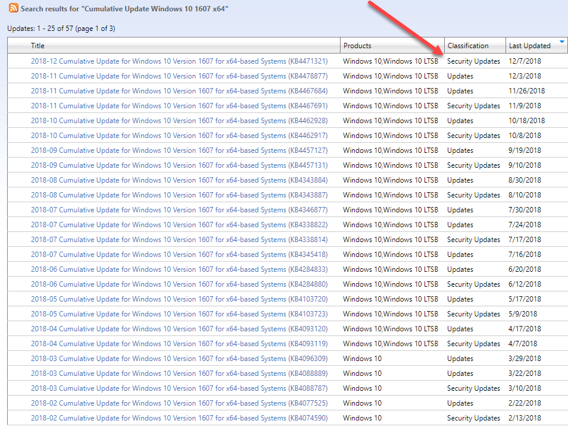
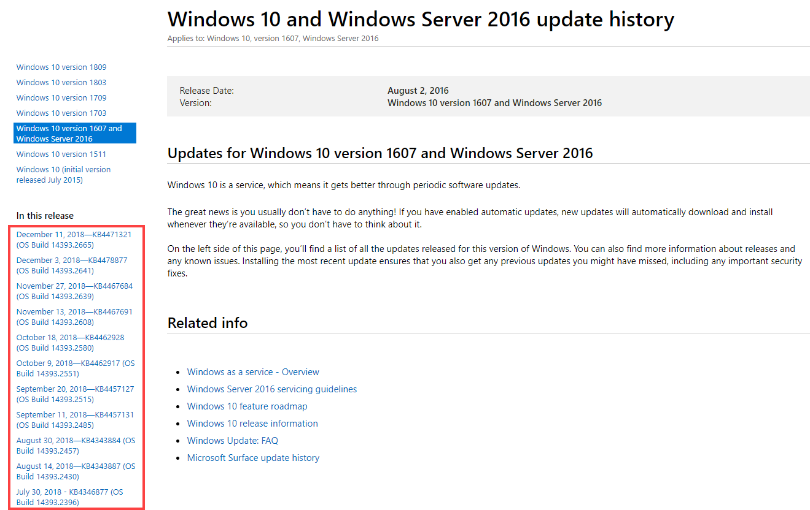

# WSUS vs Microsoft Update Catalog

I frequently get pinged on when a new Cumulative Update gets published on Microsoft Update Catalog, and why it is not in OSBuilder.  I hope this will clear a few things up.

## Microsoft's Take

[Michael Fortin](https://blogs.windows.com/windowsexperience/author/michaelfortin/) \(Microsoft Corporate Vice President, Windows\) explains in some detail about the different updates



And here is the important stuff ...

## WSUS Updates

These updates will consist of the "Patch Tuesday" \(B Release\) and the on-demand updates.  C and D releases are considered "Preview Releases".  This explains why you don't see them in WSUS

## Microsoft Update Catalog

The [Microsoft Update Catalog](https://www.catalog.update.microsoft.com/Search.aspx?q=Cumulative+Update+Windows+10+1607+x64) will contain ALL releases.  Patch Tuesday Releases will be classified as Security Updates

## Windows Update History

Another method to determine the Latest Cumulative Updates is to view the Windows 10 Update History page.



This will detail the updates that appear in the Microsoft Update Catalog \(ALL Releases\)

## OSBuilder

OSBuilder Update Catalogs are generated from WSUS, so these will include the "Patch Tuesday" \(B Release\) and any On Demand Releases \(Critical\).  C and D Releases can be added to OSBuilder using [**`New-OSBUpdate`**](../osbuilder/updates/new-osbupdate.md), but at least consider that these are Preview Releases and probably should only be used for Testing, and NOT for an Enterprise Deployment, but that's your call.

## Further Reading



