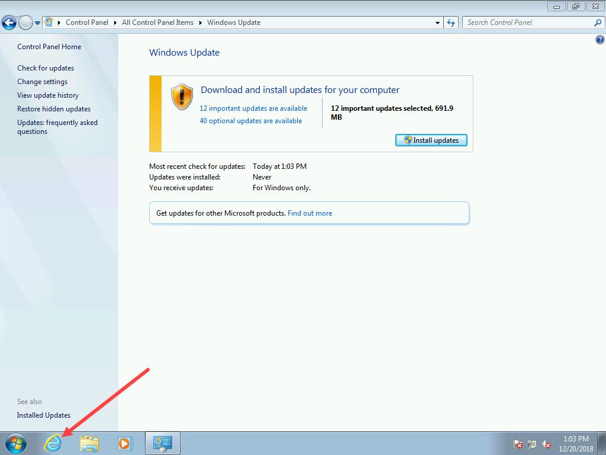

# OSBuilder Windows 7

I'll update this page with information about my progress in adding Windows 7 support to OSBuilder.  No guarantee I will finish.

## Win7 Ent x64 7601.17514 \(2.63GB\)

An alternate Import-OSMedia handles the import of Windows 7 Enterprise x64 with SP1 quite well, but 172 Updates?????

## Custom Updates

I had to add some custom updates to OSBuilder to get the ball rolling using **`New-OSBUpdate`**

This is the Servicing Stack and the Convenience Rollup





## Win7 Ent x64 7601.23403 \(3.21GB\)

After adding the updates I have an updated Build and the number of updates I need have dropped considerably.

## December 20, 2018 - Win7 Ent x64 7601.23403 + IE11

More work on getting more Updates installed, and yes I got Internet Explorer 11 sorted out

