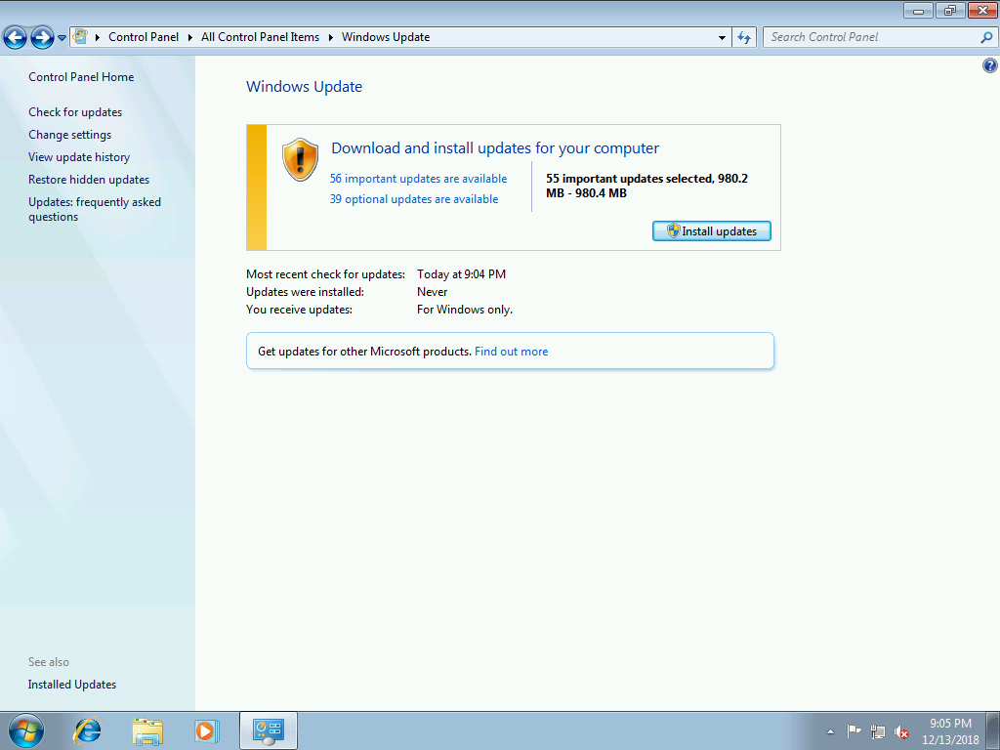
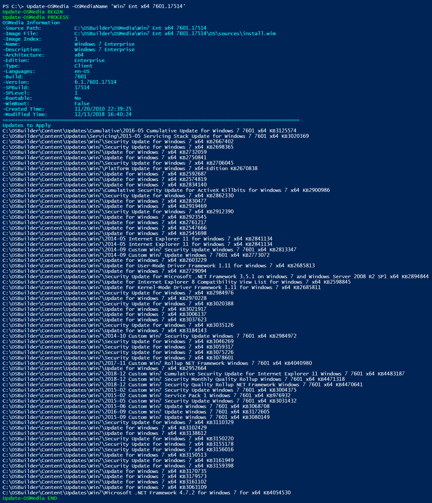
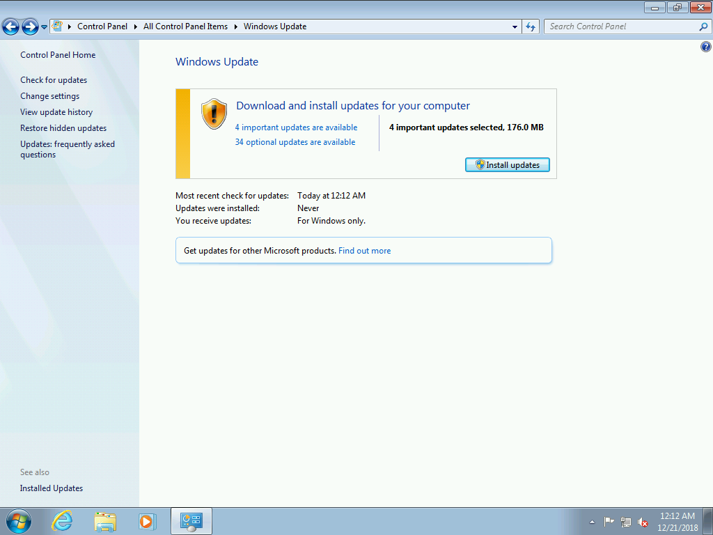
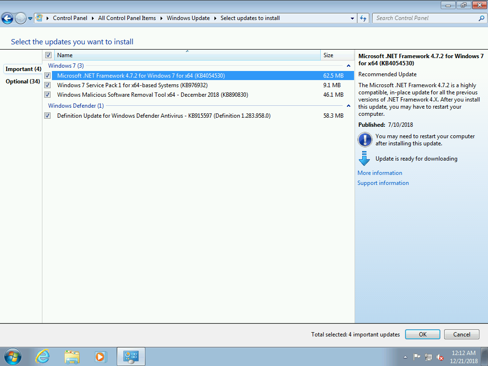
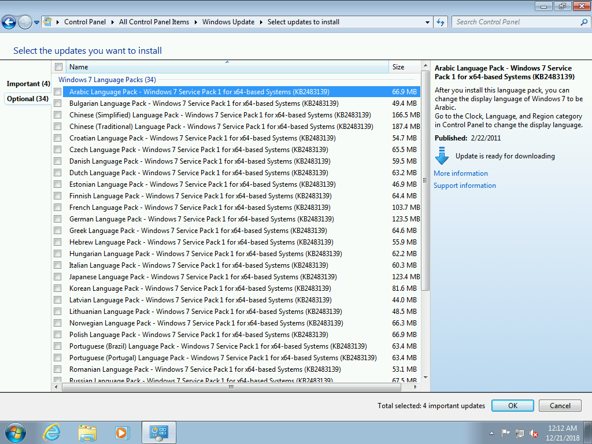

# OSBuilder Windows 7

I have not decided if I will implement and support Windows 7 with OSBuilder, but here is the results.

## Win7 Ent x64 7601.17514 \(2.63GB\)

A few changes to **`Import-OSMedia`** allows me to import Windows 7 x64.  172 Important Updates are available with several additional Optional Updates

## Custom Updates

I had to add some custom updates to OSBuilder to get the ball rolling using **`New-OSBUpdate`**

This is the Servicing Stack and the Convenience Rollup





## Win7 Ent x64 7601.23403 \(3.21GB\)

After adding the updates I have an updated Build and the number of updates I need have dropped considerably.

## Custom Updates

Here are the updates that are added to Windows 7 with **`Update-OSMedia`**

## Win7 Ent x64 7601.24312 Final

Once complete, 4 Updates remain in Windows Update

Service Pack 1 is a simple check to make sure it is installed, the other updates are EXE based and can't be updated with Offline Servicing.

## Conclusion

With some minor changes, OSBuilder can be used to Offline Service Windows 7, and yes, this was a pain in the \*\*\* to solve!

