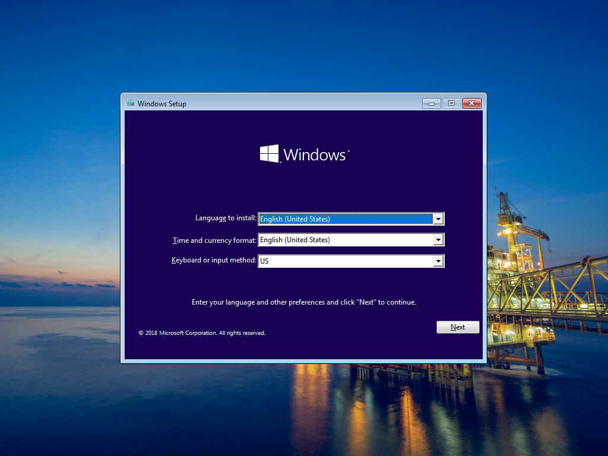
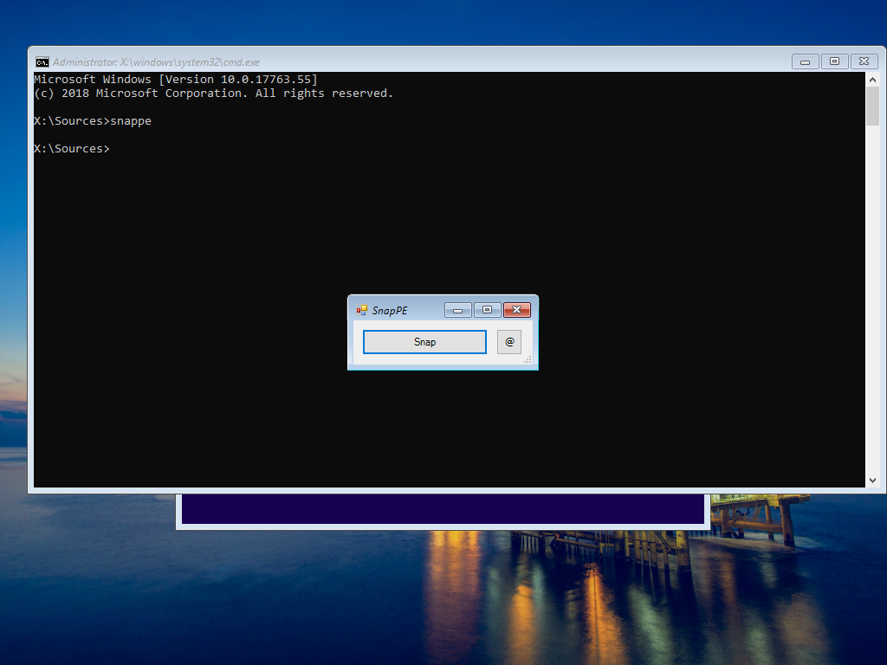
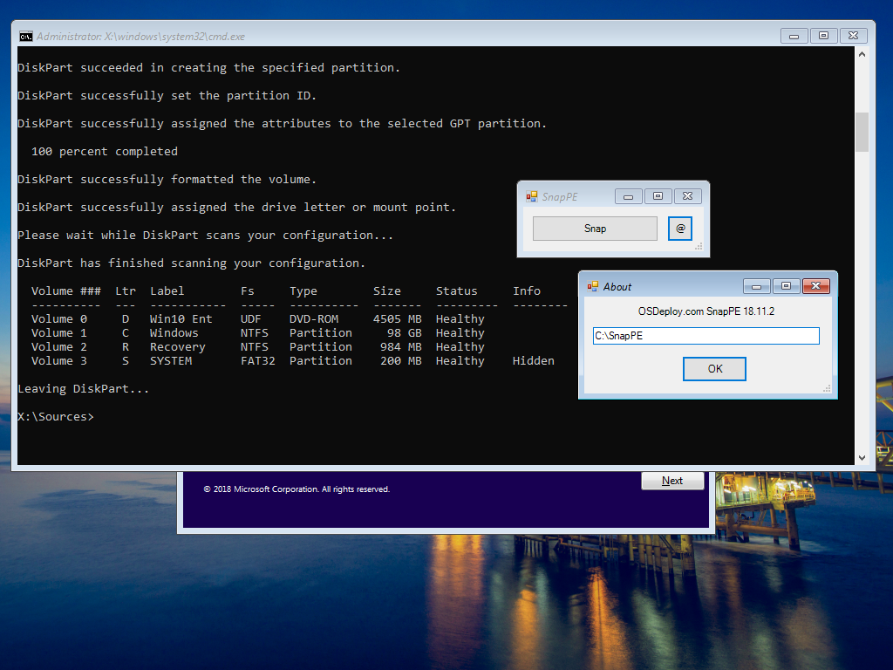
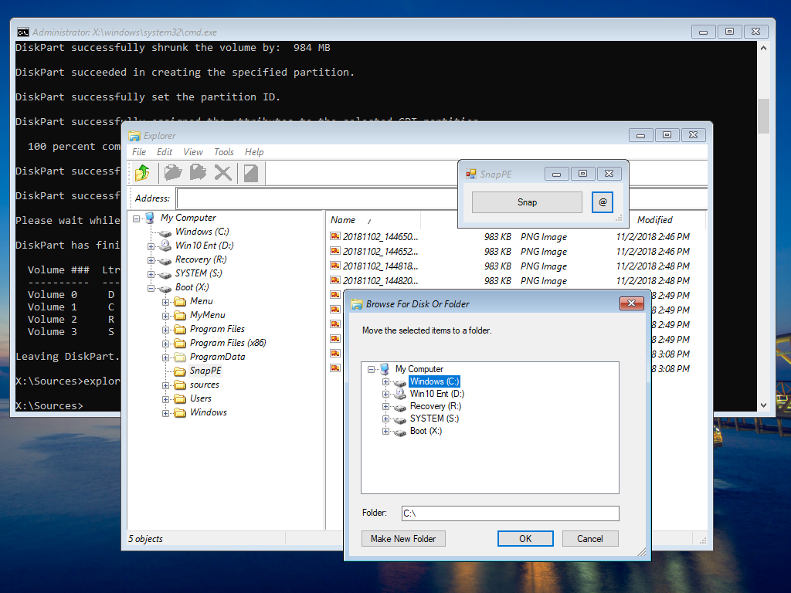
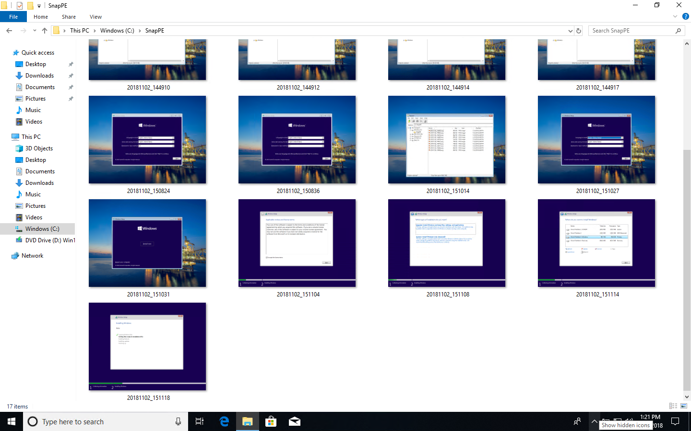
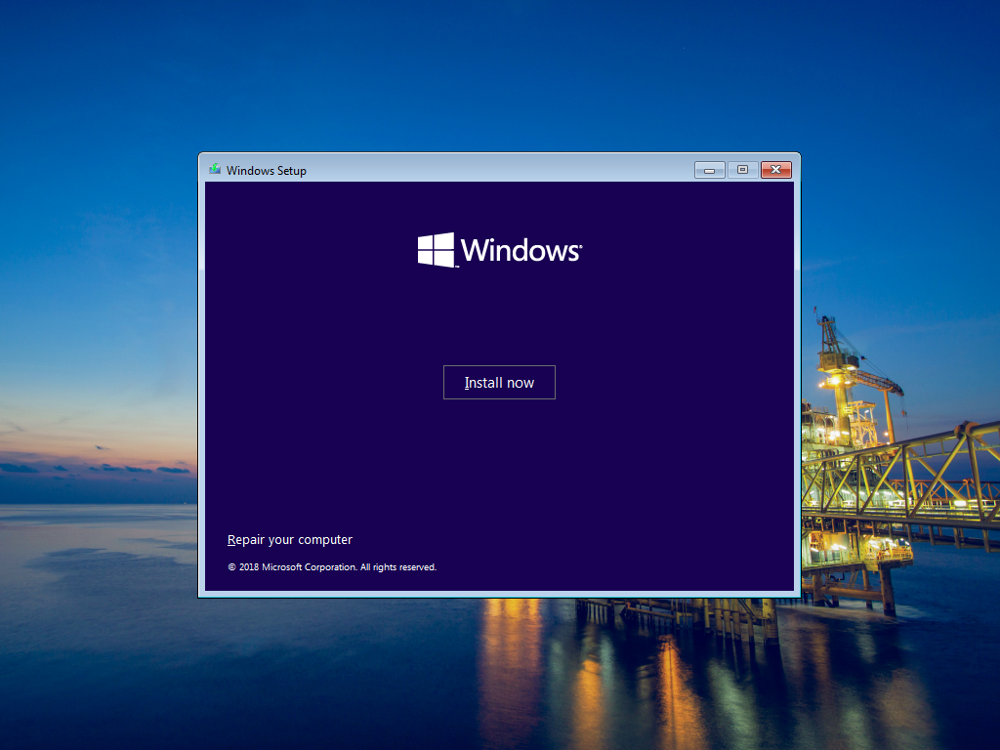
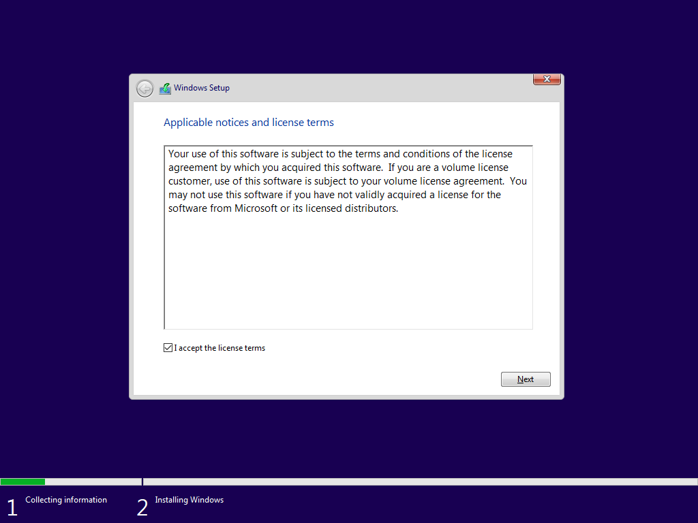
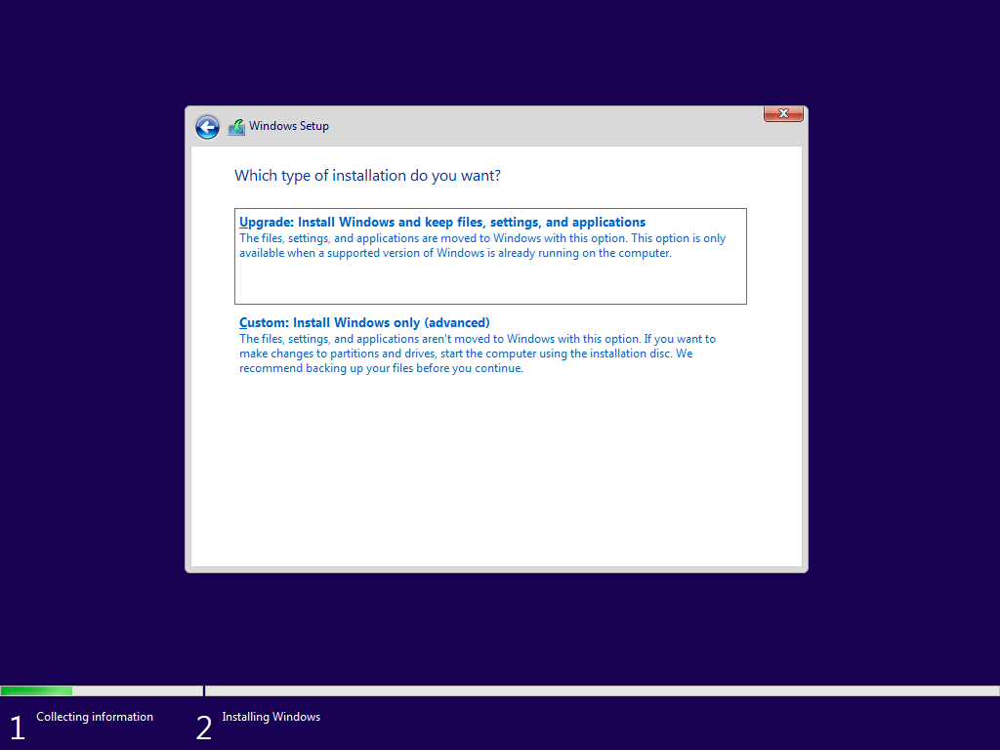
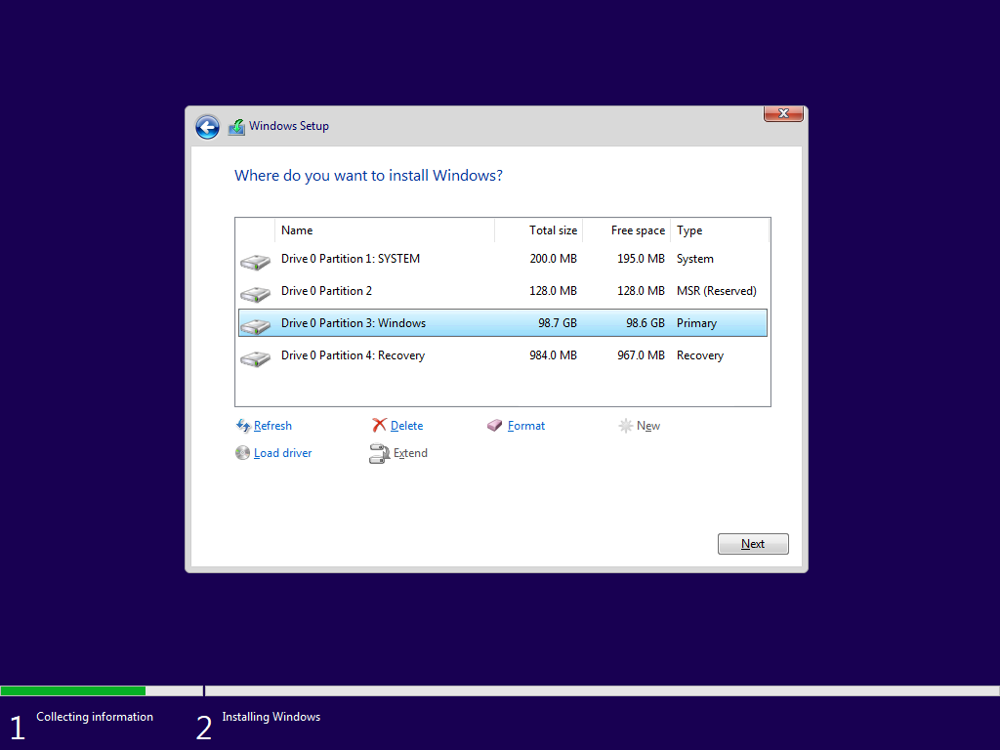
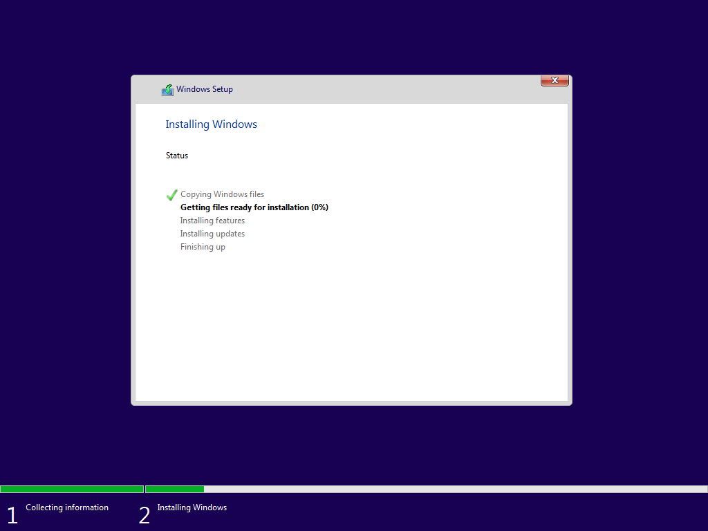

# PowerShell SnapPE

## **Download**



## OSBuilder Public

SnapPE is included in OSBuilder Public so you can easily add it using OSBuilder WinPE ExtraFiles



## Overview

**SnapPE** is a PowerShell WPF EXE used to take screenshots within WinPE.  You will need to add PowerShell from the ADK for this to work.

This can easily be added to WinPE in OSBuilder using [**WinPE Extra Files**](../osbuilder/osbuild/new-osbuildtask-winpe/winpe-extrafiles.md)\*\*\*\*

In this example I have included **SnapPE** in Windows Setup \(boot.wim Index 2\)

I will need to open the Command Prompt by holding down Shift + F10.  I can then launch SnapPE in the Command Prompt.

Pressing the Snap button will hide **SnapPE** and record the image as a PNG.  The default location  of the saves will be in X:\SnapPE

In the case of Windows Setup, saving to the Virtual Drive X won't help much, so I can WIPE my Hard Drive with a nifty script I have embedded, and redirect my snapshots

If I added Microsoft DaRT to Windows Setup, I can move the Snaps that I have already taken to the C Drive so I will have them after Windows comes online, or just redirect to a USB Drive

Now I can take my screenshots during Windows Setup

And when I am all done, everything should be saved in C:\SnapPE

## SnapPE Samples

The following screenshots were captured with **SnapPE**

