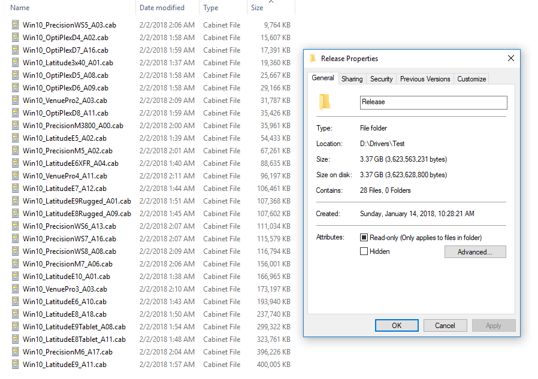

# Advanced Driver Optimization

Advanced Driver Optimization takes things up a level from standard Driver Optimization.

**Manufacturer Core Drivers** - Just like Core Drivers, this process consolidates Manufacturer Drivers. This requires more time but results in smaller Driver Packages.

**Driver Compression** - Deploying drivers into a compressed format, such as a CAB, will reduce the Driver Repository by at least 50%

**Using both of the methods above has achieved full Windows 10 x64 support on all Dell systems, using less than 3 GB of Total Drivers.**

**I will work on detailing this process soon . . .**

## Example - CAB Compression

If you followed my Optimization Example, using CAB Compression will reduce the Driver Repository by 4.05 GB

| Action | Recovered Space | New Repository Size |
| :--- | :--- | :--- |
| CAB Compression | 4.05 GB | 3.37 GB |

Here is how they look visually, sorted by size, with the largest CAB topping out at 400 MB.

**Adding a Manufacturer Core Driver Pack will reduce this from 3.37 GB to 1.60 GB**

