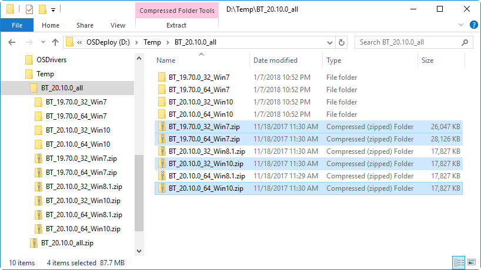

# Intel Bluetooth

The Intel Bluetooth Drivers should be downloaded from Intel using the IT Administrator Link. You should download the ALL version

[https://www.intel.com/content/www/us/en/support/articles/000005773/network-and-i-o/wireless-networking.html](https://www.intel.com/content/www/us/en/support/articles/000005773/network-and-i-o/wireless-networking.html)

The latest version at the time of writing is 20.10.0 which redirects to

[https://downloadcenter.intel.com/download/27392/Intel-Wireless-Bluetooth-for-IT-Administrators](https://downloadcenter.intel.com/download/27392/Intel-Wireless-Bluetooth-for-IT-Administrators)

You should download the ALL version


**Alternate Method:**

[https://www.intel.com/content/www/us/en/support/articles/000005559/network-and-i-o/wireless-networking.html](https://www.intel.com/content/www/us/en/support/articles/000005559/network-and-i-o/wireless-networking.html)

Additionally I have found you will need this specific version for Hardware ID VID\_8087&PID\_07DA

[https://downloadcenter.intel.com/download/26419/Wireless-Intel-Wireless-Bluetooth-for-Windows-10](https://downloadcenter.intel.com/download/26419/Wireless-Intel-Wireless-Bluetooth-for-Windows-10)

## Zip Extraction

Extract the OS Zip files that you need into directories.

These will have MSI Installers, but not Driver INF files.



## Bluetooth INF Files

To get INF files for the Bluetooth Drivers, you need to run the following command

```text
msiexec /a "%~dp0Driver.msi" /qb TARGETDIR="%~dp0Extract"
```

