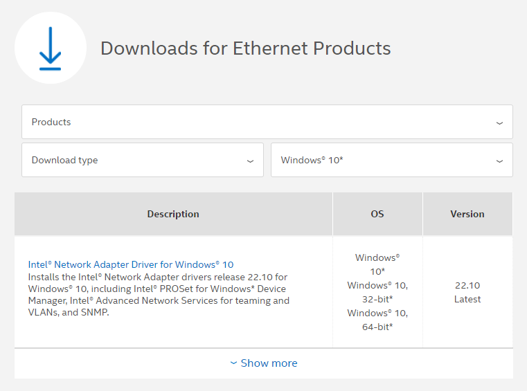
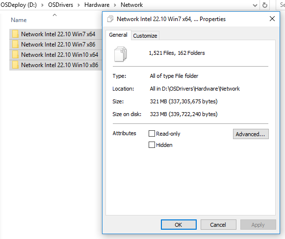

# Intel Network

All Intel Network Drivers can be obtained directly from Intel at the following link:

[https://downloadcenter.intel.com/product/36773/Ethernet-Products](https://downloadcenter.intel.com/product/36773/Ethernet-Products)

You can filter by Operating System as needed

## Driver Processing

Make sure you save the Drivers using a proper naming convention. After unpacking the Drivers there is some cleanup that can be done in the extracted directories to further reduce space.

* **WinPE** - Remove all directories named WinPE.  These can be used for updating Boot Images, but are not necessary with creating Driver Packages
* **APPS** - Remove directories named APPS as you should not need the Intel SDK and advanced installers for OS Deployment.  These directories consume most of the space
* **DOCS** - Remove these directories as these are non-essential

