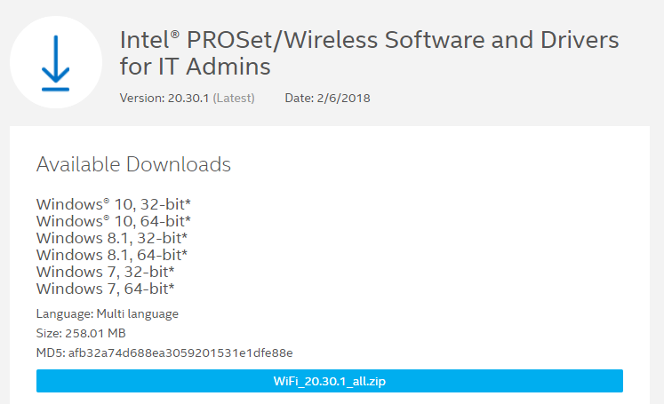

# Intel Wireless

For Windows 10, you only need a single download from Intel.

The Intel Wireless Drivers should be downloaded from Intel using the IT Administrator Link. You should download the ALL version

[https://www.intel.com/content/www/us/en/support/articles/000017246/network-and-i-o/wireless-networking.html](https://www.intel.com/content/www/us/en/support/articles/000017246/network-and-i-o/wireless-networking.html)

**Alternate Method with Version Information**

[https://www.intel.com/content/www/us/en/support/articles/000005559/network-and-i-o/wireless-networking.html](https://www.intel.com/content/www/us/en/support/articles/000005559/network-and-i-o/wireless-networking.html)

## Windows 7

If you are still deploying Windows 7, you will additionally need Versions 15.x, 16.x, and 18.x

