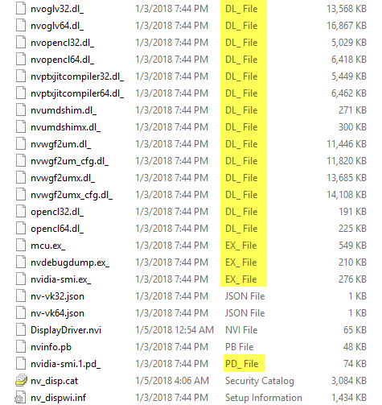

# Nvidia Video Drivers

To cover all of Windows 10 x64, you would typically only need 3 Drivers.

**Nvidia GeForce 390.65**

[http://www.nvidia.com/download/driverResults.aspx/129085/en-us](http://www.nvidia.com/download/driverResults.aspx/129085/en-us)

**Nvidia Quadro 377.83**

[http://www.nvidia.com/download/driverResults.aspx/130177/en-us](http://www.nvidia.com/download/driverResults.aspx/130177/en-us)

**Nvidia Quadro 390.65**

[http://www.nvidia.com/download/driverResults.aspx/129090/en-us](http://www.nvidia.com/download/driverResults.aspx/129090/en-us)

More information about Nvidia Video Drivers are below

## ODE - Optimal Driver for Enterprise Drivers

This is the long lifecycle driver branch providing ISV Certification, optimal stability and performance for Quadro customers. This is the driver that is most commonly deployed at enterprises

## QNF - Quadro New Feature Driver

The driver is a short lived branch where new Quadro features are deployed initially. Typically support for new Game Engines as well as new VR headsets are also introduced in this driver branch before rolling into the ODE driver

## SCCM Report Count Video Cards by Type

I'll start by referencing my SCCM Report - Count video cards by type. According to this Report, I have the following Nvidia Graphics Cards, sorted by popularity. These are my top 25 out of 77 total.

```text
NVIDIA NVS 5200M
NVIDIA NVS 4200M
NVIDIA Quadro M2000M
NVIDIA Quadro 4000
NVIDIA Quadro K1100M
NVIDIA Quadro K1000M
NVIDIA Quadro K4000
NVIDIA Quadro 2000
NVIDIA Quadro 1000M
NVIDIA Quadro M3000M
NVIDIA GeForce GT 720M
NVIDIA Quadro K3100M
NVIDIA Quadro K2100M
NVIDIA Quadro M4000
NVIDIA Quadro FX 580
NVIDIA Quadro K3000M
NVIDIA NVS 3100M
NVIDIA Quadro K2000
NVIDIA Quadro FX 570
NVIDIA Quadro K2000M
NVIDIA Quadro 3000M
NVIDIA GRID M60-0Q
NVIDIA NVS 510
NVIDIA Quadro FX 2800M
NVIDIA Quadro NVS 420
```

## Nvidia NVS 5200M

Since the Nvidia NVS 5200M is my most popular Video Card, this is what I will focus on. I will head over to [http://www.nvidia.com/Download/index.aspx](http://www.nvidia.com/Download/index.aspx) and download this driver. I notice that this uses the


On the Download page I see that this Driver will work for several of my Nvidia Video Cards in my environment.


I'll download and repeat this process for my other Operating Systems.

## Nvidia GeForce GT 720M

Since GeForce Drivers are not part of the Quadro Driver Pack, I'll download these drivers as well.

## Unpack Drivers - Don't

The easiest method to expand the Drivers is to double click the EXE file, but when extracting multiple drivers it is easier to Unzip them. Also, extracting the drivers will not run any Setup Program.


## Unpack Drivers - Do

7-Zip will unzip the EXE \(but not uncompress the underscored files\). A simple Right Click will take care of all the downloaded Drivers


## Compressed Files

Nvidia likes to compress their Drivers. You can identify the compressed files as the extension ends in an underscore. You can't just rename the files, you have to expand them first.



If you require further reading on this method, see this link

[https://technet.microsoft.com/en-us/library/cc938939.aspx](https://technet.microsoft.com/en-us/library/cc938939.aspx)

> Typically, files compressed with this tool are named with the last letter of the file name extension replaced with an underscore character \(\_\) to clearly identify the file as compressed.

## Nvidia Junk

Nvidia adds several Junk files to the Drivers that are not needed and not used when installing during OSD.


The following Directories can be safely removed in my experience.

```text
"Display.NView",
"Display.Optimus",
"Display.Update",
"DisplayDriverCrashAnalyzer",
"GFExperience",
"GFExperience.NvStreamSrv",
"MSVCRT",
"nodejs",
"NV3DVision",
"NvBackend",
"NvCamera",
"NvContainer",
"NVI2",
"NvTelemetry",
"NVWMI",
"PhysX",
"ShadowPlay",
"Update.Core"
```

## PS Module OSDrivers - Expand-OSDriver

The OSDrivers PowerShell Module will easily handle the Expand of the Compressed Files, as well as removing the Nvidia Junk.

[https://www.osdeploy.com/psmodule/osdrivers/expand-osdriver.html](https://www.osdeploy.com/psmodule/osdrivers/expand-osdriver.html)


