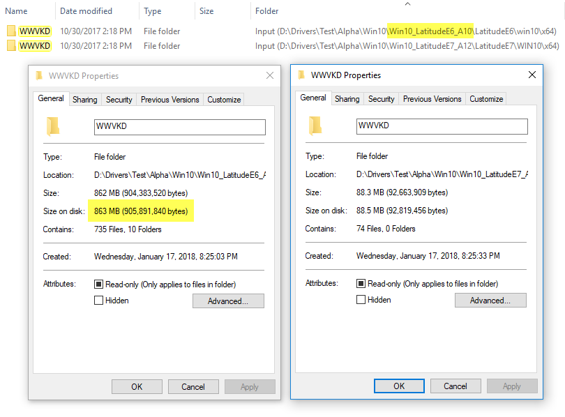
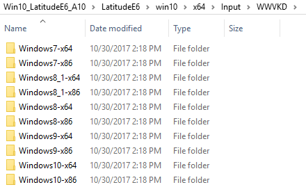
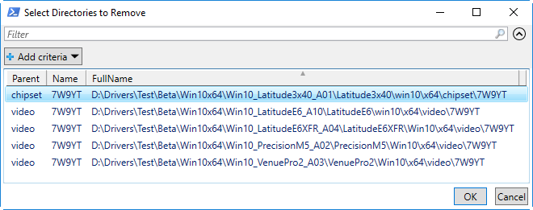
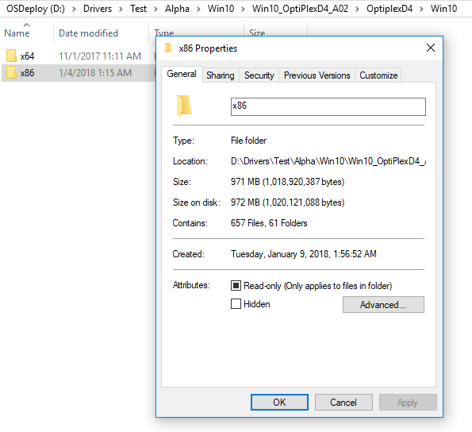
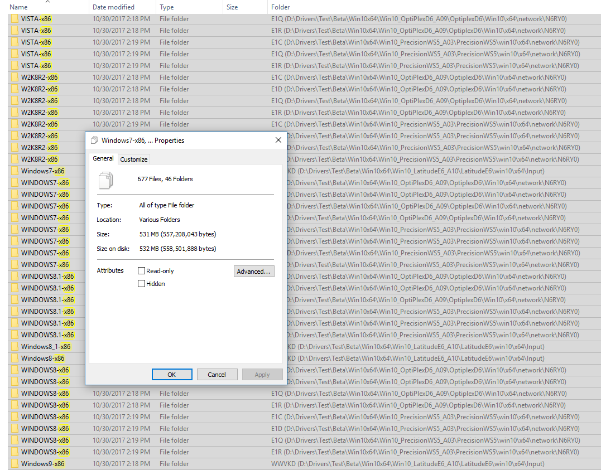
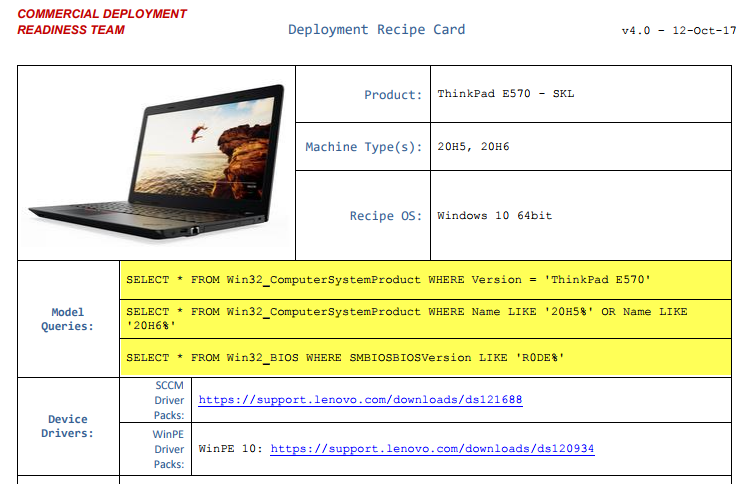

# Validate Drivers

Some examples of my observations from Driver Validation are listed below. In my Enterprise, roughly 95% of the Computers are Dell systems, so I apologize in advance for picking on them in this article.

## Fat Touchpad Drivers

Dell has a Touchpad Driver \(WWVKD\) that is used in the Latitude E6 A10 and the Latitude E7 A12 Family Driver CABs, but why is the one in the E6 10 times larger than the one in the E7?



The solution is easy, remove everything except Windows10-x64



## Incorrect Category

Not sure why a Intel Video Driver \(Dell Download 7W9YT\) would be listed under Chipset in the Latitude 3x40 A01 Family Pack, when it should be in Video.



## Driver Packs include x86 and x64 Drivers

Is there really a logical reason these are combined? Here is my 1.7GB OptiPlex D4 Driver Pack with almost 1 GB in x86 Drivers. These should be separated as most everyone will either not use the x86 Drivers, or create Separate Driver Packages if they do need them.



## x86 Drivers in x64 Drivers

Easy enough to fix, but this would only be caught with proper Validation. This is not the same issue as above, these are clearly in the x64 part of the Driver Pack.



## Incomplete Readme.txt

Located in the Driver Pack is a Readme.txt which contains some information. This one in particular is from the Dell Precision WS8 A08 Family Pack.

```text
Dell TechCenter Community

Family Driver ZIP for Dell

OS:       Win10 
Date:     2017-08-31 11:16
Revision: A08

Note: This driver CAB is provided As-is with no warranty of functionality or support. Use at your own risk.  The Dell TechCenter community maintains this ZIP file.  Comments or concerns can be posted there.

The Dell drivers that are applied to a given system with this driver pack may be different Dell drivers than the supported Dell drivers available on support.dell.com

This driver pack does not attempt to have the most current drivers for each model listed.  It contains drivers that work best for the series of models listed below.

The goal of this driver pack is to have a single cab for a series of systems, for the purpose of:

1. Simplify driver management.
2. Minimize storage required for drivers.
3. Support Stand-alone media limitations.

A current list of tested models is maintained on DellTechCenter.com at 

http://en.community.dell.com/techcenter/enterprise-client/w/wiki/11438.dell-family-driver-cab-s

WMI Queries for targeting of this driver pack are as follows:

1. Use a If Statement so that the correct queries below will apply.

select * from Win32_ComputerSystem where Model like 'Venue %'
select * from Win32_ComputerSystem where Model like 'Latitude %'
select * from Win32_ComputerSystem where Model like 'XPS %'
select * from Win32_ComputerSystem where Model like 'Precision %'
select * from Win32_ComputerSystem where Model like 'Optiplex %'

For additional information on how to use the Dell Family Driver package, go to http://www.dell.com/imageassist  for the latest documentation.

Supported Systems: 
                32BIT - No Systems Supported
                64BIT - 5720AIO,PRECISION7920RACK,PRECISION7920XLRACK,PRECISION5820TOWER,PRECISION5820XLTOWER,PRECISION7820TOWER,PRECISION7820XLTOWER,PRECISION7920TOWER,PRECISION7920XLTOWER


Individual CABS Integrated into build:
```

The WMI Queries in here are generic and incomplete. In comparison the Lenovo Recipe Cards are very accurate and helpful.



[https://support.lenovo.com/us/en/solutions/ht104042](https://support.lenovo.com/us/en/solutions/ht104042)

If we are instructed to use WMI Queries in this document, why are the proper ones not included? Looking at the x64 supported models is easy enough to tell where they should apply, but hard for me to get the proper WMI Query correct, without having these systems present in the first place.

```text
5720AIO,PRECISION7920RACK,PRECISION7920XLRACK,PRECISION5820TOWER,PRECISION5820XLTOWER,PRECISION7820TOWER,PRECISION7820XLTOWER,PRECISION7920TOWER,PRECISION7920XLTOWER
```

## Conclusion

With proper Driver Optimization, these issues can be resolved \(except for the incomplete Readme.txt\). You should be checking every Driver you import to ensure they are valid.

