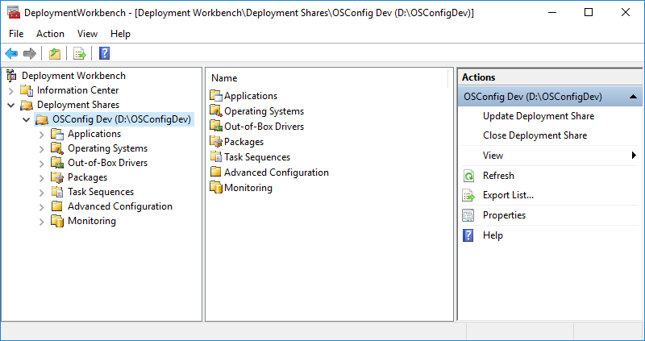
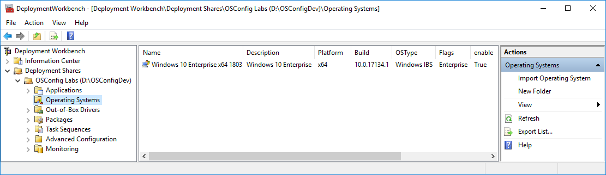
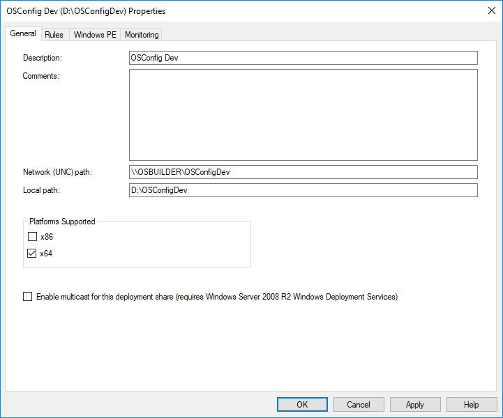
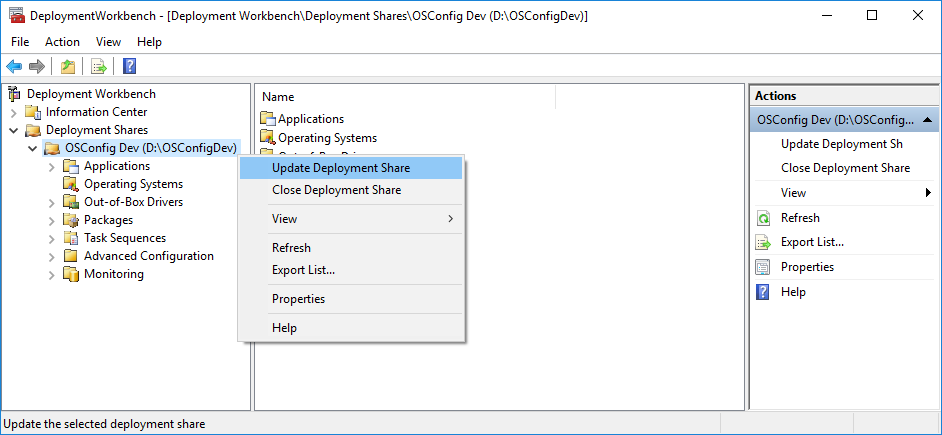
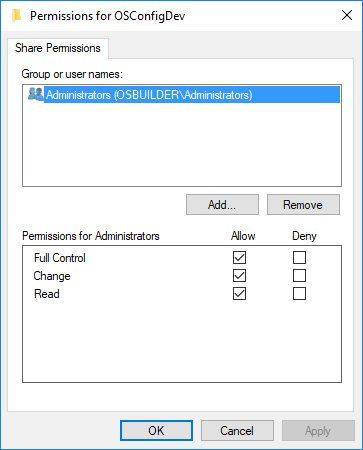
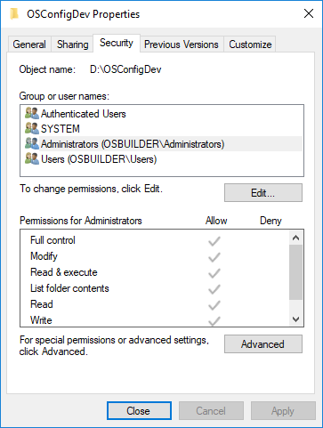

# MDT Deployment Share

The fastest way to setup, customize, and test OSConfig is by creating an MDT Deployment Share on your computer and testing with Hyper-V.


Remember this is "Development", not "Production". Don't try to use an existing MDT Share


## OSConfigDev Deployment Share

Complete the MDT Wizard and create a new Deployment Share called OSConfigDev

## Import an Operating System

In my case, I imported Windows 10 Enterprise x64 1803

## Edit Deployment Share Properties

No need to create an x86 Boot Image. Everything else should be ok

### Update Deployment Share

You will need to update the Deployment Share to create the Boot Image

## Edit Share and NTFS Permissions

Make sure you have Full Control in your Share Permissions

And NTFS Full control as well. You will be copying files back and forth, so this will save some time

