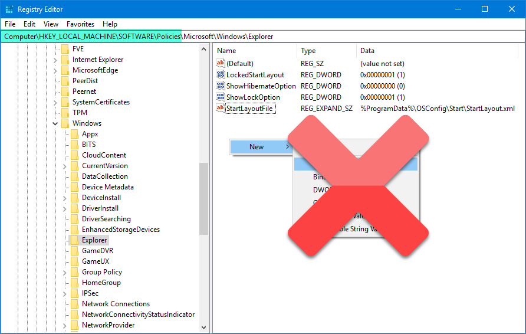
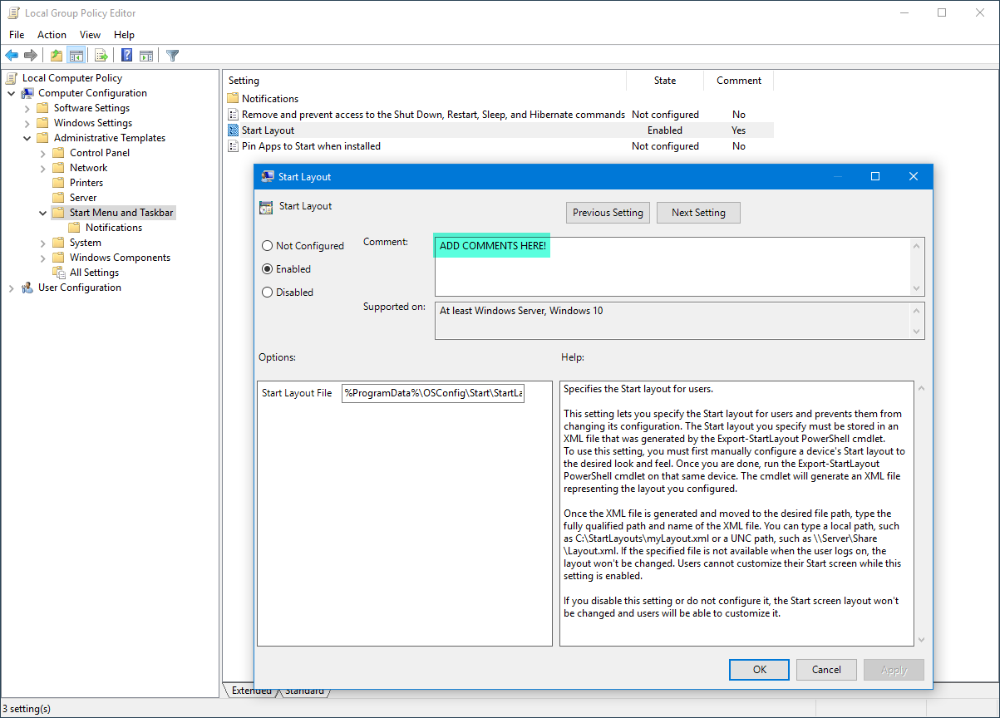

# Editing Policy Reg Keys

If you are adding registry entries in any of the following Keys in the Registry . . . 

* HKEY\_CURRENT\_USER\Software\Policies
* HKEY\_CURRENT\_USER\Software\Microsoft\Windows\CurrentVersion\Policies
* HKEY\_LOCAL\_MACHINE\SOFTWARE\Policies
* HKEY\_LOCAL\_MACHINE\SOFTWARE\Microsoft\Windows\CurrentVersion\Policies

Stop doing this!  Make your changes the right way . . . Manage these changes using Local Policy, Group Policy, or ConfigMgr!

