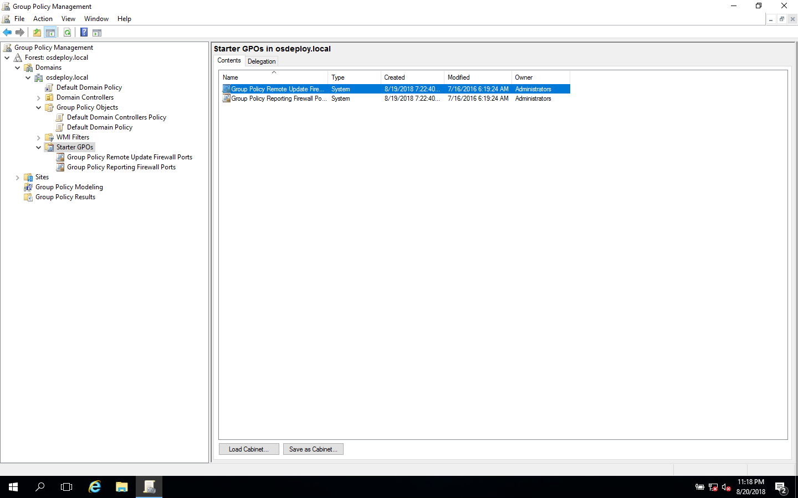

# Group Policy Management

The goal of this section is to setup a GPO with Policies and Preferences \(Registry\).  I found it easier to work on this section by setting up my own standalone Domain Controller.  If you don't have rights to create Group Policies, you may find creating your own will work much better than working with your Active Directory team.

Make sure that before you start, you have updated your ADMX Templates from this link

[https://support.microsoft.com/en-us/help/3087759](https://support.microsoft.com/en-us/help/3087759)

