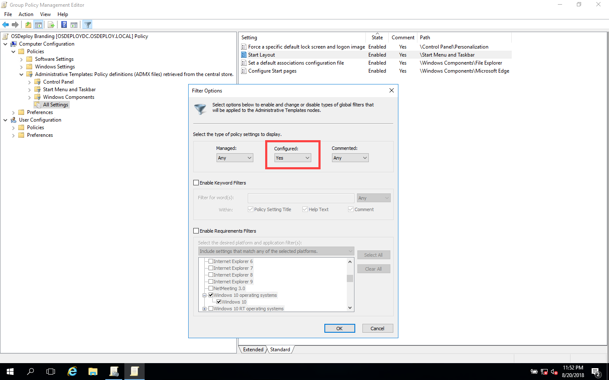

# OSDeploy Branding

All customizations related to Operating System customizations should be specified in this GPO.  The following configurations are set in this Policy

* \(Computer\) Lock Screen Image: %ProgramData%\OSConfig\Background\LockScreen.jpg
* \(Computer\) Start Layout: %ProgramData%\OSConfig\Start\StartLayout.xml
* \(Computer\) Default Associations: %ProgramData%\OSConfig\Applications\AppAssoc.xml
* \(Computer\) Edge Start Page: www.osdeploy.com
* \(User\) Theme: %ProgramData%\OSConfig\Theme\Custom.theme

Edit your Edge Start Page to your Corporate Home Page and leave the others alone for now.

### Filter Options

You can easily see just the edited Policies by enabling Filter Options

