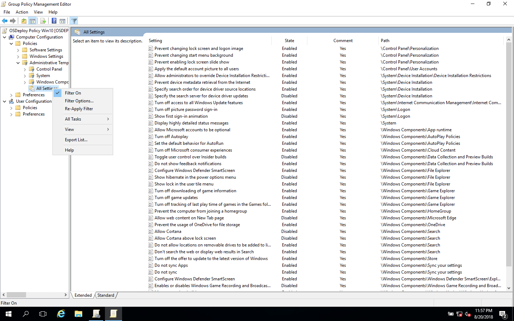

# OSDeploy Policy Win10

Edit the OSDeploy Policy Win10 \(and Win7\) to suit your Enterprise.  Make sure your Filter Options are on so you can remove Policies that you do not want added to your Enterprise OS Configuration.  How you configure your systems by Policy is entirely up to you.

