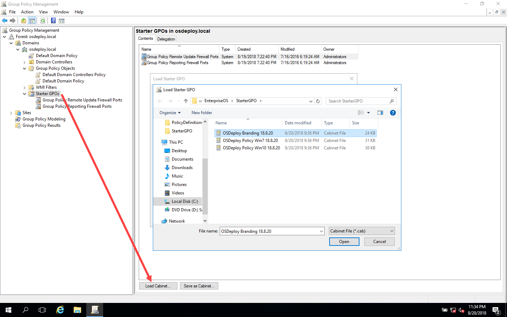
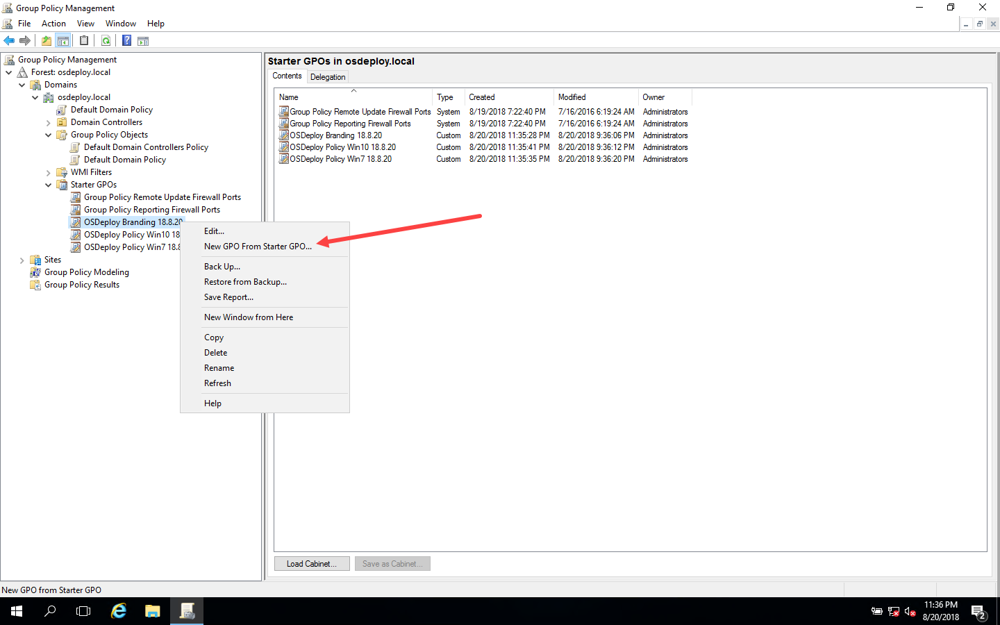

# Starter GPOs

The best way I can share my Group Policies is to convert them to Starter GPOs for you to work with.


OSDeploy Starter GPOs are on [GitHub](https://github.com/OSDeploy/EnterpriseOS/tree/master/StarterGPO)


Download my Starter GPOs from this link [https://github.com/OSDeploy/EnterpriseOS/tree/master/StarterGPO](https://github.com/OSDeploy/EnterpriseOS/tree/master/StarterGPO)

### Import Starter GPOs

In Group Policy Management, select Starter GPOs and import my CAB files individually.  No need to import the Win7 Starter GPO if you are only working with Windows 10

### Create New Group Policy Objects

From each of the Starter GPOs that were imported, create a "New GPO From Starter GPO"

Once this is complete, you should have new Group Policy Objects

