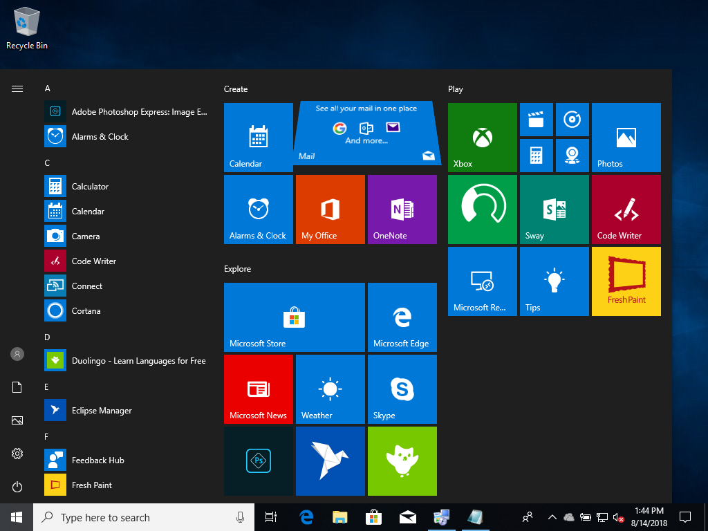
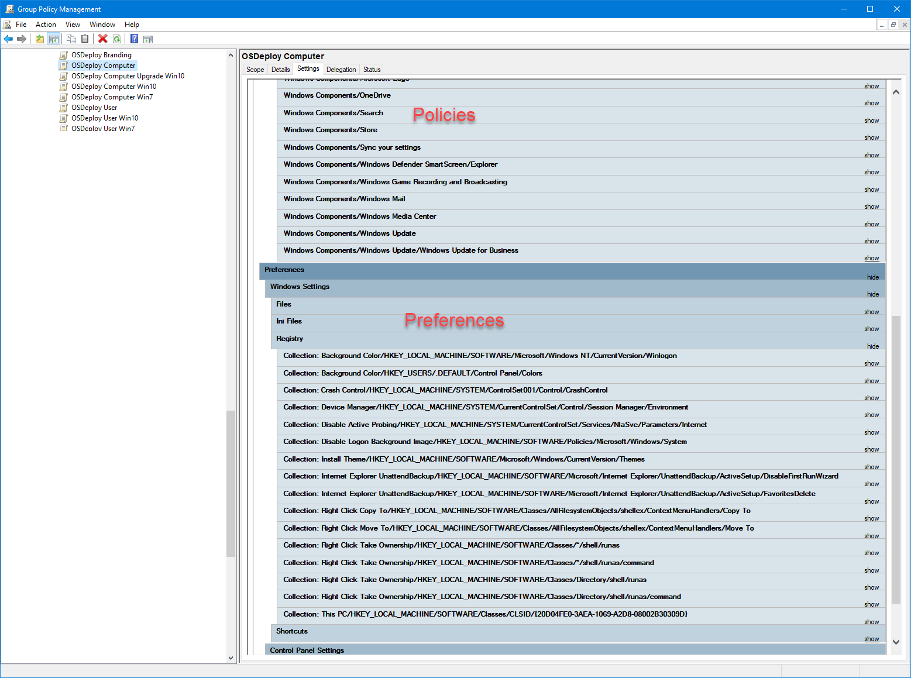
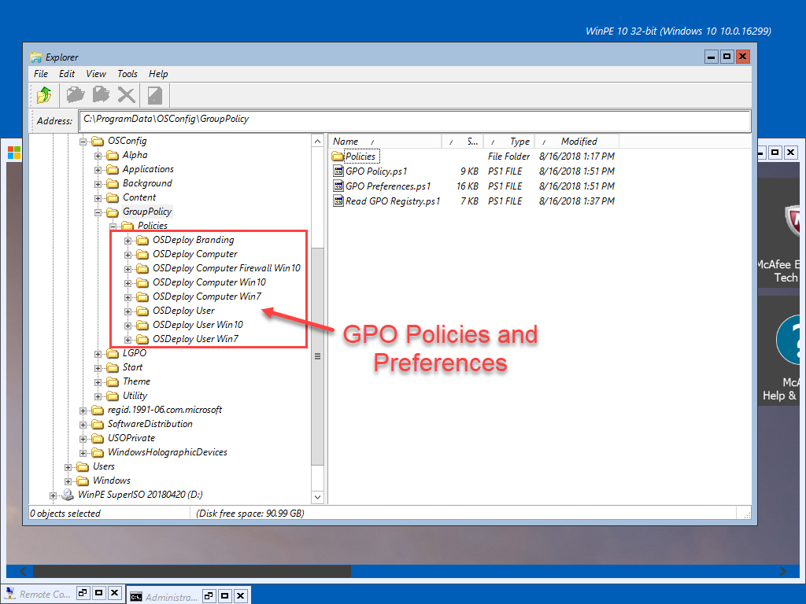
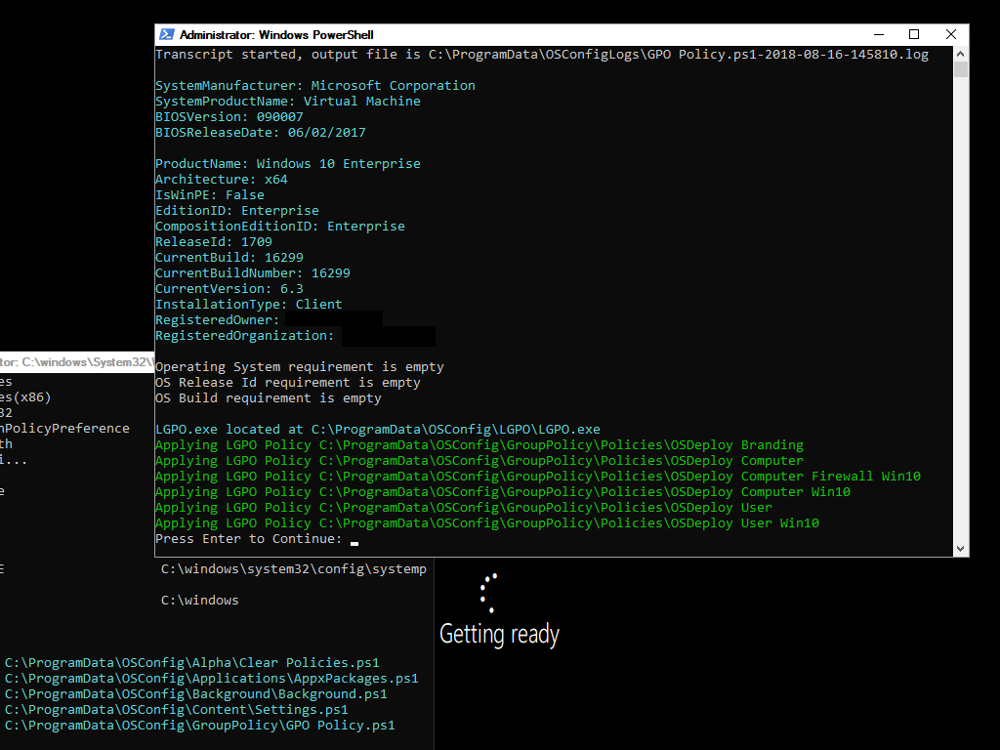
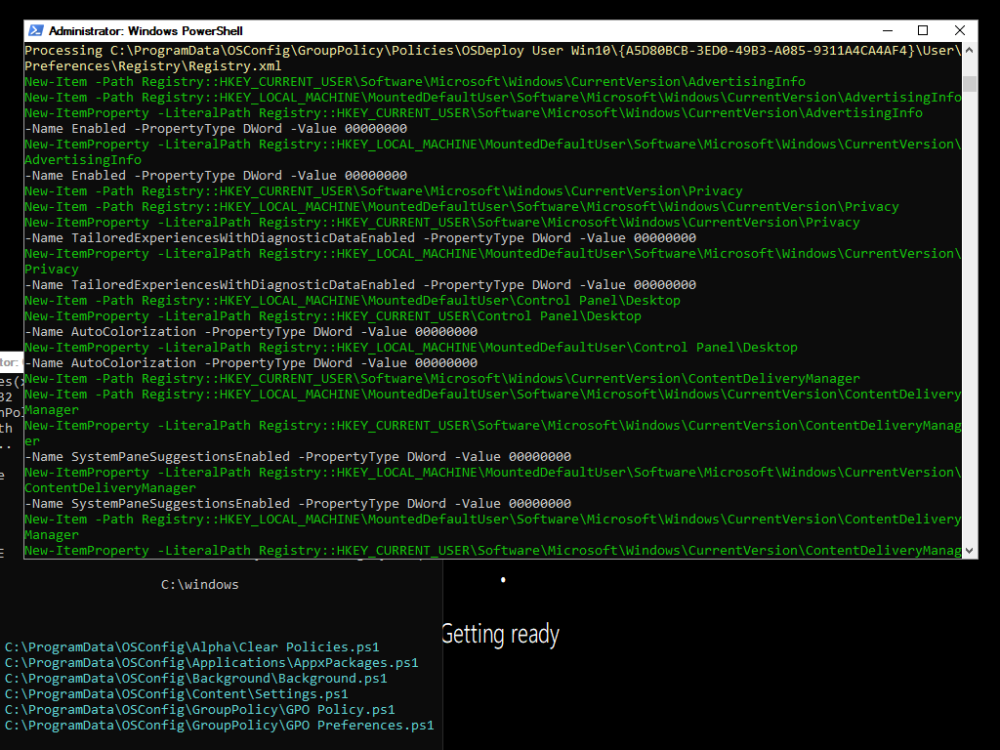
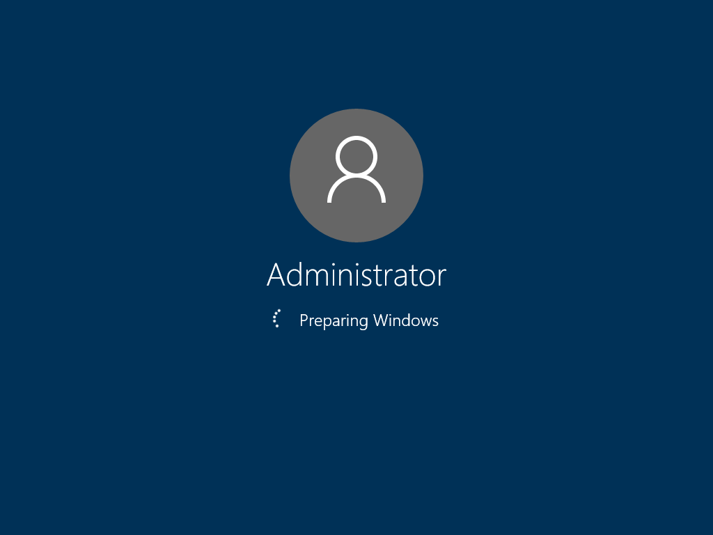
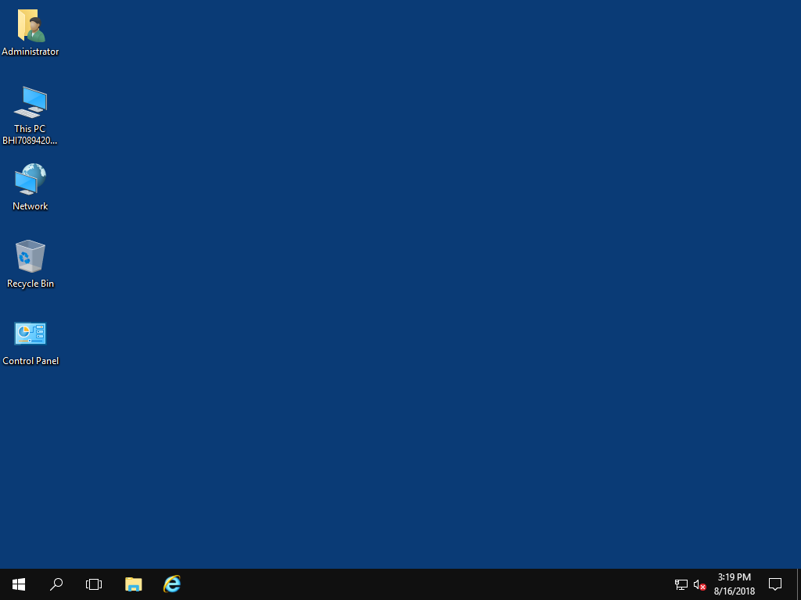
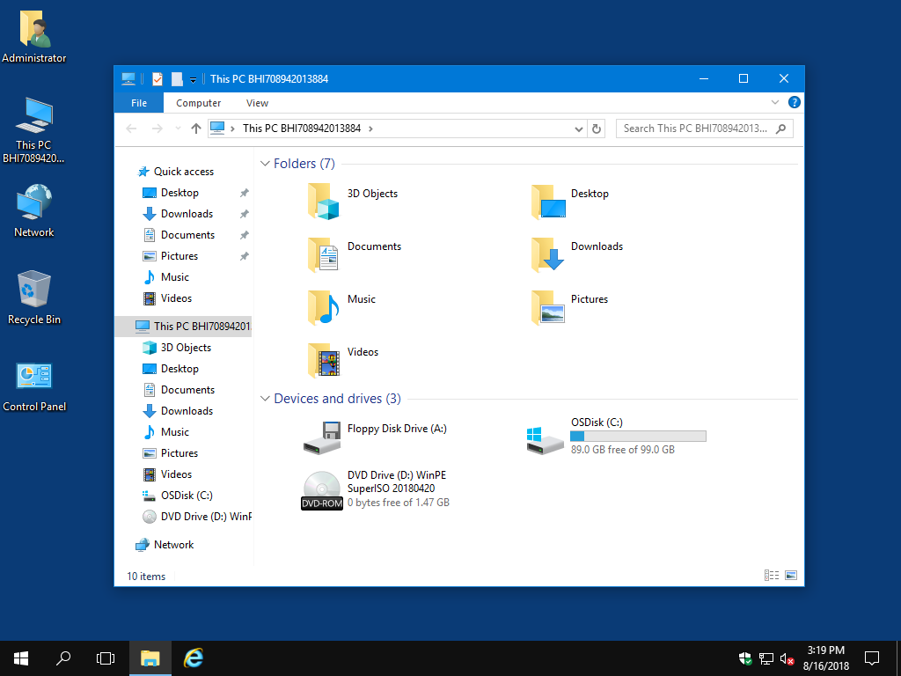
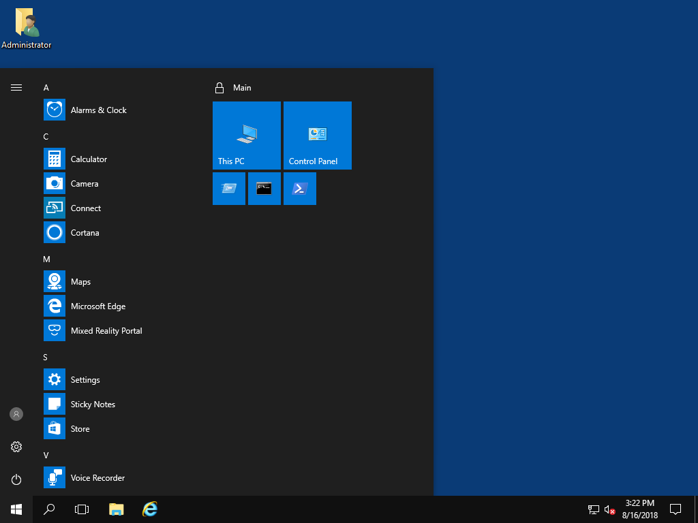

# Enterprise OS Overview

I am going to shift gears from OSBuilder to detailing how to customize Windows 10 from its default configuration to a fully customized Enterprise OS using Group Policy.  Be patient while I get the documentation up to speed.

### Default Windows 10

We all know what it looks like if you do nothing.  This is simply not an ideal presentation for your Enterprise

### Group Policy

It's actually much easier to take all your Policies and Preferences and put them in Group Policy instead of having multiple steps and custom scripts in your Task Sequence

### Local Copy

Once you have all your settings in Group Policy, simply the Policies from SysVol to your OS during deployment, or run in an SCCM Package.

### LGPO

Use Local GPO to apply these Policies

### Apply Preferences with PowerShell

Since LGPO only applies Policies and not Preferences, simply add a PowerShell script to read the GPO Preferences and apply the settings \(yes I will publish said script soon\)

### Enterprise OS

And as soon as Windows starts for the first time, everything is configured exactly how you want it.  Fully customized without multiple steps in the Task Sequence.

