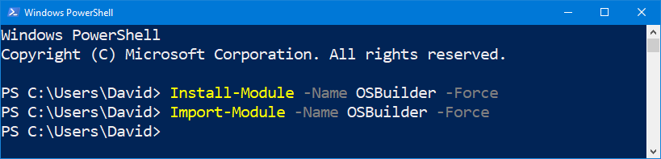
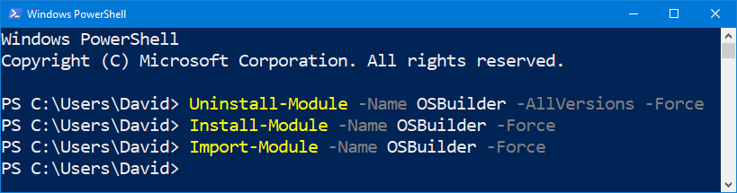

# Installation

## PowerShell Gallery

**OSBuilder** is published in the [**PowerShell Gallery**](https://www.powershellgallery.com/)\*\*\*\*

\*\*\*\*[**https://www.powershellgallery.com/packages/OSBuilder**](https://www.powershellgallery.com/packages/OSBuilder)\*\*\*\*

## Clean Install

If you don't have an existing version of OSBuilder installed, you can simply Install and Import OSBuilder with the following **PowerShell** commands

```text
Install-Module -Name OSBuilder -Force
Import-Module -Name OSBuilder -Force
```



## Update Existing Version

If you have an existing version of OSBuilder, you will need to Uninstall-Module first with the following **PowerShell** commands

```text
Uninstall-Module -Name OSBuilder -AllVersions -Force
Install-Module -Name OSBuilder -Force
Import-Module -Name OSBuilder -Force
```



