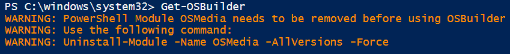

# Requirements

## Admin Rights

**OSBuilder** requires Admin Rights in PowerShell as you will be mounting Windows Images for Offline Servicing.  This is a requirement of DISM

## Operating System Requirements

The **OSBuilder** PowerShell Module requires an OS Version of 10, which includes the following Operating Systems

* **Windows 10**
* **Windows Server 2016**
* **Windows Server 2019**


Using the **OSBuilder** PowerShell Module on Windows 7 or Windows Server 2012 will only cause pain, grief, and sorrow


## Offline Servicing Operating Systems

OSBuilder will allow you to fully Update and Customize Windows 10, Server 2016, or Server 2019.  Windows 7 and Server 2012 can be Updated but not Customized

| **Operating System** | **Update** | **Customize** |
| :--- | :--- | :--- |
| **Windows 7** | **YES** | **NO** |
| **Windows 10** | **YES** | **YES** |
| **Windows Server 2012** | **YES** | **NO** |
| **Windows Server 2016** | **YES** | **YES** |
| **Windows Server 2019** | **YES** | **YES** |

## Hardware Requirements

Offline Servicing of Windows 10 can take a considerable amount of time, especially on older releases. The process of Mounting a WIM, Applying a Cumulative Update, and performing DISM Image Cleanup will take as little as 30 minutes \(1803 x86\) on a healthy Intel Core i7 computer with a SSD, to almost 2 hours \(1607 x64\) on the same system.

I strongly recommend using a Workstation class system in performing these updates.

Since OSBuilder will mount Windows Images, I strongly recommend that you do not have any running Anti-Virus scanning files ON ACCESS. McAfee will prevent the dismounting of images properly.


OSBuilder works best on a stand alone Workgroup computer without an AntiVirus performing On Access Scanning.  Use a Virtual Machine \(with some power\) as an alternate solution


## OSMedia

If you used my previous attempt at this called OSMedia, you will need to get rid of it first.

