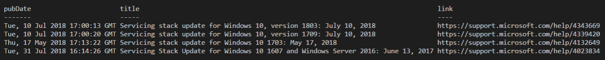
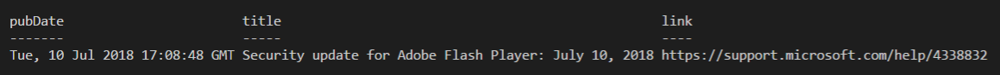
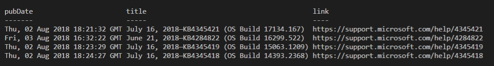
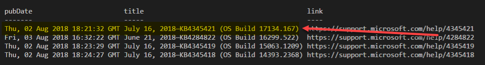
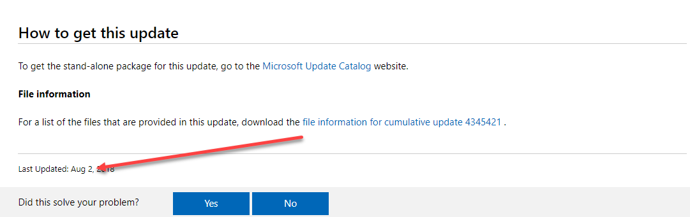
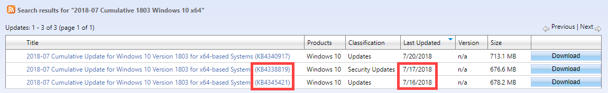
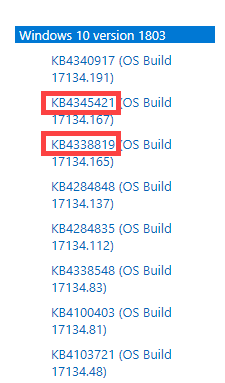

# Automating Windows Update Downloads

I have been asked on more than one occasion about automating the download of Servicing Stacks, Cumulative Updates, and Adobe Security Updates.  Let's first see if this is possible.

### Get-LatestSSU \(Servicing Stacks\)

With a simple PowerShell script, we can check Microsoft RSS for the latest Servicing Stacks 

```text
$rss = "https://support.microsoft.com/app/content/api/content/feeds/sap/en-us/6ae59d69-36fc-8e4d-23dd-631d98bf74a9/rss"
$rssFeed = [xml](New-Object System.Net.WebClient).DownloadString($rss)
$feed = $rssFeed.rss.channel.item | Where-Object {$_.title -like "*Servicing Stack Update for Windows 10*"}

$feed | Where-Object {$_.title -like "*1803*"} | Select-Object -Property pubDate, Title, Link -First 1
$feed | Where-Object {$_.title -like "*1709*"} | Select-Object -Property pubDate, Title, Link -First 1
$feed | Where-Object {$_.title -like "*1703*"} | Select-Object -Property pubDate, Title, Link -First 1
$feed | Where-Object {$_.title -like "*1607*"} | Select-Object -Property pubDate, Title, Link -First 1
```

And we get a nice output of the latest ones



### Get-LatestAdobe

```text
$rss = "https://support.microsoft.com/app/content/api/content/feeds/sap/en-us/6ae59d69-36fc-8e4d-23dd-631d98bf74a9/rss"
$rssFeed = [xml](New-Object System.Net.WebClient).DownloadString($rss)
$feed = $rssFeed.rss.channel.item

$feed | Where-Object {$_.title -like "*Security update for Adobe Flash Player*"} | Select-Object -Property pubDate, Title, Link -First 1
```



### Get-LatestCU \(Cumulative Updates\)

```text
$rss = "https://support.microsoft.com/app/content/api/content/feeds/sap/en-us/6ae59d69-36fc-8e4d-23dd-631d98bf74a9/rss"
$rssFeed = [xml](New-Object System.Net.WebClient).DownloadString($rss)
$feed = $rssFeed.rss.channel.item

$feed | Where-Object {$_.title -like "*OS Build*" -and $_.title -like "*17134*"} | Select-Object -Property pubDate, Title, Link -First 1
$feed | Where-Object {$_.title -like "*OS Build*" -and $_.title -like "*16299*"} | Select-Object -Property pubDate, Title, Link -First 1
$feed | Where-Object {$_.title -like "*OS Build*" -and $_.title -like "*15063*"} | Select-Object -Property pubDate, Title, Link -First 1
$feed | Where-Object {$_.title -like "*OS Build*" -and $_.title -like "*14393*"} | Select-Object -Property pubDate, Title, Link -First 1
```



### Automating Downloads

Great so we have everything we need, now time to automate the download, right?  Not so fast.  Take a closer look at what the latest CU for 1803 was . . . it should be 17134.191 right?



How can this be?  The pubDate shows that this was updated August 2 . . . Take a look at [https://support.microsoft.com/en-us/help/4345421](https://support.microsoft.com/en-us/help/4345421) and you will see, Microsoft likes to go back and edit their Update History



### Microsoft Update Catalog

Ok, let's try Microsoft Update Catalog to see if we can somehow determine the latest Cumulative Update

[https://www.catalog.update.microsoft.com/Search.aspx?q=2018-07+Cumulative+1803+Windows+10+x64](https://www.catalog.update.microsoft.com/Search.aspx?q=2018-07+Cumulative+1803+Windows+10+x64)



If you simply go by the Last Updated you will see these are not always accurate.  Go back to Windows Update History and check again [https://support.microsoft.com/en-us/help/4099479](https://support.microsoft.com/en-us/help/4099479)



Yes, the Microsoft Update Catalog had an OLDER KB listed as NEWER.

### Mistakes Were Made

So I have pointed out issues with using RSS and Microsoft Update Catalog, so what about the Windows 10 Update History pages?  Yes, this is not always accurate as well.


### What's the Point?

If you decide you want to Automate your downloads of Windows Updates, be cautious as you have no way of knowing if your Automatic download is actually pulling the right updates.  If YOU are integrating updates in your Windows Image, YOU are responsible, and YOU should be aware of what you are putting in your Image.

If you are one of the many people that have ever applied a Cumulative Update without installing a Servicing Stack, and never took the time to look in the DISM log to see if it actually installed, then automating too much has burned you already.

I can absolutely integrate full automation of the SSU and CU's, but one thing I can say is that I TEST the integration of CU's and SSU's before I add them to the JSON files so you can download them.  We have three points of data to get the updates, Microsoft Update Catalog, Microsoft RSS, and Microsoft Update History.  I have pointed out issues with all three of them.  Until there is a 100% accurate sources for identifying which are the accurate updates to download, you do NOT want this automated.  I validate all three sources, YOU should validate my work as well.

**Garbage In . . . Garbage Out**


