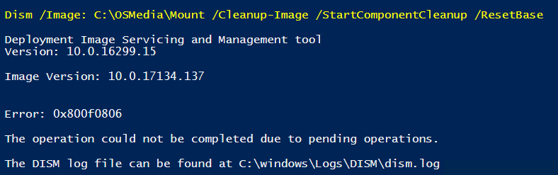

# DISM Cleanup Image Pending Operations

I'll write more on this topic in the next few days. The main takeaway is that you cannot run a

```text
Dism /Image:<MountPath> /Cleanup-Image /StartComponentCleanup /ResetBase
```

if you have a Windows Capability with Install Pending



You can run Get-WindowsCapability on a Mounted Windows Image to see what the problem is


