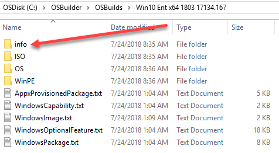
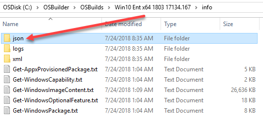
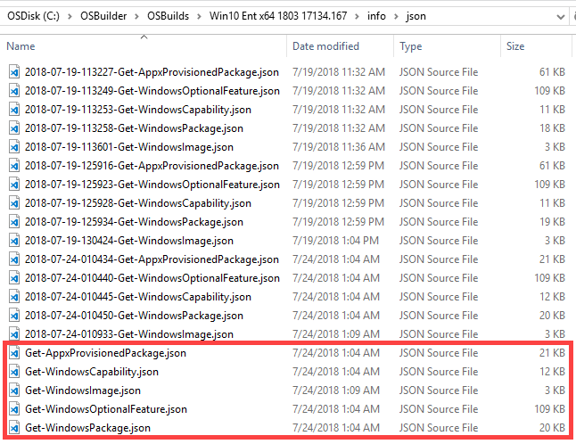

# OSBuilder OS Information

OSBuilder is able to display a complete list of information about any OSMedia or OSBuild. To see an example of the information, see the [How To: Show OS Information](../functions/media/show-mediainfo.md).

So here is how it works. All OSMedia and OSBuilds have the following directory structure \(ISO is optionally created using **New-OSBuilderISO**\). All the configuration about the Operating System is saved in the TXT files in the root where it is easily readable. OSBuilder uses information in the info subdirectory \(removing this directory will kill your ability to use this Operating System with OSBuilder\)

## info Directory

All the Logs when using OSBuilder are saved in the logs directory. This can get quite large so keep an eye on this. OSBuilder uses the content in the json subdirectory. Information in the xml subdirectory is identical to the json subdirectory, just in a different format.

## json Directory

Historic configuration always includes the DATE TIME of creation. The oldest ones would be when the Operating System was imported.

Current Configuration does not contain the DATE TIME in the name \(there is an identical Historic copy\).

It is these files that OSBuilder uses when prompting you to select Appx Packages to remove or Features to enable. These files are updated any time the Operating System is mounted with OSBuilder.

So now you know the secret to why OSBuilder can show you so much information about the Operating System.

