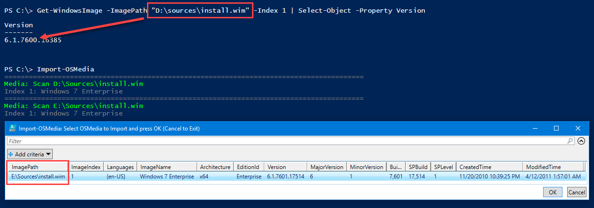
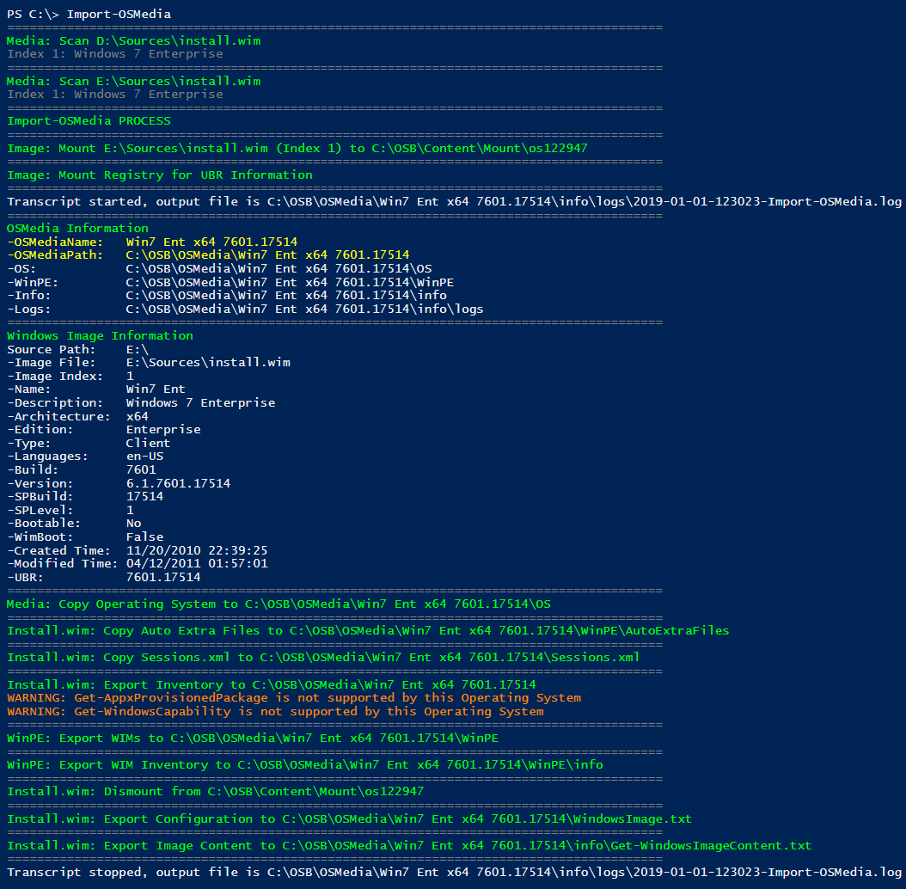

# Import OSMedia

## Requirements

**OSBuilder** will only support **Windows 7 x64 SP1 \(version 7601\)**.  There are no plans to support non-SP1 Media . . . ever

In this example, I have mounted the following

* **Windows 7 x64 \(Version 7600\)**
* **Windows 7 x64 SP1 \(Version 7601\)**

In the image below you can see that [**`Import-OSMedia`**](../../functions/osmedia/import-osmedia.md) will not recognize the non-SP1 media

## Import-OSMedia

You can use [**`Import-OSMedia`**](../../functions/osmedia/import-osmedia.md) and select **Windows 7 x64 SP1** without issues

