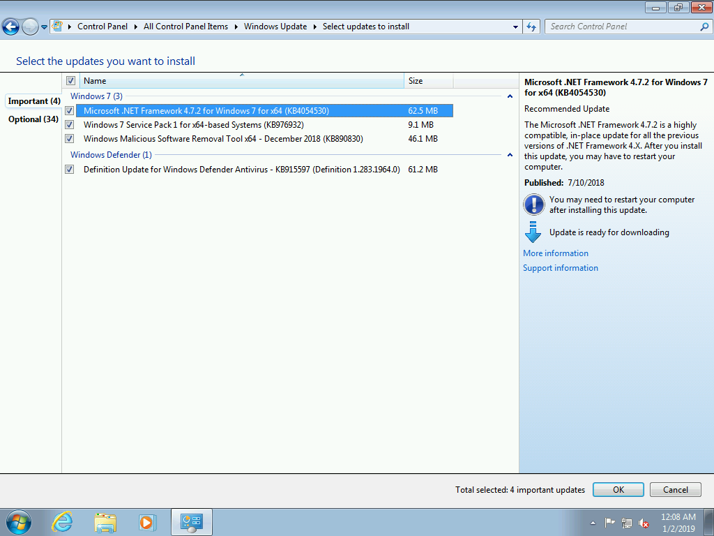

# ISO Testing

Create a new ISO with [**`New-OSBMediaISO`**](../../functions/media/new-osbmediaiso.md) and install Windows 7 on a clean Virtual Machine

## Windows Update

Here is what Windows 7 x64 SP1 7601 looks like without running through OSBuilder

After using OSBuilder, Windows Update looks much better.  The remaining updates cannot be added through Offline Servicing.  Windows 7 Service Pack 1 is just a check to make sure that it is installed properly, as you can see from the 9.1MB size.

