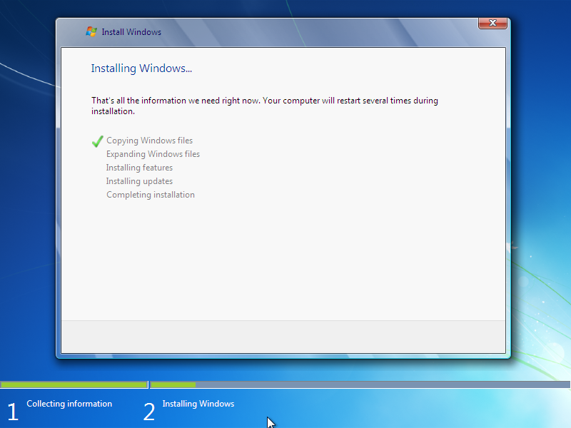
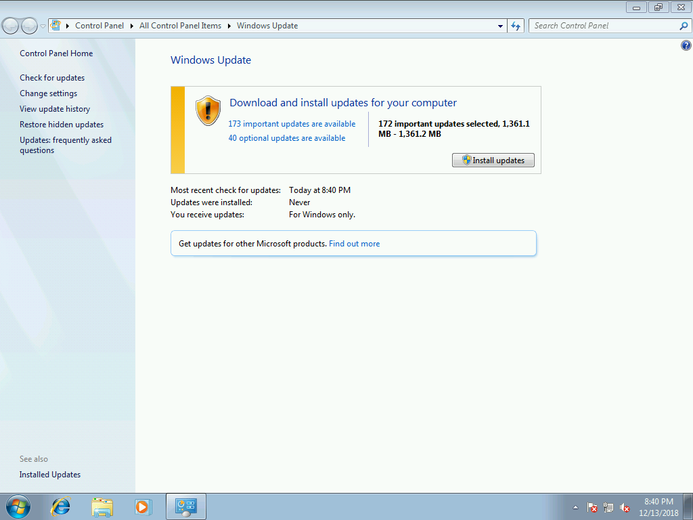

# ISO Testing

Create a new ISO with [**`New-OSBMediaISO`**](../../functions/media/new-osbmediaiso.md) and install Windows 7 on a clean Virtual Machine

## Windows Update

Here is what Windows 7 x64 SP1 7601 looks like without running through OSBuilder

After using OSBuilder, Windows Update looks much better

