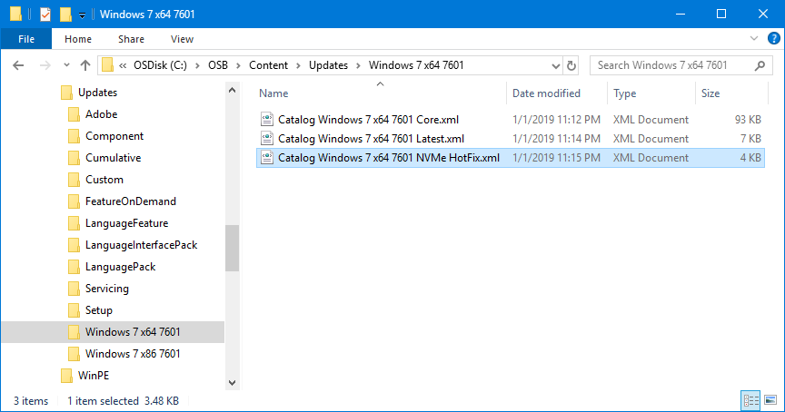
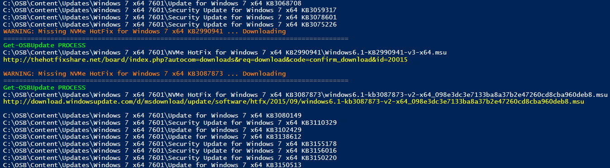
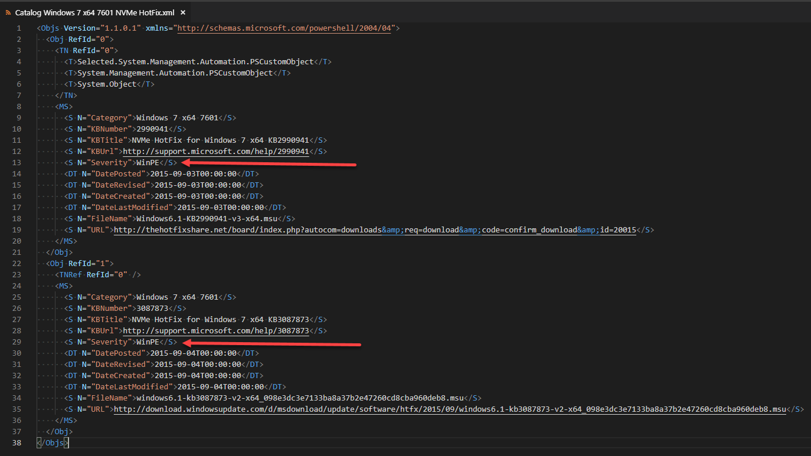

# NVMe Hotfix

To enable **NVMe** support to Windows 7 you need to add **KB2990941** and **KB3087873**





## OSBuilder Catalog XML

The issue is that this Hotfix is not available from Microsoft anymore, which explains why it is not automatically added to OSBuilder.  The only place I could find the MSU file was on a Third Party website.


Microsoft Update KB2990941 is hosted by a Third Party \([http://thehotfixshare.net/board/](http://thehotfixshare.net/board/)\), but is digitally signed by Microsoft


To add these Hotfixes to OSBuilder simply download the attached XML file and save it in **C:\OSBuilder\Content\Updates\Windows 7 x64 7601**



## Update-OSMedia -DownloadUpdates

Simply run another [**`Update-OSMedia -DownloadUpdates`**](../../functions/osmedia/update-osmedia/#update-osmedia-downloadupdates) to get the added Hotfixes and you should be ready to go

## WinPE

For Windows 7, only the Servicing and Cumulative Updates are applied to WinPE.  For the NVMe Hotfixes, I change the Severity of the update to WinPE.  OSBuilder will automatically import these Microsoft Updates in WinPE for Windows 7 as long as this value is present.

## Windows 7 x86 SP1 7601

While I do not have any plans on adding Windows 7 x86 SP1 7601 support, here is the XML files if you decide YOU want to do this.  Save this file in **C:\OSBuilder\Content\Updates\Windows 7 x86 7601**



And here's a minimal and very incomplete CORE file



