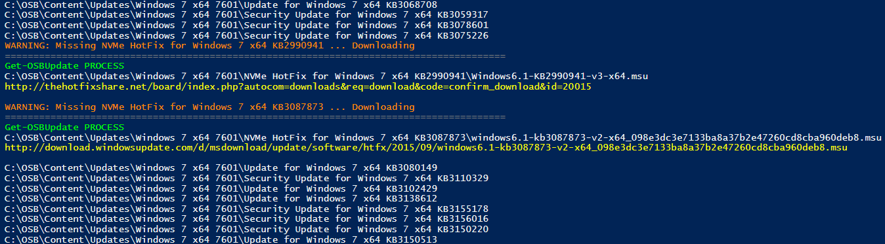

# Win7 - NVMe Hotfix

## NVMe Hotfix KB2990941

To enable NVMe support to Windows 7 you need to add this **KB2990941**



The issue is that this Hotfix is not available from Microsoft anymore, which explains why it is not automatically added to OSBuilder.  The only place I could find the MSU file was on a Third Party website.

If you require this update, save this XML file to **&lt;OSBuilder&gt;\Content\Updates\Windows 7 x64 7601**




This Microsoft Update is hosted by a Third Party \([http://thehotfixshare.net/board/](http://thehotfixshare.net/board/)\), but is digitally signed by Microsoft


## NVMe Hotfix KB3087873

Additonally you will need a second Hotfix which can be added easily to OSBuilder

If you require this update, save this XML file to **&lt;OSBuilder&gt;\Content\Updates\Windows 7 x64 7601**



Here is the KB Article for reference



## Update-OSMedia -DownloadUpdates

Simply run another [**`Update-OSMedia -DownloadUpdates`**](../../functions/osmedia/update-osmedia/#update-osmedia-downloadupdates) to get the added Hotfixes and you should be ready to go

## Windows 7 x86 SP1 7601

While I do not have any plans on adding x86 support, here are the necessary XML files if you decide YOU want to do this





