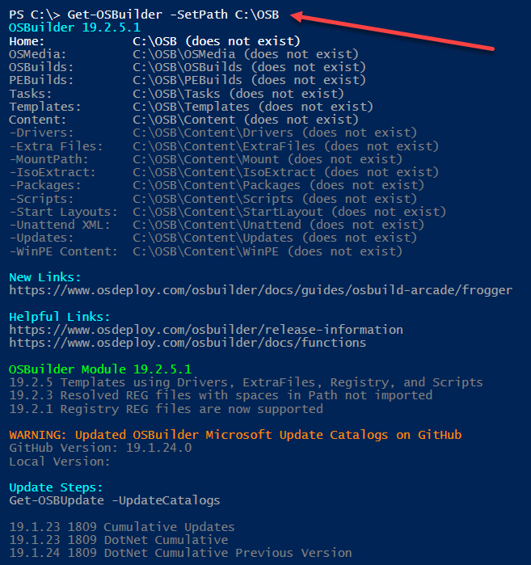
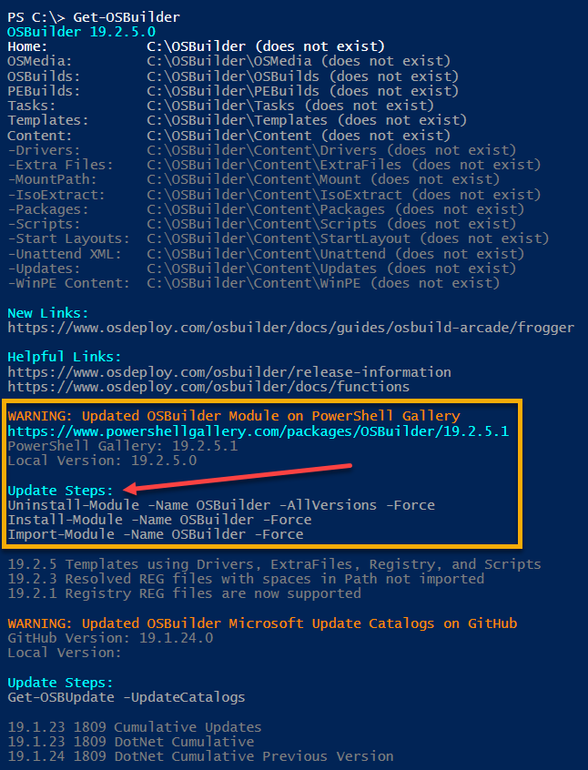
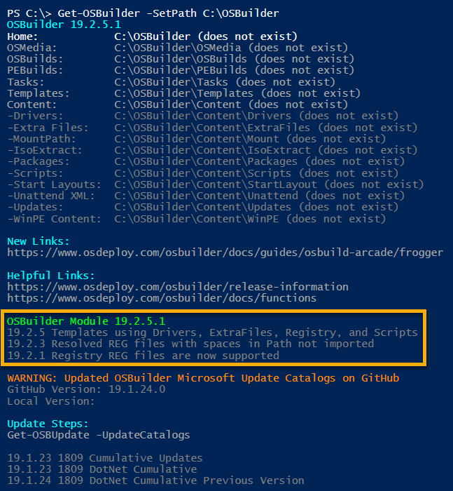
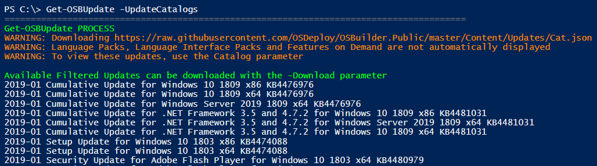
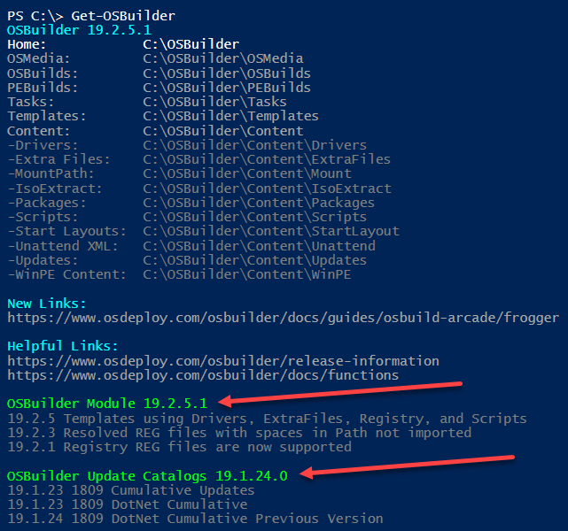

# Get Started


**Open PowerShell with Admin Rights**


## Get-OSBuilder

This simple command will get you started.  When using Get-OSBuilder for the first time, it will automatically select C:\OSBuilder as the OSBuilder Home directory


## Get-OSBuilder -SetPath C:\OSB

If this path doesn't work for you, then you can set the path to something else



## Module Information

If your computer is online, the OSBuilder Module Version is checked to ensure that it is up to date.  If it is not, you will receive a warning.  The Update Steps will be displayed so you can copy/paste in PowerShell

```text
Uninstall-Module -Name OSBuilder -AllVersions -Force
Install-Module -Name OSBuilder -Force
Import-Module -Name OSBuilder -Force
```



If everything is OK, the **OSBuilder Module Version** will be displayed in Green



## Catalog Information

OSBuilder downloads Microsoft Update Catalogs to know which Patches are required for Offline Servicing.  Make sure you have access to the following link.  You may need to configure Firewall or Proxy information.



If the OSBuilder Catalogs require an update, the PowerShell command will be displayed


You can copy the PowerShell command from the Console and execute it.  This will download the latest Catalogs.  Additionally this command will create the OSBuilder directories

```text
Get-OSBUpdate -UpdateCatalogs
```



## Everything's OK

If the OSBuilder PowerShell Module and Update Catalogs are up to date, both Versions will be listed in Green and you will not see any Warnings



## Get-OSBuilder Function

For additional information and parameters, see the following link



