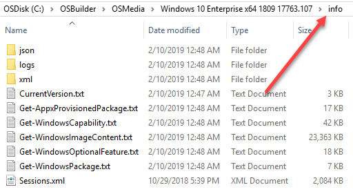
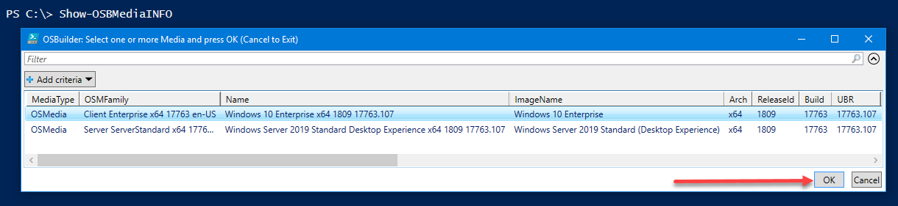
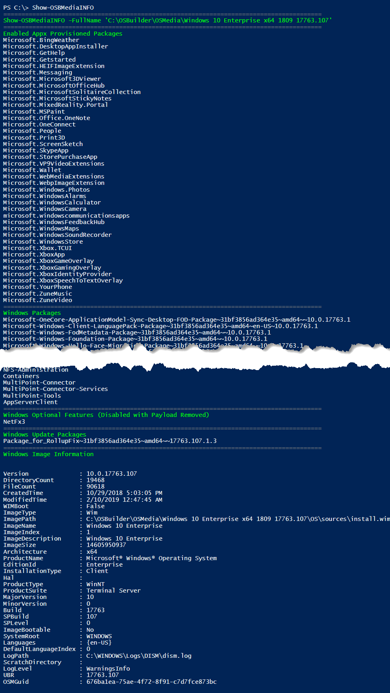

# OS Information

Every time an Operating System is mounted, information is exported and saved in the info directory.  To recover space, you may clear out any historical information that contains a date in the file name, but all other files are required by OSBuilder and should not be deleted.  You can easily view the TXT files for information



## Show-OSBMediaINFO

To have PowerShell display the information about any OSBuilder Media \(OSMedia, OSBuild, or PEBuild\), the following command can be used

```text
Show-OSBMediaINFO
```

You will be prompted to select an OSBuilder Media and press OK



This function will read the exported Operating System information and display the following

* **Enabled Appx Provisioned Packages**
* **Windows Packages**
* **Windows Packages \(Language\)**
* **Windows Capabilities**
* **Windows Capabilities \(Language\)**
* **Windows Optional Features \(Enabled\)**
* **Windows Optional Features \(Enable Pending\)**
* **Windows Optional Features \(Disabled\)**
* **Windows Optional Features \(Disabled with Payload Removed\)**
* **Windows Update Packages**
* **Windows Image Information**




