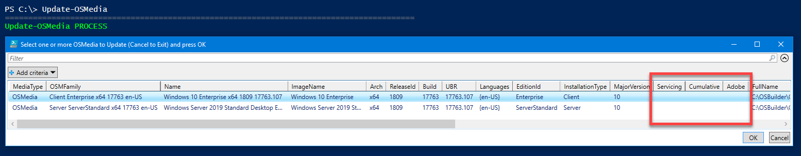
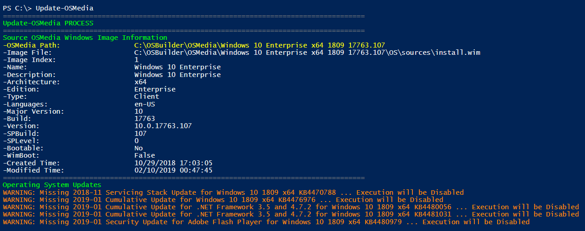

# Update an OS

OSBuilder makes it easy to update any Imported Operating System with the latest Microsoft Updates


An OSMedia is an Imported or Updated OS without any customizations


## Update-OSMedia

To view the required Updates for any OSMedia, simply use the following PowerShell command

```text
Update-OSMedia
```

A GridView list of OSMedia will be displayed.  Operating Systems that need an update will show no information under the Servicing, Cumulative, or Adobe headings.  Select an OSMedia and press OK



The required Microsoft Updates will be displayed.  If they have not been downloaded yet, you will receive a warning



## Update-OSMedia -DownloadUpdates

To download the required Microsoft Updates for an OSMedia, simply add the -DownloadUpdates parameter

```text
Update-OSMedia -DownloadUpdates
```

This will automatically download the Microsoft Updates using BITS Transfer.


BITS requires an Interactive Login


When using thi


