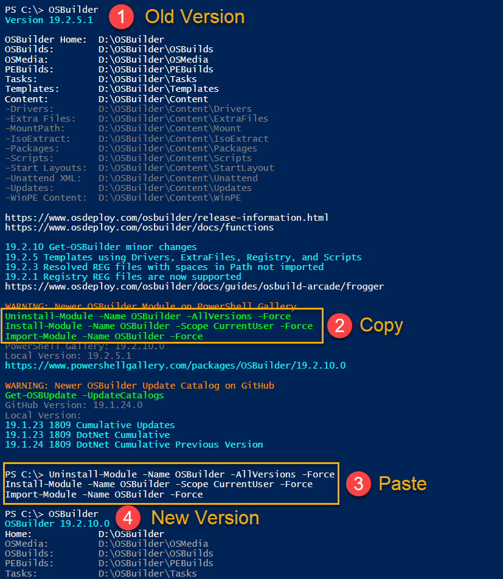
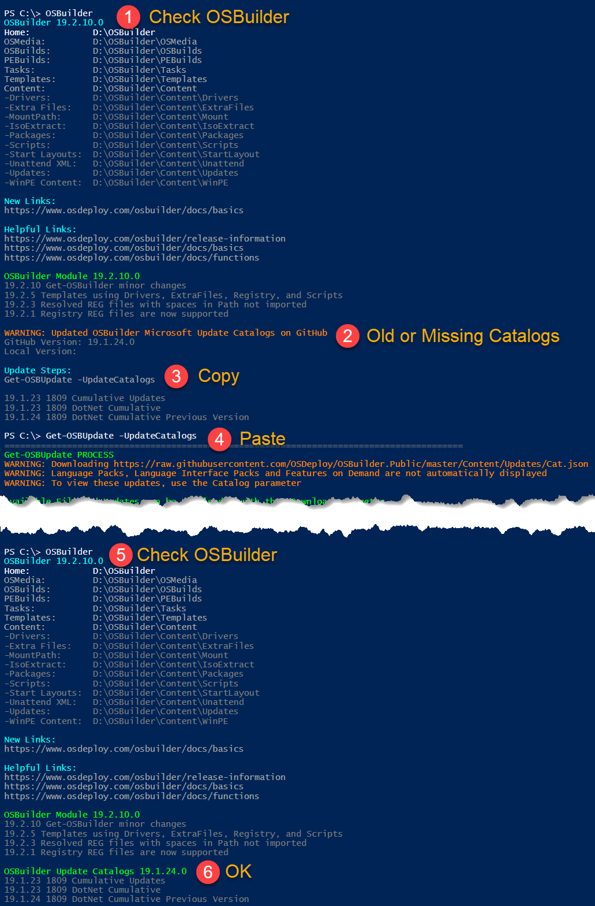

# Update OSBuilder

**The last page had quite a bit of information, so here is how to update the OSBuilder Module and the Update Catalogs the easy way**

## **OSBuilder PowerShell Module**

## OSBuilder Update Catalogs

