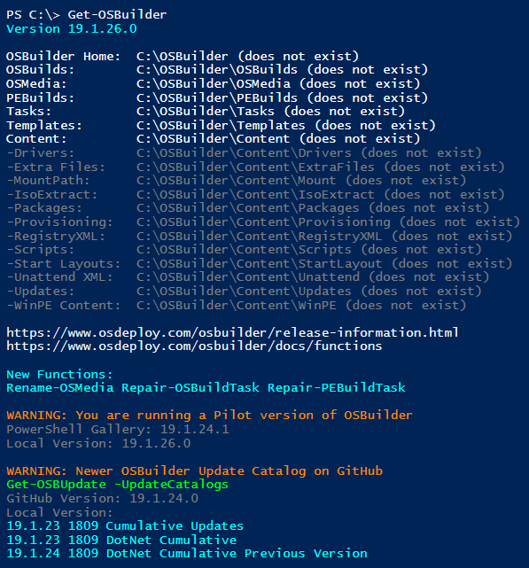
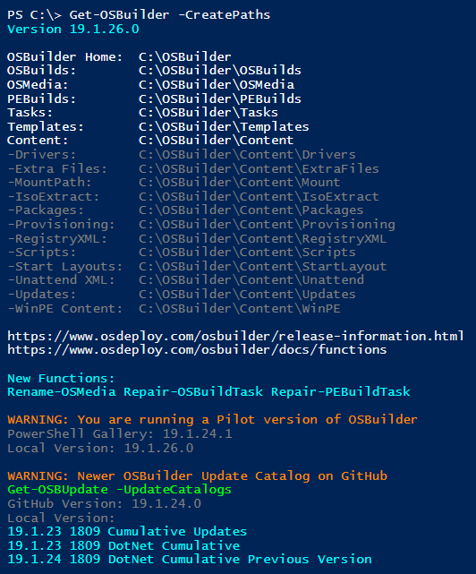
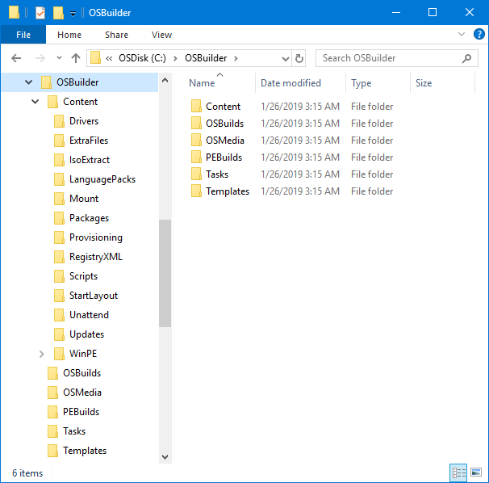
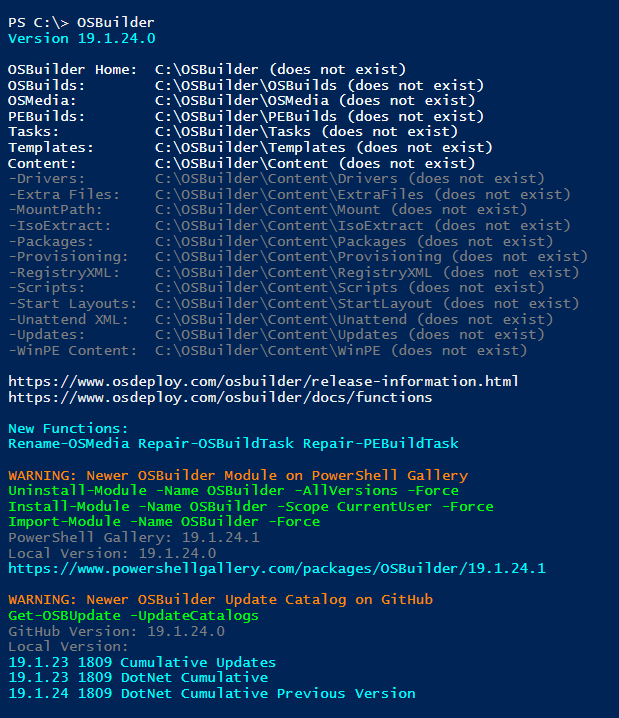

# Get-OSBuilder

If you are new to OSBuilder, start by opening PowerShell ISE Elevated \(Run as Administrator\). Select the OSBuilder Module and then **`Get-OSBuilder`**.  Run

When executing **`Get-OSBuilder`** without any parameters, it will display a few things:

* PowerShell Module Version
* Directory Structure
* Important Links
* Information
* Module and Update Catalogs Version Validation

## Get-OSBuilder -CreatePaths

This will create the OSBuilder directory structure.  This is automatically done if necessary

## Get-OSBuilder -HideDetails

This parameter does not output any information and is used by other functions to set OSBuilder variables

## Additional Information

Latest Updates will be displayed.  This is typically reserved for updated documentation.  OSBuilder Module information will be displayed indicating if there is an update on PowerShell Gallery.  Update Catalogs are checked as well, to make sure you have the latest Cumulative Updates.

