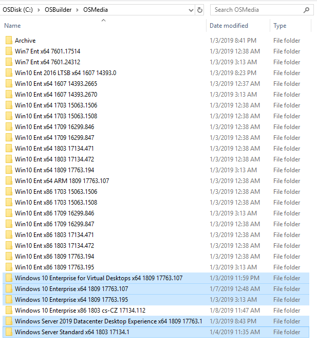
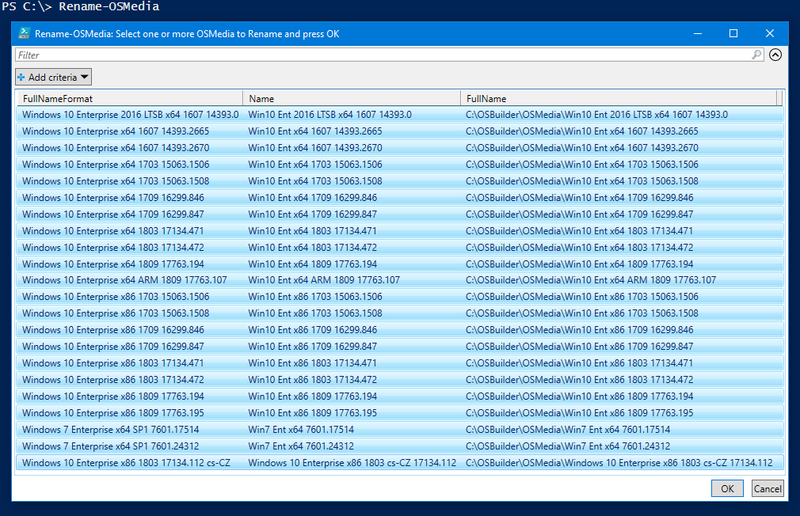
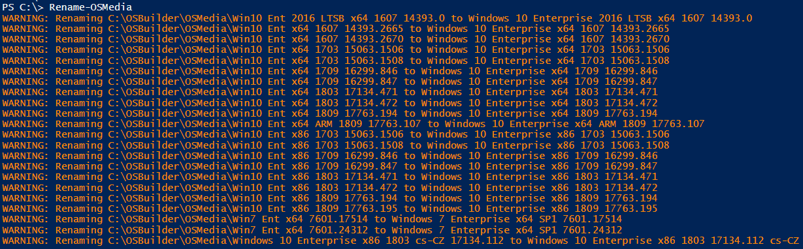
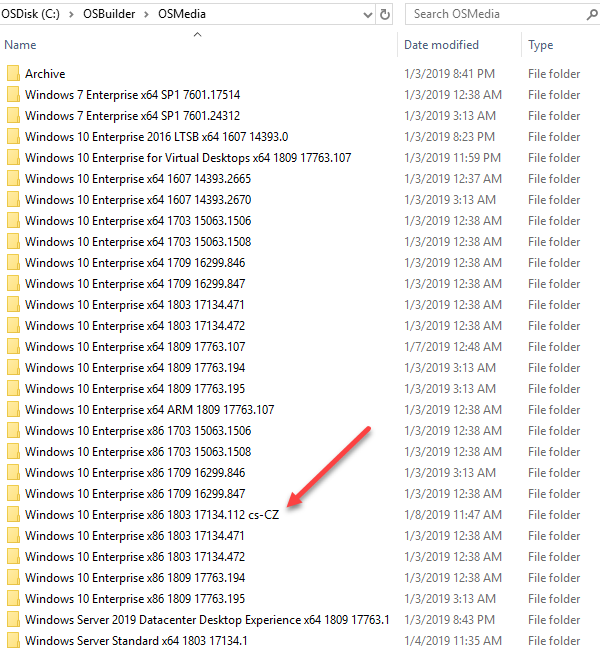
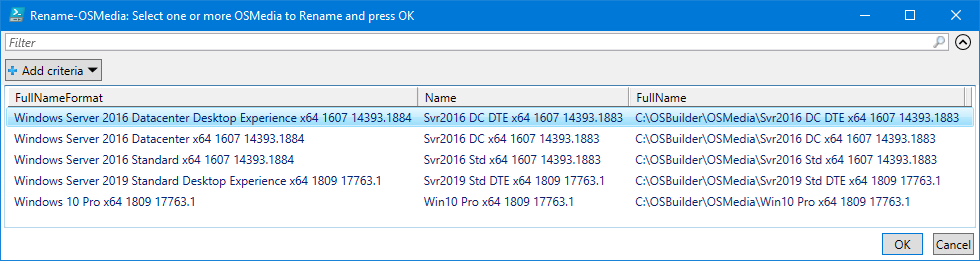

# Rename-OSMedia

## Purpose

Rename OSMedia is used to change the OSMedia Directory Name from the Abbreviated Naming Format to the Full Name Format.  PowerShell ISE is required for GridView to function properly

## Example

When looking in my OSBuilder's OSMedia directory, new imports are displayed without abbreviations, whereas my older versions contain abbreviations.  Additionally Language information is displayed before the UBR.

Any **OSMedia** that is not in the proper **Full Name Format** will be displayed.  Select one or more items and press OK to start the Rename Process

Results will be displayed as a Warning

Directories should be renamed \(unless there were any Open or In Use Files\).  Language information will be displayed at the end of the Operating System information

Here's some more examples with other OSMedia ...

