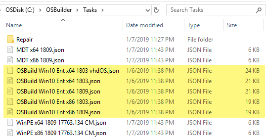
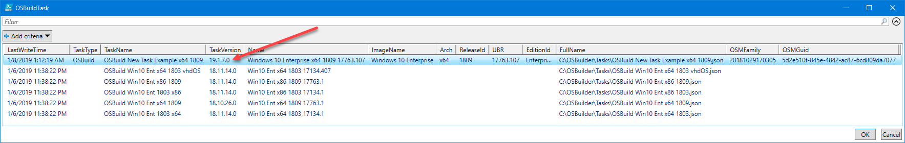
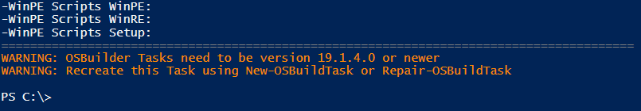
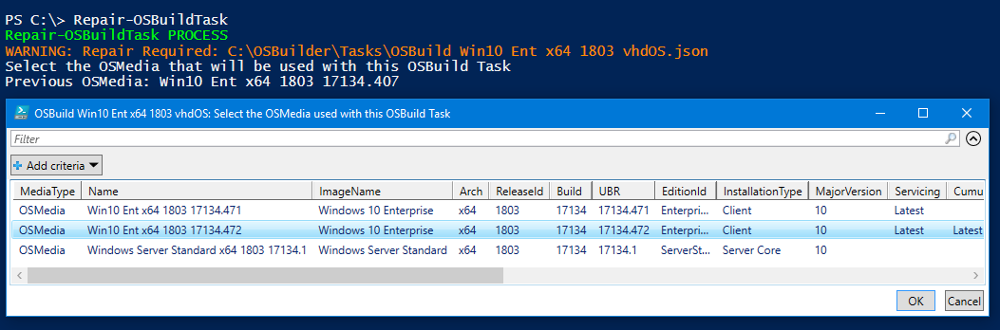
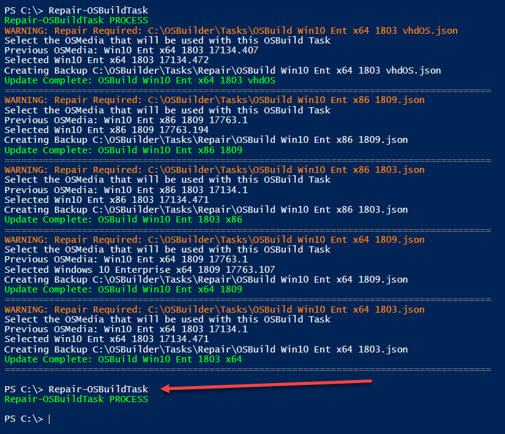
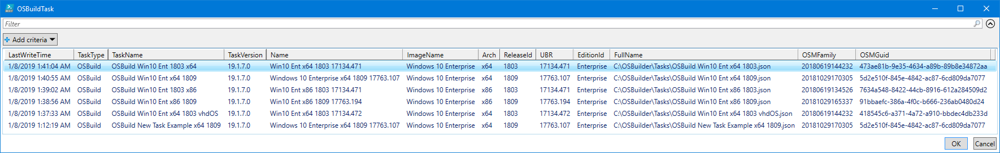
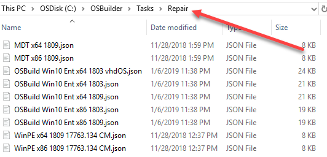

# Repair-OSBuildTask

## Purpose 

The purpose of **Repair-OSBuildTask** is to update an old OSBuild Task to the current version. This function requires **PowerShell ISE** for Gridview to function properly.

## Example 

In this example I have some OSBuild Tasks which can be identified by the OSBuild prefix in the Json File Name.

A current [**New-OSBuildTask**](../osbuild/new-osbuildtask/) contains more information and can no longer be used with [**New-OSBuild**](../osbuild/new-osbuild.md)\*\*\*\*

When using an old OSBuild Task with [**New-OSBuild**](../osbuild/new-osbuild.md), you will receive an error

In PowerShell ISE,  execute **Repair-OSBuildTask** without any parameters.  You will be prompted to select an existing [**OSMedia**]() for use with each of the OSBuild Tasks that need to be updated

Repeat this process for every PEBuild Task that needs an update.  Once Repair-PEBuildTask is complete, there should be no results in subsequent executions

Everything should look good after this process is complete

A backup of the old OSBuild Task will be created in a Repair subdirectory

