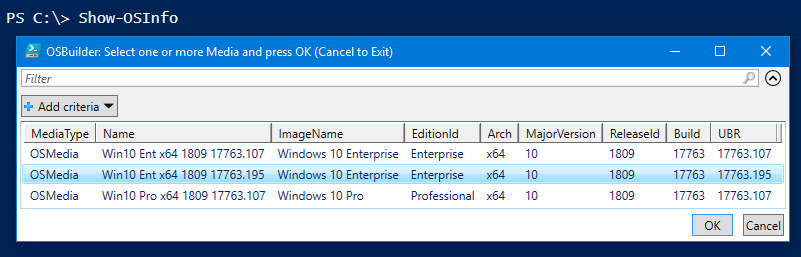

# Show-OSBMediaInfo

This function is used to display information about any **`OSMedia`**, **`OSBuild`**, or **`PEBuild`**.  If you want to know how this works, read [Knowledge: OSBuilder OS Information](../../articles/osbuilder-os-information.md)

```text
<#
.SYNOPSIS
Shows Operating System information of any OSBuilder Media

.DESCRIPTION
Shows Operating System information of any OSBuilder Media (OSMedia, OSBuilds, PEBuilds)

.LINK
https://www.osdeploy.com/osbuilder/docs/functions/media/show-osbmediainfo

.PARAMETER FullName
Full Path of the OSBuilder Media
#>

function Show-OSBMediaInfo {
    [CmdletBinding()]
    PARAM (
		[Parameter(ValueFromPipelineByPropertyName)]
		[string[]]$FullName
    )
}
```

## Show-OSBinfo

When using **`Show-OSBinfo`** without any parameters, you will be prompted to select an OSMedia, OSBuild, or PEBuild.  Select one or more and press OK



## Show-OSBinfo -FullName

When using the **`-FullName`** parameter, use the path of the imported Media \(not the install.wim\)

```text
Show-OSBinfo -FullName 'C:\OSBuilder\OSBuilds\Win10 Ent x64 1803 17134.167'
```

## Output

The following is an example of what is displayed when using **`Show-OSBinfo`**


