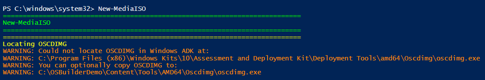
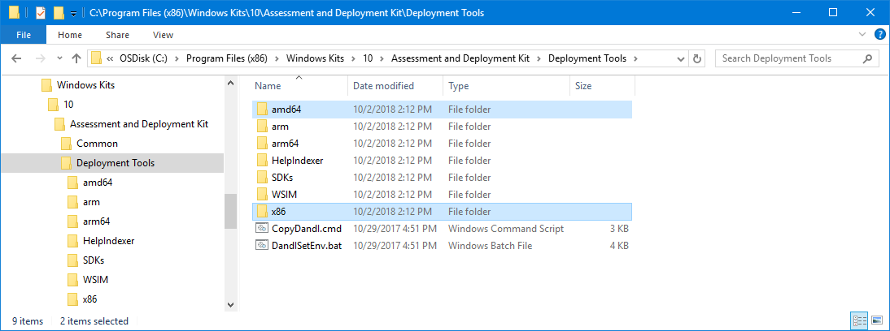
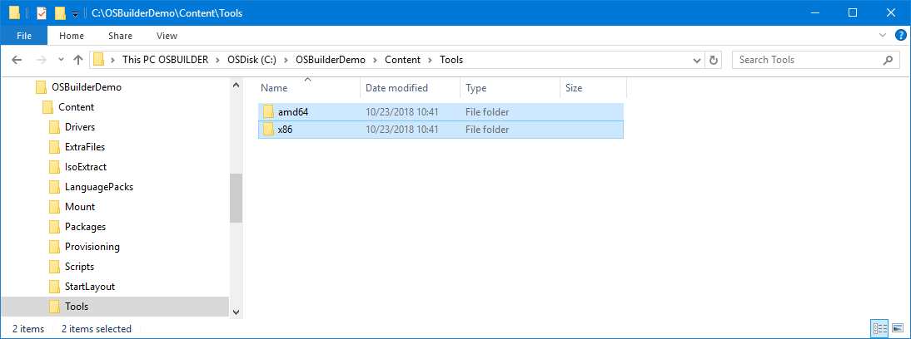
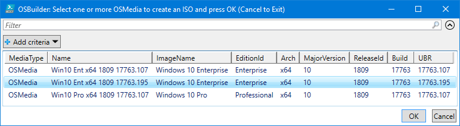
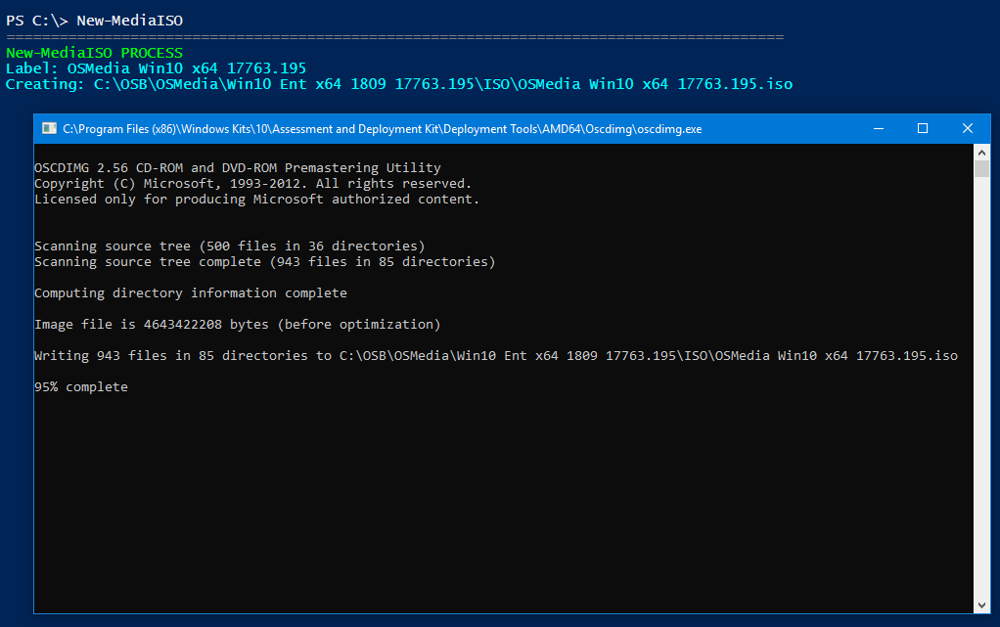
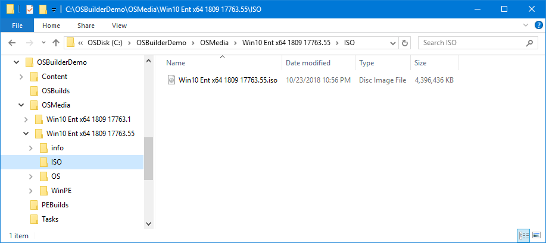

# New-OSBMediaISO

## Function

```text
<#
.SYNOPSIS
Creates an ISO of any OSBuilder Media

.DESCRIPTION
Creates an ISO of any OSBuilder Media (OSMedia, OSBuilds, PEBuilds)

.LINK
https://www.osdeploy.com/osbuilder/docs/functions/media/new-osbmediaiso

.PARAMETER FullName
Full Path of the OSBuilder Media
#>
```

```text
[Parameter(ValueFromPipelineByPropertyName)]
[string[]]$FullName
```

## Windows ADK Required

You need to have ADK installed first or you will get a Warning message



You can download the Windows ADK from the following link



## OSBuilder Tools

You can optionally copy the amd64 and x86 directories from ADK into OSBuilder\Content\Tools instead of  having ADK installed





## Select Media

You can multi-select any OSMedia, OSBuild, or PEBuild you want to create an ISO for and press OK



## Create ISO

The ISO's will automatically be generated



And saved within an ISO directory of the Media. Enjoy!




