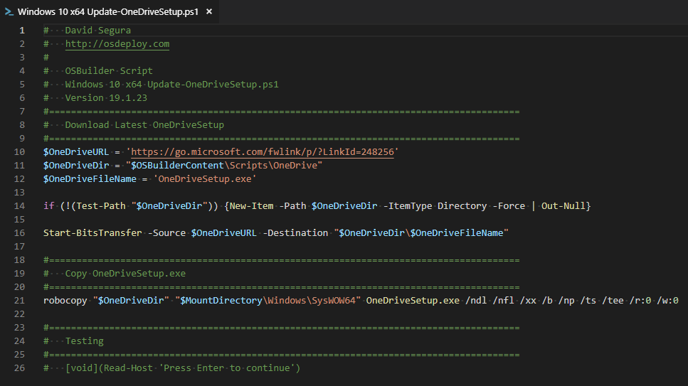
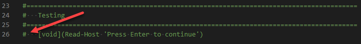
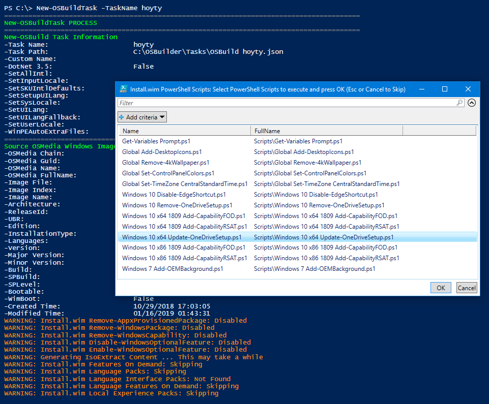
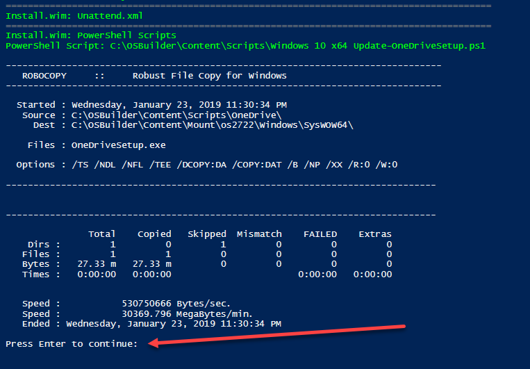
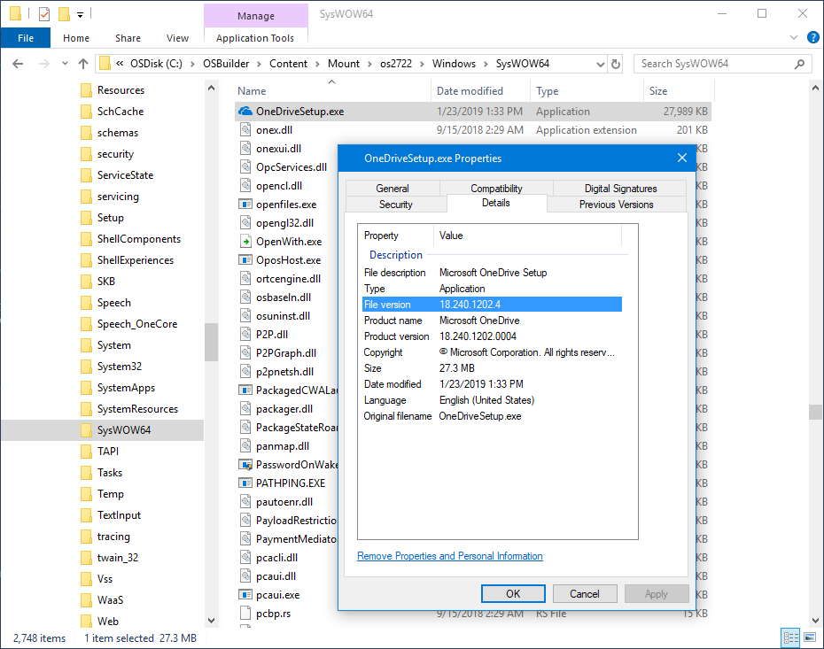
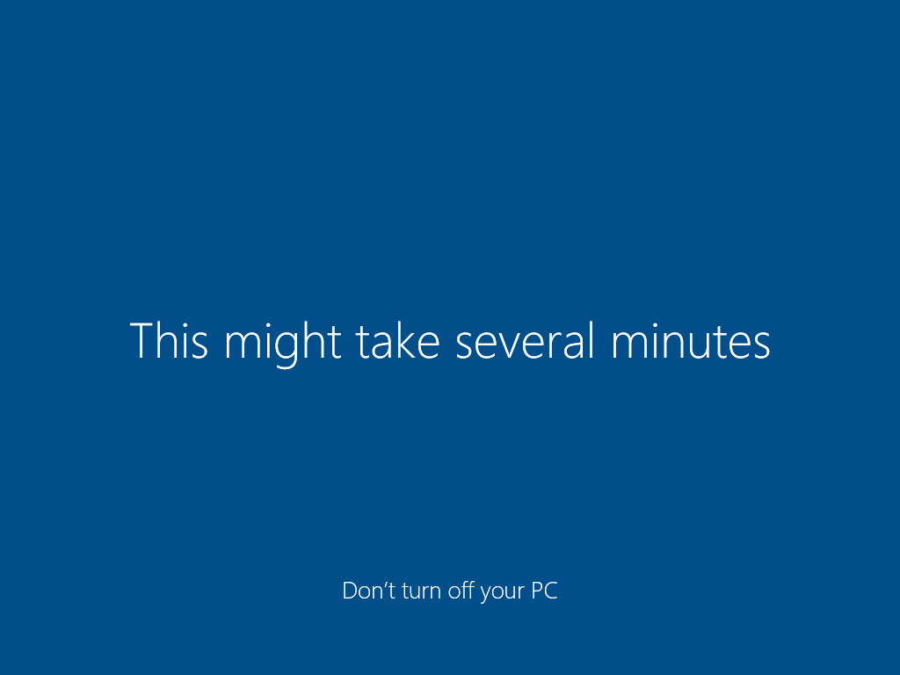
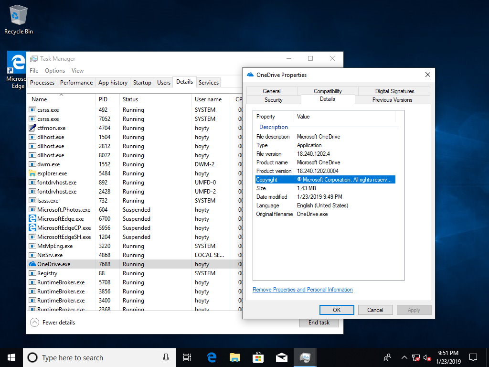
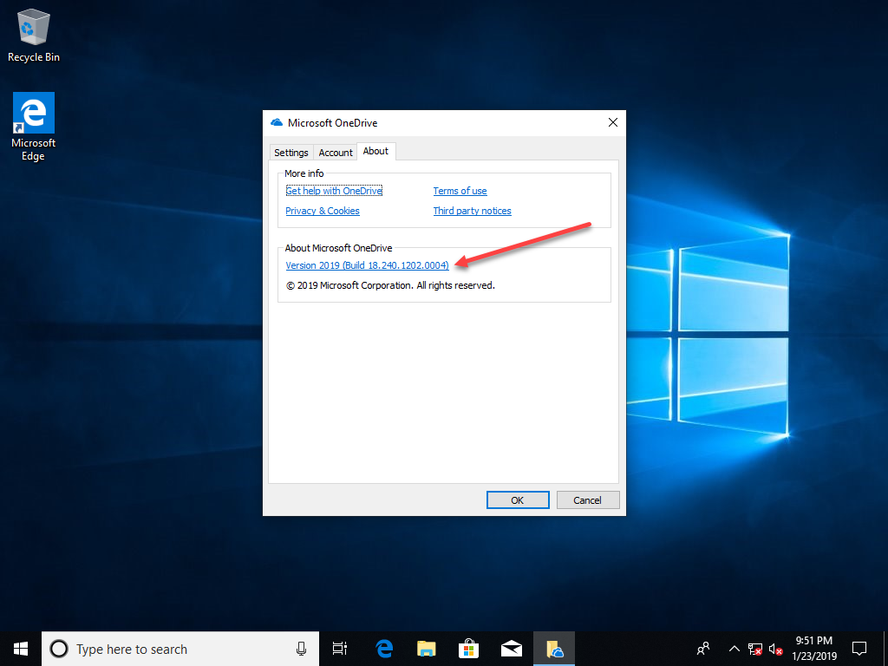

# Update-OneDriveSetup

So today I get a fan request to update OneDriveSetup.exe using OSBuilder



## The Script

Download the attached PowerShell script and save it in your OSBuilder\Content\Scripts directory



This is a quick and dirty script to download an update OneDriveSetup.exe and copy it to the Windows 10 x64 default location

I'll make sure to enable the Testing line at the bottom of the script.  This one:

## The Task

Create a new Task and make sure to select the PowerShell Script when prompted

## The Build

The PowerShell Script will wait for me to press Enter

Which gives me time to check the Mount Directory.  Looks good

## The Test

I'll setup a Virtual Machine with no Internet Access to make sure I get proper results and now its time to play some Xbox.  BRB

Ok, back.  Let's see how we did ...

## Conclusion

If there is something that OSBuilder doesn't do, just add a PowerShell script!  For a copy of this script and any of my other "Bonus" scripts, hit up this link



