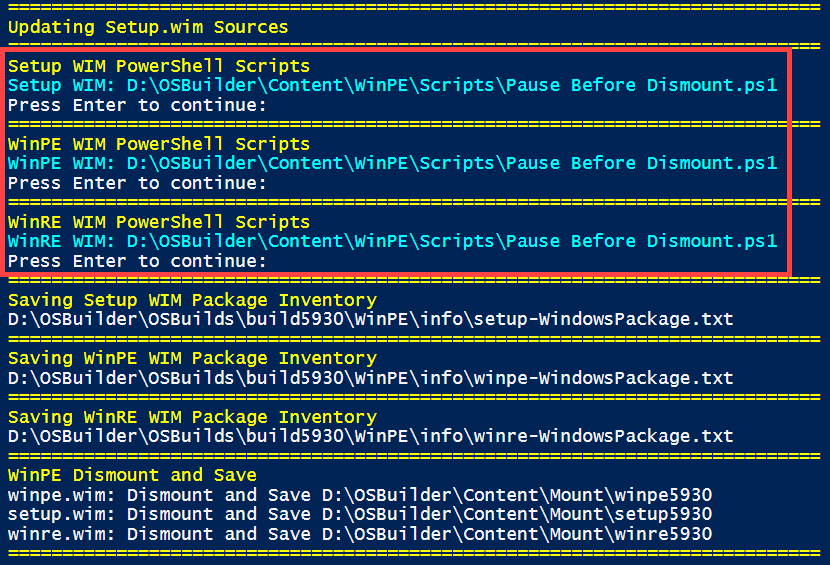
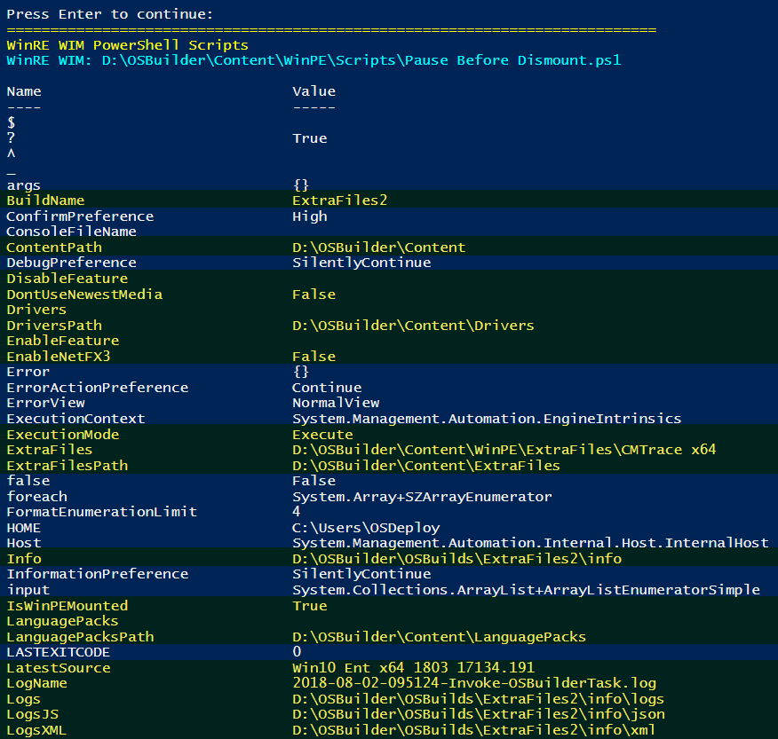

# WinPE PowerShell Scripts

OSBuilder 18.8.2 allows you the ability to execute scripts during the an OSBuild Task before WinPE is dismounted.

Add a PowerShell script to your C:\OSBuilder\Content\WinPE\Scripts directory.  Once you have content in this directory, you will be prompted to select it when creating a new **OSBuild Task**.  You can optionally select one or more PowerShell scripts to execute in each of the different WinPE's \(Setup, WinPE, and WinRE\)


In the example above, I have created a script to stop actions until I press Enter.  This allows me to validate things before the WinPE WIMs are dismounted.

```text
[void](Read-Host 'Press Enter to continue')
```

During **Invoke-OSBuilder** when running the **OSBuild Task**, the selected scripts will execute before the WinPE WIMs are dismounted.  Let me know what you create!



### Using OSBuilder Variables

With a simple change to the above script, you can easily see all the Variables that you can use within OSBuilder

```text
Get-Variable | Select-Object -Property Name, Value | Format-Table
[void](Read-Host 'Press Enter to continue')
```




