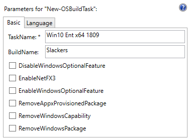
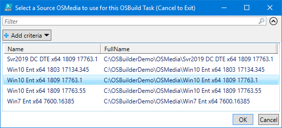
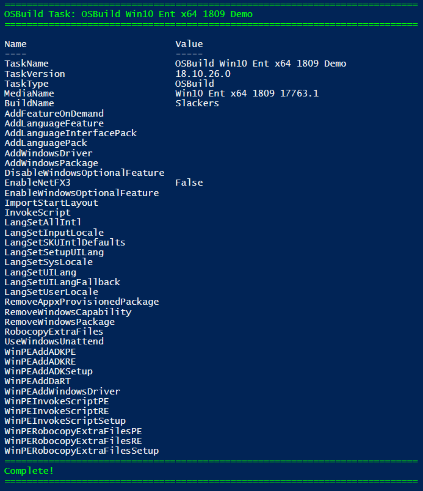
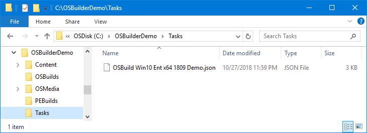
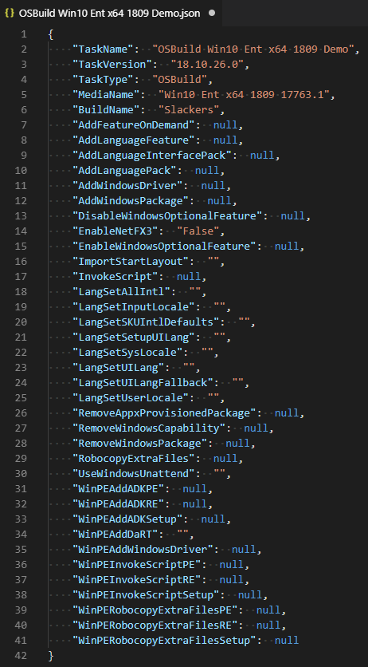

# New-OSBuildTask



A New-OSBuildTask will take an existing [**`OSMedia`**](../../osmedia/) and apply customizations

## -TaskName

The name of the Task you are creating.  This name will be used for naming the Task JSON file.  This parameter is required

```text
New-OSBuildTask -TaskName 'Win10 Ent x64 1809'
```

## -BuildName

OSBuilds are automatically named in the following format:

`<Operating System> <Edition> <Arch> <UBR>`

  If you require something more friendly, use the BuildName parameter

```text
New-OSBuildTask -TaskName 'Win10 Ent x64 1809' -BuildName 'Engineering Build'
```

## -EnableNetFX3

If you want to enable NetFX3 in your OSBuild \(recommended\), use this parameter

```text
New-OSBuildTask -TaskName 'Win10 Ent x64 1809' -EnableNetFX3
```

## Create New-OSBuildTask

Now create a basic New-OSBuildTask with the following command line

```text
New-OSBuildTask -TaskName 'Win10 Ent x64 1809 Demo' -BuildName 'Slackers'
```

#### Select a Source OSMedia

Select a source [**`OSMedia`**](../../osmedia/) to use for the OSBuild Task.  It is not necessary to select the latest version as OSBuilder will automatically select the newest version when using [**`New-OSBuild`**](../new-osbuild.md)**\`\`**



#### Complete

When the script is complete, the customizations will be displayed in the PowerShell console



#### Task File

A Task will be created at "C:\OSBuilderDemo\Tasks\**OSBuild Win10 Ent x64 1809.json**"



#### Task Contents

The image below is what a typical OSBuild Task looks like.  In this JSON file are all the values needed for creating a [**`New-OSBuild`**](../new-osbuild.md)**\`\`**




