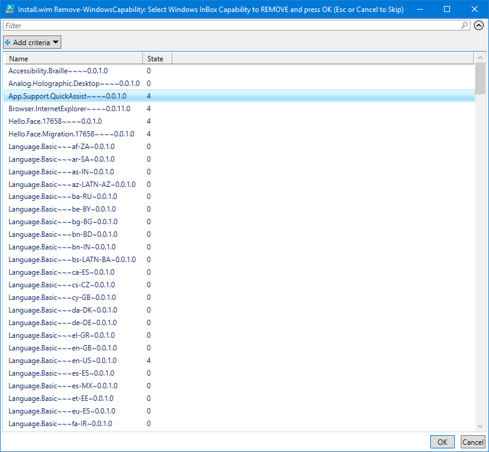
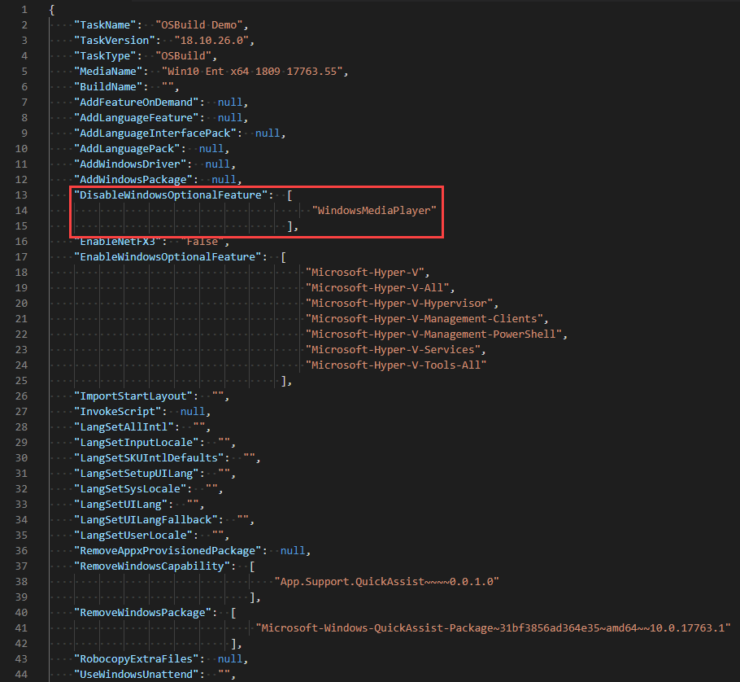

# Remove Windows Capability

When creating an OSBuild for Windows 10, your have the option to remove an installed Windows Capability

## -RemoveWindowsCapability

Using this parameter with [`New-OSBuildTask`](./), you will be prompted to select Windows Capabilities to remove from your OSBuild.

```text
New-OSBuildTask -TaskName Demo -RemoveWindowsCapability
```

Simply multi-select the Windows Capabilities you want to remove and press OK



The selected Windows Capabilities will be added to the OSBuild Task. When executing [`New-OSBuild`](../new-osbuild.md), these Windows Capabilities will be removed



