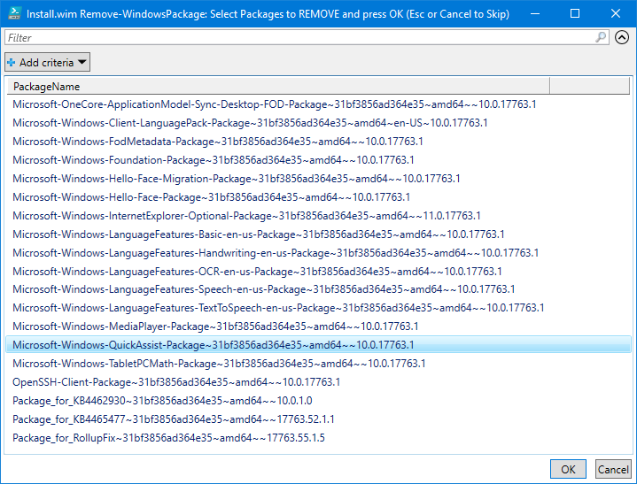
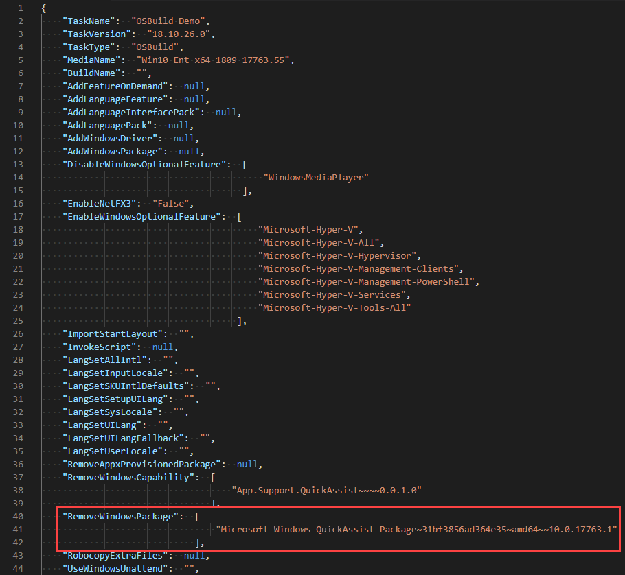

# Remove Windows Package

When creating an OSBuild for Windows 10, your have the option to remove an installed Windows Package

## -RemoveWindowsPackage

Using this parameter with [`New-OSBuildTask`](./), you will be prompted to select Windows Packages to remove from your OSBuild.

```text
New-OSBuildTask -TaskName Demo -RemoveWindowsPackage
```

Simply multi-select the Windows Packages you want to Remove and press OK



The selected Windows Packages will be added to the OSBuild Task. When executing [`New-OSBuild`](../new-osbuild.md), these Windows Packages will be removed



