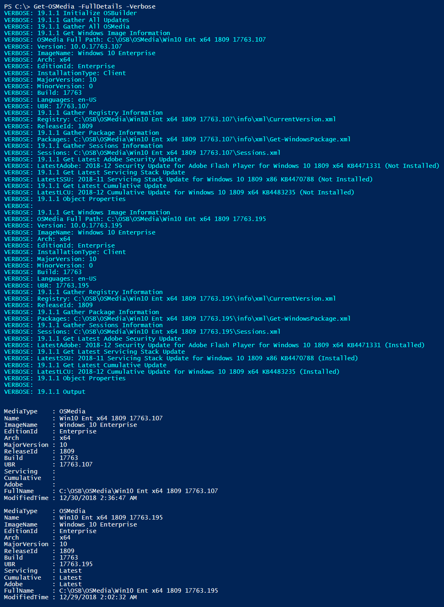
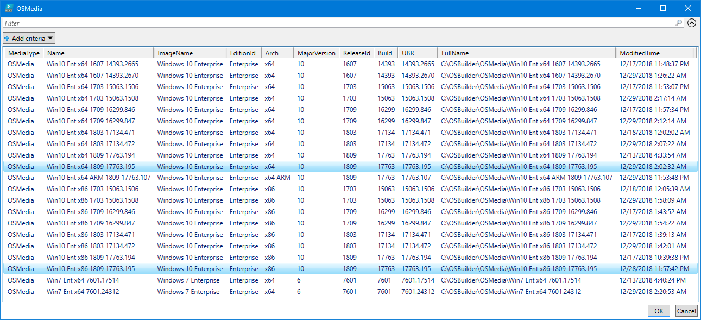
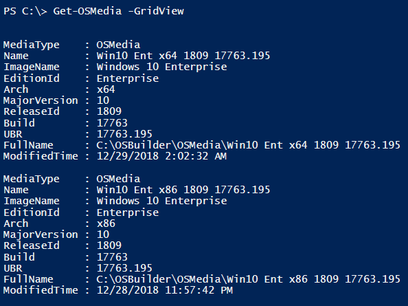
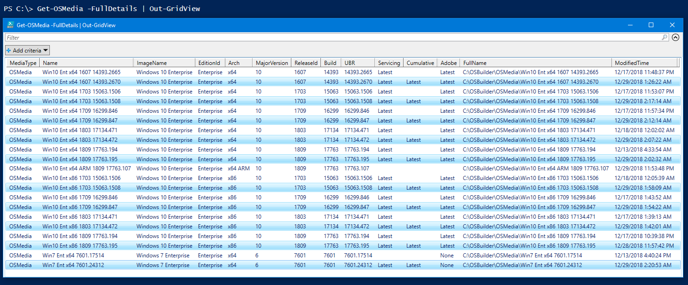
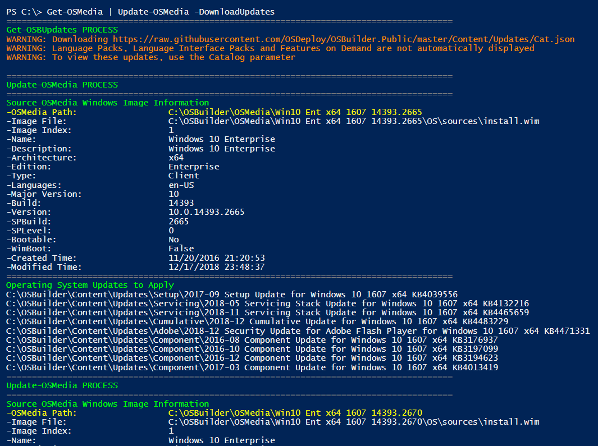

# Get-OSMedia

## Parameters

* **`[switch] FullDetails`**
  * Displays Update Information \(Servicing, Cumulative, Adobe\)
* **`[switch] GridView`**
  * Displays results in GridView

## Usage

**`Get-OSMedia`** will return all [**`OSMedia`**](./) as a PowerShell Custom Object


## Get-OSMedia -FullDetails

This will determine if the Updates are the Latest available.  Cumulative Update information is obtained by parsing an exported Sessions.xml file \(exported in OSBuilder 18.12.5 or newer\)


## Get-OSMedia -FullDetails -Verbose

Even more detail can be viewed when using the -Verbose parameter.  This will display information about the Updates that are validated.  This process can take up to a minute for multiple OSMedia



## Get-OSMedia -GridView

You can display the results in GridView using this parameter.  This will allow you to select multiple OSMedia using PassThru





## Piping: GridView

As an alternative, you can use the following commands to perform a GridView

```text
Get-OSMedia | Out-GridView
Get-OSMedia -FullDetails | Out-GridView -PassThru
```



## Piping: Display only Latest CU

Or just display the OSMedia with the Latest Cumulative Update

**`(Get-OSMedia -FullDetails).Where({$_.Cumulative -eq 'Latest'})`**


## Piping: Show-OSInfo

You can also pipe OSMedia to some other OSBuilder functions like[**`Show-OSInfo`**](../osbuilder/show-osbinfo.md) using any of the following commands

```text
Get-OSMedia -FullDetails | Out-GridView -PassThru | Show-OSInfo
Get-OSMedia -FullDetails | Where-Object {$_.Cumulative -eq 'Latest'} | Show-OSInfo
(Get-OSMedia -FullDetails).Where({$_.Cumulative -eq 'Latest'}) | Show-OSInfo
```


## Piping: Update-OSMedia

You can even use **`Get-OSMedia`** to download updates for all your existing [**`OSMedia`**](./)**\`\`**

```text
Get-OSMedia | Update-OSMedia -DownloadUpdates
```



## Internal Functions

**`Get-OSMedia`** will be used internally in other OSBuilder functions.  For example, [**`Update-OSMedia`**](update-osmedia/) used to use a simple selection based on Directories contained in OSMedia


**`Get-OSMedia`** will allow more detailed information in the selection of OSMedia to Update


