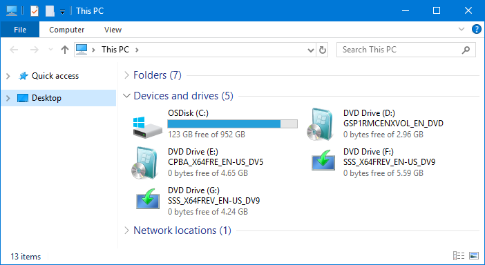
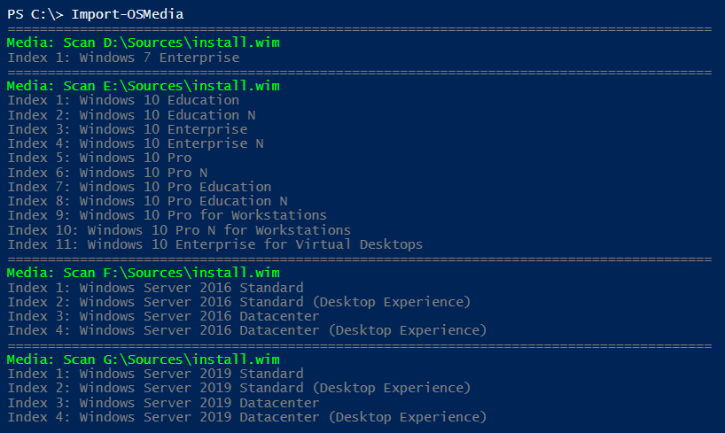
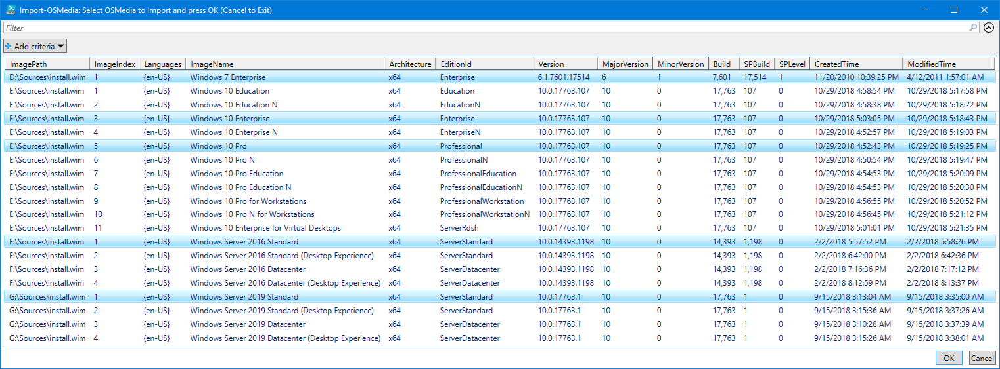
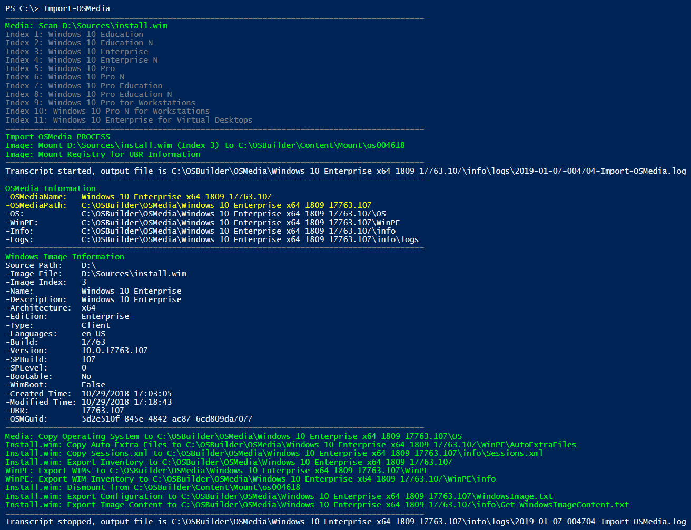

# Import-OSMedia

```text
.SYNOPSIS
Imports an Operating System into OSBuilder

.DESCRIPTION
Imports a supported Operating System into the OSBuilder OSMedia directory

.LINK
https://www.osdeploy.com/osbuilder/docs/functions/osmedia/import-osmedia

.PARAMETER CreateISO
New-OSBMediaISO -FullName $FullName
Creates an ISO after Import

.PARAMETER ShowMediaInfo
Show-OSBMediaInfo -FullName $FullName
Displays Media Information after Import

.PARAMETER UpdateOSMedia
Update-OSMedia -Name $Name -DownloadUpdates -Execute
Automatically updates the Imported Operating System

.PARAMETER EditionId
Operating System Edition to import

.PARAMETER ImageIndex
Operating System Index to Import

.PARAMETER ImageName
Operating System Image Name to Import

.PARAMETER SkipGridView
Used to bypass the ISE GridView Operating System Selection

.EXAMPLE
Import-OSMedia -EditionId Enterprise

.EXAMPLE
Import-OSMedia -EditionId Enterprise -SkipGridView

.EXAMPLE
Import-OSMedia -EditionId Enterprise -SkipGridView -UpdateOSMedia
```




```text
[switch]$CreateISO,
[switch]$ShowMediaInfo,
[switch]$UpdateOSMedia,
```



```text
[switch]$CreateISO,
[switch]$ShowMediaInfo,
[switch]$UpdateOSMedia,
[ValidateSet('Education','EducationN','Enterprise','EnterpriseN','EnterpriseS','EnterpriseSN','Professional','ProfessionalEducation','ProfessionalEducationN','ProfessionalN','ProfessionalWorkstation','ProfessionalWorkstationN','ServerRdsh','ServerDatacenter','ServerDatacenterACor','ServerRdsh','ServerStandard','ServerStandardACor')]
[string]$EditionId,
[int]$ImageIndex,
[ValidateSet('Windows 10 Education','Windows 10 Education N','Windows 10 Enterprise','Windows 10 Enterprise 2016 LTSB','Windows 10 Enterprise for Virtual Desktops','Windows 10 Enterprise LTSC','Windows 10 Enterprise N','Windows 10 Enterprise N LTSC','Windows 10 Pro','Windows 10 Pro Education','Windows 10 Pro Education N','Windows 10 Pro for Workstations','Windows 10 Pro N','Windows 10 Pro N for Workstations','Windows Server 2016 Datacenter','Windows Server 2016 Datacenter (Desktop Experience)','Windows Server 2016 Standard','Windows Server 2016 Standard (Desktop Experience)','Windows Server 2019 Datacenter','Windows Server 2019 Datacenter (Desktop Experience)','Windows Server 2019 Standard','Windows Server 2019 Standard (Desktop Experience)','Windows Server Datacenter','Windows Server Standard')]
[string]$ImageName,
[switch]$SkipGridView
```



## Preparation

Importing an Operating System into OSBuilder is one of the first steps that should be taken.  In this example.  Multiple Operating System Versions and Editions can be imported at the same time.  In this example I have mounted MVLS ISO's for the following:

* **Windows 7 SP1 x64**
* **Windows 10 x64**
* **Windows Server 2016**
* **Windows Server 2019**



## Import-OSMedia

**`Import-OSMedia`** can be run without any parameters in PowerShell ISE \(for GridView functionality\).  Once executed, it will will search all attached Drives for install.wim or Install.esd files.  This process should take about a minute, so be patient and let the scan finish.  During the scan, any Operating Systems that are found will be displayed



#### GridView

Once the scanning is complete, a GridView will display with all the available Windows Images. Multi-select the ones you want to import and press OK



#### Mount Phase

After the Windows Image selection, the Install.wim or Install.esd will be mounted so **OSBuilder** can gather additional information.  Two important pieces of information will be displayed

* **OSMediaName** - This is the **Name** of the Operating System as defined by **OSBuilder**.  This is used in the Directory Name of the **OSMedia**.  It contains the following information ~~in an abbreviated format~~
  * **&lt;ImageName&gt; &lt;Architecture&gt; &lt;Version&gt; &lt;UBR&gt;**
* **OSMediaPath** - This is the **FullName** or **Path** of the **OSMedia**

#### Import Phase

When the Mount Phase is complete, the Operating System can be copied into **OSBuilder\OSMedia** in a directory name matching the **OSMediaName**

The process of importing an Operating System will take about 1 minute of actual work, with about 6 - 8 minutes of processing



## -NewMediaISO


**Microsoft ADK** needs to be installed before using this parameter as **OSCDIMG** is required


**Usage:  `Import-OSMedia -NewMediaISO`**

Creates an ISO of the imported **OSMedia** in the **&lt;OSMediaPath&gt;\ISO** directory using the **OSBuilder** [**`New-MediaISO`**](../osbmedia/new-osbmediaiso.md) function.  The following command line is passed

```text
New-MediaISO -FullName "$FullName"
```



## -ShowOSInfo

**Usage:  `Import-OSMedia -ShowOSInfo`**

Displays the full **OSMedia** Information by executing the **OSBuilder** [**`Show-OSInfo`**](../osbmedia/show-osbmediainfo.md) function.  The following command line is passed

```text
Show-OSInfo -FullName "$FullName"
```



## -UpdateOSMedia

**Usage:  `Import-OSMedia -UpdateOSMedia`**

Automatically applies patches to the imported Operating System using the **OSBuilder** [**`Update-OSMedia`**](update-osmedia/) function.  The following command line is processed

```text
Update-OSMedia -Name $Name -DownloadUpdates -Execute
```

This option will automatically download any required Updates.  You will need an Internet connection and keep in mind the Cumulative Updates are quite large, so don't do this with a Metered Connection.



## -EditionId

**Usage:  `Import-OSMedia -EditionId Enterprise`**

You can filter the Operating System by Edition ID using this parameter.  The following values can be used with this parameter

* **Education**
* **EducationN**
* **Enterprise**
* **EnterpriseN**
* **EnterpriseS**
* **EnterpriseSN**
* **Professional**
* **ProfessionalEducation**
* **ProfessionalEducationN**
* **ProfessionalN ProfessionalWorkstation**
* **ProfessionalWorkstationN**
* **ServerDatacenter**
* **ServerDatacenterACor**
* **ServerRdsh**
* **ServerStandard**
* **ServerStandardACor**

## -ImageIndex

**Usage:  `Import-OSMedia -ImageIndex 3`**

If you know the Image Index, then you can specify this to filter the Operating Systems

## -ImageName

**Usage:  `Import-OSMedia -ImageName 'Windows 10 Enterprise'`**

You can filter the Operating System by Image Name using this parameter.  The following values can be used with this parameter

* **Windows 10 Education**
* **Windows 10 Education N**
* **Windows 10 Enterprise**
* **Windows 10 Enterprise 2016 LTSB**
* **Windows 10 Enterprise for Virtual Desktops**
* **Windows 10 Enterprise LTSC**
* **Windows 10 Enterprise N**
* **Windows 10 Enterprise N LTSC**
* **Windows 10 Pro**
* **Windows 10 Pro Education**
* **Windows 10 Pro Education N**
* **Windows 10 Pro for Workstations**
* **Windows 10 Pro N**
* **Windows 10 Pro N for Workstations**
* **Windows Server 2016 Datacenter**
* **Windows Server 2016 Datacenter \(Desktop Experience\)**
* **Windows Server 2016 Standard**
* **Windows Server 2016 Standard \(Desktop Experience\)**
* **Windows Server 2019 Datacenter**
* **Windows Server 2019 Datacenter \(Desktop Experience\)**
* **Windows Server 2019 Standard**
* **Windows Server 2019 Standard \(Desktop Experience\)**
* **Windows Server Datacenter**
* **Windows Server Standard**

## -SkipGridView

**Usage:  `Import-OSMedia -EditionId Enterprise -SkipGridView`**

To fully automate the import of an Operating System, use this parameter to skip the PowerShell GridView selection.  It is recommended on Multi-Index Media that you specify an **`-EditionId`**, **`-ImageIndex`**,  or **`-ImageName`**

