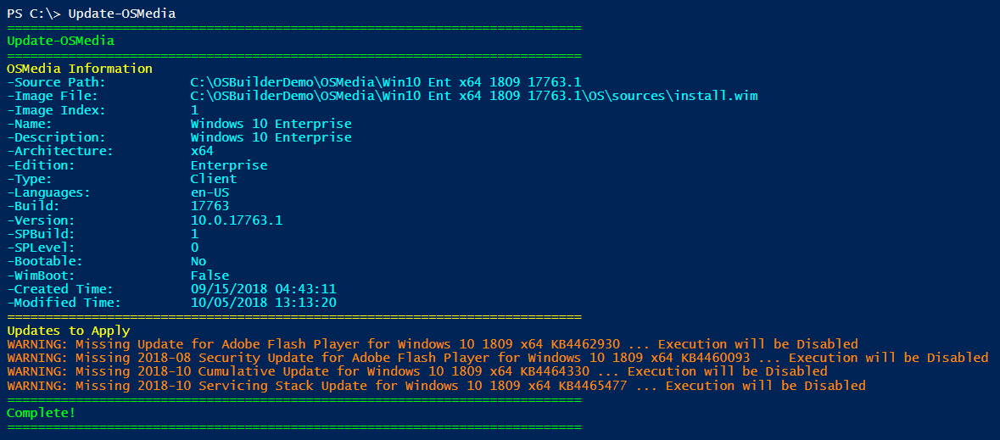

# Update-OSMedia

Update-OSMedia is used to apply Patches to an imported OSMedia.  Previous versions of OSBuilder required the creation of a Task to specify the Update sources, but this is no longer required.

Simply execute Update-OSMedia without any Parameters.  You will be prompted to select an imported OSMedia \(PowerShell ISE is required to select the Operating System for now\).  Make a selection and press OK.

## Multiple OS Selection

You can update multiple OSMedia to update by multi-selecting the OSMedia

## Information

When running Update-OSMedia without any parameters, information about the Operating System will be displayed.  Required updates will also be displayed.

